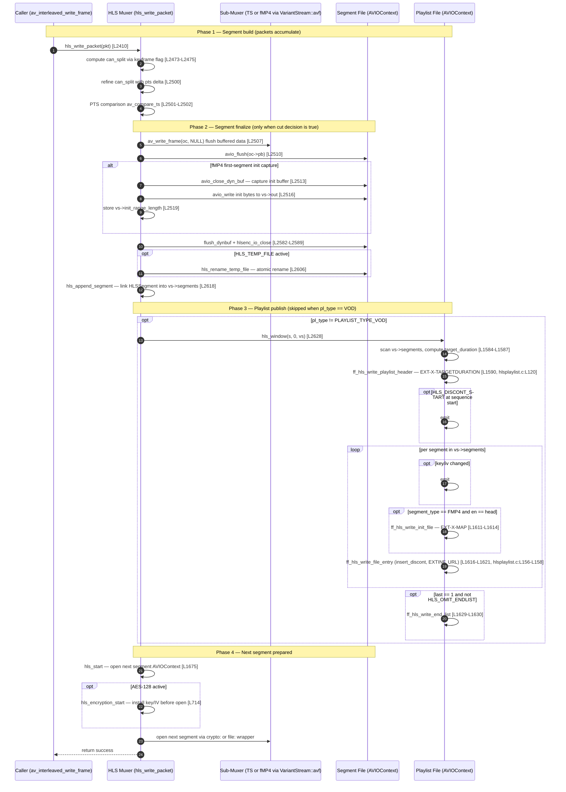

# Timing Dependencies — HLS Pipeline API Contracts

> **Commit Anchor:** All source references in this document are anchored to commit `566ad786` (full hash `566ad7869ee3c8b6993e1f880e0a50eae18c66ac`). Line numbers cited as `[<path>:L<start>-L<end>]` are valid at this commit. See [`../README.md`](../README.md) for the documentation-set-wide commit-anchor convention and citation format.

---

## Overview

This document captures every **ordering rule** the FFmpeg HLS pipeline relies on. Each rule is phrased as "X must happen before Y." If a port executes X and Y in the wrong order, the produced playlists or segments will be invalid even when every individual operation is correct in isolation. The HLS specification does not encode these orderings explicitly — they are implicit in the wire format. A player that polls an M3U8 file while the muxer is in the middle of writing it does not see "a playlist being written"; it sees either a parsable file or a malformed one. The orderings below are what keep the file parsable at every observable instant.

The HLS muxer is a **meta-muxer**: it wraps a child `AVFormatContext` stored in `VariantStream::avf` (`[libavformat/hlsenc.c:L133]`) which actually performs MPEG-TS or fMP4 packet muxing. Every ordering constraint in this document applies at the wrapper (HLS-meta-muxer) level; the child sub-muxer's internal ordering is its own concern and is not duplicated here. See [`../technical/data-model.md`](../technical/data-model.md) for the `VariantStream::avf` field definition and [`../technical/pipeline-orchestration.md`](../technical/pipeline-orchestration.md) for the wrapper/child lifecycle relationship.

Each constraint section below opens with a plain-language statement readable without deep FFmpeg knowledge, then drops into a `### Technical detail` block that names the **Precondition** (what must complete first), the **Postcondition** (what runs second), the **Mechanism** (how the existing code enforces the order), and the **Failure mode if violated** (what malformed output a port would produce). The final section is an end-to-end Mermaid `sequenceDiagram` covering one full packet → segment → playlist publish cycle, followed by cross-references and a port-reviewer validation checklist.

Two invocation sites for the playlist publisher `hls_window` (`[libavformat/hlsenc.c:L1531]`) are worth fixing in the reader's mind before reading the constraints: it is called from inside the per-packet loop **only when the playlist is not VOD** (`hls->pl_type != PLAYLIST_TYPE_VOD` at `[libavformat/hlsenc.c:L2627]`), and it is also called once at trailer time from `hls_write_trailer` with `last == 1`. For VOD playlists, the per-packet `hls_window` is intentionally skipped — the playlist is written only once, at end-of-stream. Every ordering constraint below applies equally to both invocation paths.

---

## Constraint: Keyframe Detection Precedes Segment-Cut

A segment may only be cut at a video keyframe (or at any point if the `HLS_SPLIT_BY_TIME` flag is set). The muxer first computes a boolean "can we split here?" answer based on the packet flags, and only then performs the duration-based comparison that decides whether the elapsed time has actually reached the segment target. A port that performs the duration check without the keyframe gate will cut segments in the middle of a GOP, producing TS files that have no decoder anchor and that no HLS client can play.

### Technical detail

**Precondition.** Inside `hls_write_packet`, the muxer computes `can_split` as the AND of (a) the packet's stream is the reference video stream and (b) either the packet carries `AV_PKT_FLAG_KEY` or the `HLS_SPLIT_BY_TIME` flag is set on the muxer: `can_split = st->codecpar->codec_type == AVMEDIA_TYPE_VIDEO && ((pkt->flags & AV_PKT_FLAG_KEY) || (hls->flags & HLS_SPLIT_BY_TIME));` (`[libavformat/hlsenc.c:L2473-L2475]`). The variable is then refined a few statements later with a forward-progress check: `can_split = can_split && (pkt->pts - vs->end_pts > 0);` (`[libavformat/hlsenc.c:L2500]`).

**Postcondition.** The PTS-based segment-cut comparison `if (vs->packets_written && can_split && av_compare_ts(pkt->pts - vs->start_pts, st->time_base, end_pts, AV_TIME_BASE_Q) >= 0)` runs only when `can_split` is true (`[libavformat/hlsenc.c:L2501-L2502]`). The body of this `if` is the entire segment-cut block.

**Mechanism.** Sequential code in `hls_write_packet`: the keyframe-gate variable is computed unconditionally first, then refined, then short-circuited as the first operand of the segment-cut conditional. Because `&&` short-circuits, the duration comparison is never reached unless the keyframe gate is satisfied.

**Failure mode if violated.** A port that performs the PTS comparison without the keyframe gate cuts segments mid-GOP, producing TS or fMP4 segments that begin with a P-frame or B-frame. No HLS client can decode such segments (the first reference frame is missing); the result is silent decoder failure or visible corruption at every segment boundary.

---

## Constraint: Segment File Fully Written Before Playlist Update

When the muxer decides to cut a segment, it must completely finalize the segment file on disk — flush the child sub-muxer, flush the AVIOContext, close the file — **before** writing the updated playlist that references the new segment. If the playlist publishes a segment URL while the segment file is still being written, a player polling the playlist will fetch a truncated TS file and fail to decode it.

### Technical detail

**Precondition.** Within the segment-cut block in `hls_write_packet`, the muxer calls `av_write_frame(oc, NULL)` to flush any buffered sub-muxer state (`[libavformat/hlsenc.c:L2507]`), then `avio_flush(oc->pb)` on the segment file's AVIOContext (`[libavformat/hlsenc.c:L2510]`). For MPEG-TS segments the file is opened fresh per segment via `hlsenc_io_open` (`[libavformat/hlsenc.c:L2571]`), the buffered TS payload is flushed with `flush_dynbuf` (`[libavformat/hlsenc.c:L2582]`), and the file is closed with `hlsenc_io_close` (`[libavformat/hlsenc.c:L2589]`). When the temp-file mechanism is active, `hls_rename_temp_file` runs after the close (`[libavformat/hlsenc.c:L2605-L2606]`). For fMP4 segments the buffered movie payload is written through the same `flush_dynbuf`/close path.

**Postcondition.** The new `HLSSegment` is linked into `vs->segments` via `hls_append_segment` (`[libavformat/hlsenc.c:L2618]`), and only then — guarded by the VOD-skip condition — does the publisher run: `if (hls->pl_type != PLAYLIST_TYPE_VOD) { if ((ret = hls_window(s, 0, vs)) < 0) ... }` (`[libavformat/hlsenc.c:L2627-L2628]`). `hls_window` re-writes the M3U8 file from scratch with the new segment listed.

**Mechanism.** Sequential code — the playlist update is unconditionally after the flush + close + append sequence; there is no path through `hls_write_packet` where `hls_window` runs before the segment file is finalized. The `hls_append_segment` call also serves as the moment the segment becomes visible to the playlist writer's `for (en = vs->segments; ...)` traversal at `[libavformat/hlsenc.c:L1600]` and `[libavformat/hlsenc.c:L1616]`.

**Failure mode if violated.** A client retrieving the playlist while the segment is still being written downloads a truncated file. For MPEG-TS this usually produces a parser error at the player; for fMP4 the player may receive a half-written `mdat` box and fail with a moov/mdat mismatch. Live-streaming clients that retry the segment URL on the next playlist refresh will recover, but the lost time appears as a stall in playback. The temp-file mechanism (next constraint) protects against the analogous problem for the playlist file itself.

---

## Constraint: EXT-X-TARGETDURATION Computed Before First Segment Is Emitted

The `#EXT-X-TARGETDURATION` line in an M3U8 playlist must be at least as large as the longest segment in that playlist. The muxer recomputes this value at the top of every playlist publish — by scanning the live segment linked-list and taking the maximum — and only then writes the playlist header. A port that writes the header with a stale or zero target-duration produces playlists that violate RFC 8216 §4.3.3.1.

### Technical detail

**Precondition.** At the top of `hls_window`, after the temp-filename construction and version cascade, the muxer iterates the live segment list to compute `target_duration` from rounded segment durations: `for (en = vs->segments; en; en = en->next) { if (target_duration <= en->duration) target_duration = lrint(en->duration); }` (`[libavformat/hlsenc.c:L1584-L1587]`). The `lrint` call rounds each segment's `double` duration to the nearest integer second per the EXT-X-TARGETDURATION wire format.

**Postcondition.** Immediately after the loop, the muxer writes the playlist header: `ff_hls_write_playlist_header(byterange_mode ? hls->m3u8_out : vs->out, hls->version, hls->allowcache, target_duration, sequence, hls->pl_type, hls->flags & HLS_I_FRAMES_ONLY);` (`[libavformat/hlsenc.c:L1590-L1591]`). The header function then emits the `#EXT-X-TARGETDURATION:%d\n` line at `[libavformat/hlsplaylist.c:L120]` using the just-computed value.

**Mechanism.** `target_duration` is a local variable in `hls_window` recomputed on every invocation. There is no cross-call cache; each publish re-scans the live segment list from scratch. For the very first publish the loop iterates over a single segment, so `target_duration` equals that segment's `lrint(duration)`. For subsequent publishes `target_duration` monotonically grows whenever a longer segment is appended.

**Failure mode if violated.** A playlist that emits `#EXT-X-TARGETDURATION:0` or a value smaller than the largest segment's duration violates RFC 8216 §4.3.3.1. Strict players reject the playlist outright; permissive players accept it but may misallocate playback buffer or trigger spurious stall warnings. See the related invariant in [`./functional-invariants.md`](functional-invariants.md) and the value-format contract in [`./data-contracts.md`](data-contracts.md).

---

## Constraint: Temp-File Atomic Rename (HLS_TEMP_FILE)

When the `hls_flags +temp_file` option is set, the muxer writes every playlist file and (for `file://`-protocol segments) every segment file to a `.tmp` suffix first, then atomically renames the final file into place. This ensures a polling player either sees the old playlist content or the new playlist content — never a half-written file. A port that omits the temp-file mechanism leaves the playlist exposed to mid-write reads on every refresh.

### Technical detail

**Precondition.** Inside `hls_window`, the temp-filename is constructed by appending `.tmp` to the M3U8 path when `use_temp_file` is true: `snprintf(temp_filename, sizeof(temp_filename), use_temp_file ? "%s.tmp" : "%s", vs->m3u8_name);` (`[libavformat/hlsenc.c:L1577]`). The variable `use_temp_file` itself is computed earlier at `[libavformat/hlsenc.c:L1542]` as the AND of `is_file_proto` and either the explicit `HLS_TEMP_FILE` flag or the implicit VOD-mode default (VOD playlists always use temp-file). All playlist `avio_printf` calls in `hls_window` write to this temp file.

**Postcondition.** After the playlist `avio_close` returns, the file is renamed into place: when `use_temp_file` is set, `hls_rename_temp_file` calls `ff_rename(oc->url, final_filename, s)` after stripping the `.tmp` suffix from the URL (`[libavformat/hlsenc.c:L1300-L1313]`). For segment files written under `HLS_TEMP_FILE`, the same `hls_rename_temp_file` runs from inside the segment-finalize block at `[libavformat/hlsenc.c:L2605-L2606]`.

**Mechanism.** POSIX `rename(2)` (wrapped by `ff_rename`) is atomic within a filesystem: the destination name resolves either to the old inode or to the new inode for every observer. There is no observable instant when the destination file is partially written. The HLS pipeline relies on this primitive for both segment files (when on a local filesystem) and for every playlist file.

**Failure mode if violated.** A port that writes directly to the final filename (no `.tmp` indirection) exposes the playlist to mid-write reads. A player polling at second-resolution intervals will, on most refreshes, miss the race — but on a small fraction of refreshes will fetch an M3U8 file that is truncated mid-line. The player's M3U8 parser reports a syntax error and falls back to its previous parsed playlist, producing a visible playback stall and (depending on the player's recovery policy) a re-buffer event.

---

## Constraint: fMP4 Init Segment Written Before First Media Segment Referenced

When `hls_segment_type=fmp4`, the muxer captures the fMP4 initialization data (the `ftyp` + `moov` boxes) into an in-memory buffer during the first segment cut, then writes it as a standalone file. The `#EXT-X-MAP:URI=…` line in the playlist references this init file. The init file must be materialized on disk **before** the playlist that references it is published, otherwise players fetching the EXT-X-MAP URI receive HTTP 404s.

### Technical detail

**Precondition.** Inside the segment-cut block of `hls_write_packet`, when `segment_type == SEGMENT_TYPE_FMP4` and the init buffer has not yet been captured (`!vs->init_range_length`), the muxer calls `range_length = avio_close_dyn_buf(oc->pb, &vs->init_buffer);` to extract the buffered init data (`[libavformat/hlsenc.c:L2513]`). The data is then written to the init file's AVIOContext via `avio_write(vs->out, vs->init_buffer, range_length);` (`[libavformat/hlsenc.c:L2516]`), the length is stored as `vs->init_range_length = range_length;` (`[libavformat/hlsenc.c:L2519]`), and the underlying file is closed via `hlsenc_io_close`. When the `hls_fmp4_init_resend` option is set, the init buffer is retained (`if (!hls->resend_init_file) av_freep(&vs->init_buffer);` at `[libavformat/hlsenc.c:L2517-L2518]`) so `hls_init_file_resend` can rewrite the init file on every refresh (`[libavformat/hlsenc.c:L2362]`).

**Postcondition.** Inside the per-segment emission loop in `hls_window`, the EXT-X-MAP line is emitted **only for the segment-list head** (`en == vs->segments`) and only for fMP4: `if ((hls->segment_type == SEGMENT_TYPE_FMP4) && (en == vs->segments)) { ff_hls_write_init_file(... vs->fmp4_init_filename, ..., vs->init_range_length, 0); }` (`[libavformat/hlsenc.c:L1611-L1614]`). The reference URI is the init filename that was just materialized on disk.

**Mechanism.** Sequential code — the init buffer capture in `hls_write_packet` runs to completion (including the `hlsenc_io_close` of the init file) before control returns to the caller, and `hls_window` is invoked after `hls_append_segment` adds the first segment to the linked list (`[libavformat/hlsenc.c:L2618, L2628]`). The first `hls_window` invocation therefore sees a fully-written init file at `vs->fmp4_init_filename`. Subsequent invocations re-emit the same EXT-X-MAP line; when `hls_fmp4_init_resend` is set, `hls_init_file_resend` re-writes the same init bytes to the same path before each publish.

**Failure mode if violated.** A port that publishes the playlist before flushing the init file produces an EXT-X-MAP URI that resolves to HTTP 404 (or a zero-byte local file) when the player fetches it. HLS clients treat EXT-X-MAP fetch failure as fatal — they cannot decode any fMP4 segment without the moov box. The stream is unwatchable until the next playlist refresh (and only then if the init file has materialized in the interim).

---

## Constraint: AES-128 Key Installed Before Encrypted Segment Written

When the muxer is configured for AES-128 segment encryption (either `hls_key_info_file` or `hls_enc`), the encryption key, IV, and AVAES context must be installed into the `VariantStream` **before** the first segment of that key-period is written through the `crypto:` pseudo-protocol wrapper. A port that opens an encrypted segment AVIOContext before the key is installed writes plaintext to disk, which the player cannot decrypt against the EXT-X-KEY URI advertised in the playlist.

### Technical detail

**Precondition.** `hls_encryption_start` (`[libavformat/hlsenc.c:L714]`) is the function that reads the key-info file: it opens the key-info text file (`[libavformat/hlsenc.c:L723]`), reads three lines — URI on line 1, key-file path on line 2, optional hex IV on line 3 — via three `ff_get_line` calls (`[libavformat/hlsenc.c:L731, L734, L737]`), reads exactly 16 raw bytes from the key file via `avio_read(pb, key, sizeof(key))` (`[libavformat/hlsenc.c:L760]`), validates the byte count via `if (ret != sizeof(key)) return AVERROR(EINVAL);` (`[libavformat/hlsenc.c:L762-L766]`), and hex-encodes the key into `vs->key_string` via `ff_data_to_hex` (`[libavformat/hlsenc.c:L768]`). The function is called from `hls_start` (`[libavformat/hlsenc.c:L1675]`) on the path that prepares the next segment's AVIOContext.

**Postcondition.** When the next segment is opened for writing — in `hls_write_packet` at the segment-finalize block, or in `hls_write_trailer` at the trailer's final segment, or in `hls_start` for single-file mode — the open call routes through the `crypto:` pseudo-protocol with the just-installed `vs->key_string` and `vs->iv_string` passed as AVDictionary options: `av_dict_set(&options, "encryption_key", vs->key_string, 0); av_dict_set(&options, "encryption_iv", vs->iv_string, 0); filename = av_asprintf("crypto:%s", oc->url);` (`[libavformat/hlsenc.c:L2553-L2556]` in `hls_write_packet`, and analogously at `[libavformat/hlsenc.c:L2755]` in `hls_write_trailer` for the final segment and at `[libavformat/hlsenc.c:L1813]` in `hls_start` for single-file mode where the temp basename is set via `av_asprintf("crypto:%s.tmp", oc->url)`).

**Mechanism.** Callback ordering inside `hls_start`: `hls_encryption_start` runs first to populate the key material, then the segment AVIOContext is opened with the `crypto:` wrapper that consumes the just-installed key. On periodic re-key (`HLS_PERIODIC_REKEY` flag), the same `hls_encryption_start` is invoked again to reload the key info before the next key-period's first segment is opened.

**Failure mode if violated.** A port that opens the segment AVIOContext without the `crypto:` wrapper (or with stale key material) writes plaintext bytes to a file the playlist advertises as AES-128 encrypted. Players fetch the file, attempt AES-128-CBC decryption against the key URI from `EXT-X-KEY`, and produce garbage decoder input. The decoder fails immediately (typically with "invalid NAL unit" or "invalid mdat" depending on segment type) and playback halts.

---

## Constraint: EXT-X-DISCONTINUITY Line Precedes Affected Segment Entry

When a segment is marked as a discontinuity point — either because it is the first segment after sequence-start under `HLS_DISCONT_START`, or because the muxer detected a mid-stream time-gap via `vs->discontinuity` — the `#EXT-X-DISCONTINUITY` line must be emitted **before** the `#EXTINF` / file-URL pair for the affected segment. The line applies to the segment that follows it; if it is emitted after the affected segment, players associate it with the next segment instead.

### Technical detail

**Precondition.** Two distinct discontinuity sources feed the playlist:

- **Sequence-start discontinuity** (`HLS_DISCONT_START`). At the top of `hls_window`, before the per-segment loop, the muxer emits a single discontinuity line if all three of these are true: the `HLS_DISCONT_START` flag is set, `sequence == hls->start_sequence` (this is the first publish), and `vs->discontinuity_set == 0` (we have not yet emitted the sentinel). The emission: `avio_printf(byterange_mode ? hls->m3u8_out : vs->out, "#EXT-X-DISCONTINUITY\n");` followed by `vs->discontinuity_set = 1;` (`[libavformat/hlsenc.c:L1593-L1596]`). This line applies to whichever segment is the first entry in the subsequent `for (en = vs->segments; ...)` loop.

- **Per-segment discontinuity** (`en->discont`). Inside `hls_append_segment`, when `vs->discontinuity` was set by the packet path (for example, on a time-gap detected by the timestamp comparison logic), the flag is moved onto the newly-allocated segment node: `if (vs->discontinuity) { en->discont = 1; vs->discontinuity = 0; }` (`[libavformat/hlsenc.c:L1090-L1093]`). The flag is then consumed by the per-segment emitter.

**Postcondition.** Inside `ff_hls_write_file_entry`, the `insert_discont` argument (passed as `en->discont` from `hls_window` at `[libavformat/hlsenc.c:L1616]`) gates a `#EXT-X-DISCONTINUITY\n` emission **before** the EXTINF / filename pair: `if (insert_discont) { avio_printf(out, "#EXT-X-DISCONTINUITY\n"); }` (`[libavformat/hlsplaylist.c:L156-L158]`). The ordering inside the writer guarantees the line precedes the file URL it qualifies.

**Mechanism.** The sequence-start discontinuity is emitted by `hls_window` itself before the per-segment loop starts; the per-segment discontinuity is emitted by the per-entry writer as the very first byte of that entry's output. Both paths produce `#EXT-X-DISCONTINUITY\n` immediately preceding the affected segment's `#EXTINF` line.

**Failure mode if violated.** A port that emits the discontinuity line after the segment URL associates the marker with the **next** segment in the playlist, which produces off-by-one timeline confusion at the player: the player resets its decoder at the wrong boundary, producing a brief glitch one segment later than intended and missing the actual discontinuity. Some players are lenient and re-sync at the next IDR frame; others propagate the misalignment until the next discontinuity recovers.

---

## Constraint: ID3 Timestamp Parsed Before Demuxer Emits First Packet

On the demuxer side, the HLS pipeline detects whether segment timestamps come from inline ID3 PRIV tags (used for non-MPEG-TS payloads carried inside HLS) or from the sub-format's native time base. The `is_id3_timestamped` flag must be resolved during playlist parse / ID3 probe **before** `set_stream_info_from_input_stream` calls `avpriv_set_pts_info` for each stream; otherwise the stream inherits the wrong time base and playback drifts.

### Technical detail

**Precondition.** The flag begins at the sentinel value `-1` (meaning "not yet determined") when the playlist is allocated: `pls->is_id3_timestamped = -1;` (`[libavformat/hls.c:L336]`). It is resolved to `0` or `1` during ID3 probing inside `read_data`: `if (pls->is_id3_timestamped == -1) pls->is_id3_timestamped = (pls->id3_mpegts_timestamp != AV_NOPTS_VALUE);` (`[libavformat/hls.c:L1356-L1357]`). After this point the flag is stable for the lifetime of the playlist.

**Postcondition.** In `set_stream_info_from_input_stream`, called during demuxer-side stream-info propagation, the time-base is selected based on `is_id3_timestamped`: when the flag is true the function calls `avpriv_set_pts_info(st, 33, 1, MPEG_TIME_BASE);` (`[libavformat/hls.c:L2065-L2066]`), where `MPEG_TIME_BASE` is the integer literal `90000` (`[libavformat/hls.c:L56]`) and `33` is the PTS-wrap bit count matching MPEG-TS's 33-bit PCR semantics. When the flag is false, the function falls through to copy the sub-format's native time base instead.

**Mechanism.** The `read_data` path runs during playlist load and ID3 probe, before any media packet is forwarded from the sub-demuxer to the parent format context. By the time `set_stream_info_from_input_stream` is called to mirror the sub-demuxer's streams onto the HLS demuxer's `AVFormatContext`, the flag has been resolved. The HLS demuxer does not emit `avpriv_set_pts_info` calls from anywhere else with respect to `is_id3_timestamped`.

**Failure mode if violated.** A port that calls `avpriv_set_pts_info` before resolving the flag risks setting the time base to either the wrong unit (e.g., the sub-demuxer's native time base instead of `1/90000`) or the wrong wrap (e.g., 64-bit linear instead of 33-bit MPEG). Both produce silent playback drift: timestamps appear to advance at the wrong rate, the player synchronizes audio and video against an incorrect reference, and lip-sync diverges over time. Symptoms are subtle for short streams and obvious for long-running streams.

---

## End-to-End Ordering — Sequence Diagram

The sequence diagram below traces one full packet → segment-cut → playlist publish cycle across the major actors in the HLS muxer pipeline. Phases (segment build, segment finalize, playlist publish) are demarcated by `Note over` markers. Source-line citations on selected arrows allow a reviewer to cross-walk the diagram to the verified anchors in the constraint sections above.

The diagram captures the ordering constraints enforced in the constraint sections above. The `Note over` markers correspond one-for-one with the four phases a port reviewer should verify independently: build, finalize, publish, and prepare-next. The `alt` and `opt` blocks make the conditional branches explicit so a reviewer can see at a glance which messages are skipped for VOD playlists, for non-fMP4 segment types, for non-encrypted streams, and for non-temp-file deployments.

---

## Cross-References

The ordering constraints in this document are tied to invariants, contracts, and process flows documented elsewhere in the set. The companion documents below give the supporting context that a reviewer of a port needs to verify each constraint in depth:

| Companion Document | Why It Matters for This Document |
|---|---|
| [`./functional-invariants.md`](functional-invariants.md) | Several invariants depend on the orderings here — for example, the EXT-X-TARGETDURATION-as-max invariant depends on the target-duration-recomputed-before-header constraint; the EXT-X-MAP-emitted-only-for-head invariant depends on the fMP4-init-file-before-first-reference constraint; the EXT-X-DISCONTINUITY-placement invariant depends on the line-precedes-affected-entry constraint. |
| [`./data-contracts.md`](data-contracts.md) | The field-level contracts that the orderings operate on — `HLSSegment::discont`, `HLSSegment::key_uri`, `HLSSegment::iv_string`, `VariantStream::init_range_length`, `VariantStream::init_buffer`, `VariantStream::discontinuity_set`, `is_id3_timestamped`, and the AVOption defaults for `hls_segment_type`, `hls_key_info_file`, `hls_fmp4_init_filename`, and `hls_fmp4_init_resend`. |
| [`./integration-contracts.md`](integration-contracts.md) | The external-system contracts that the orderings ultimately satisfy — the AES-128 key-fetch contract for the player, the EXT-X-MAP URI-must-resolve contract, the HTTP PUT atomicity contract for CDN ingest, and the EXT-X-PROGRAM-DATE-TIME format contract. |
| [`../technical/data-model.md`](../technical/data-model.md) | The canonical struct dictionary for every field referenced in the constraints above (`HLSContext::flags`, `HLSContext::pl_type`, `HLSContext::segment_type`, `HLSContext::resend_init_file`, `VariantStream::segments`, `VariantStream::discontinuity_set`, `VariantStream::avf`, `HLSSegment::discont`, etc.). |
| [`../technical/process-flows.md`](../technical/process-flows.md) | The data-flow diagrams that complement the sequencing diagram here — segment generation, playlist update, live sliding window, encryption key rotation. The process-flow diagrams focus on *what happens*; this document focuses on *in what order*. |
| [`../technical/pipeline-orchestration.md`](../technical/pipeline-orchestration.md) | The lifecycle DAG covering `hls_init` → `hls_write_header` → `hls_write_packet` loop → `hls_write_trailer` → `hls_deinit`. The orderings in this document apply within and between those lifecycle phases. The orchestration document also documents the two `hls_window` invocation sites (per-segment in `hls_write_packet` and once in `hls_write_trailer`) referenced in the Overview. |

---

## Validation Checklist

The checklist below is a single-page summary of every ordering constraint in this document, intended as a tick-through review aid for engineers verifying a port or refactor. Each item references the source location that enforces the ordering in the existing code at commit `566ad786`.

- [ ] **Keyframe Detection Precedes Segment-Cut.** The `can_split` boolean is computed from `AV_PKT_FLAG_KEY` or `HLS_SPLIT_BY_TIME` and refined with the `pts > end_pts` forward-progress check before the duration-based `av_compare_ts` segment-cut comparison runs. (`[libavformat/hlsenc.c:L2473-L2475, L2500-L2502]`)
- [ ] **Segment File Fully Written Before Playlist Update.** The sub-muxer flush (`av_write_frame(NULL)`), `avio_flush`, `flush_dynbuf`, `hlsenc_io_close`, and (when active) `hls_rename_temp_file` all complete before `hls_window` is invoked. (`[libavformat/hlsenc.c:L2507, L2510, L2582-L2589, L2605-L2606, L2628]`)
- [ ] **EXT-X-TARGETDURATION Recomputed Per Publish.** Every `hls_window` invocation re-scans `vs->segments` with the `target_duration = lrint(en->duration)` accumulator before calling `ff_hls_write_playlist_header`. (`[libavformat/hlsenc.c:L1584-L1587, L1590-L1591]` and `[libavformat/hlsplaylist.c:L120]`)
- [ ] **Temp-File Atomic Rename.** When `HLS_TEMP_FILE` (or VOD mode) is active, every playlist write uses the `<name>.tmp` indirection and is renamed via `ff_rename` only after the close completes. (`[libavformat/hlsenc.c:L1542, L1577, L1300-L1313]`)
- [ ] **fMP4 Init Segment Before First EXT-X-MAP Reference.** The init buffer is captured via `avio_close_dyn_buf` and written to `vs->fmp4_init_filename` in the segment-cut block before `hls_window` emits the EXT-X-MAP line referencing it. (`[libavformat/hlsenc.c:L2513, L2516, L2519, L1611-L1614]`)
- [ ] **AES-128 Key Installed Before Encrypted Segment Write.** `hls_encryption_start` runs and populates `vs->key_string` / `vs->iv_string` before the `crypto:` AVIOContext is opened for any segment of the key-period. (`[libavformat/hlsenc.c:L714, L2553-L2556]`)
- [ ] **EXT-X-DISCONTINUITY Precedes Affected Entry.** The sequence-start discontinuity is emitted by `hls_window` before the per-segment loop, and per-segment discontinuities are emitted by `ff_hls_write_file_entry` as the first byte of the affected segment's entry. (`[libavformat/hlsenc.c:L1593-L1596, L1090-L1093]` and `[libavformat/hlsplaylist.c:L156-L158]`)
- [ ] **Demuxer ID3 Timestamp Probe Resolves Before pts_info Set.** `pls->is_id3_timestamped` transitions from `-1` to `0`/`1` in `read_data` before `set_stream_info_from_input_stream` calls `avpriv_set_pts_info(st, 33, 1, MPEG_TIME_BASE)`. (`[libavformat/hls.c:L336, L1356-L1357, L2065-L2066]` and `[libavformat/hls.c:L56]`)

A port that satisfies every check mark above preserves the ordering contracts of the FFmpeg HLS pipeline as observable at commit `566ad786`. Reviewers should treat each unchecked item as a porting blocker and demand either an explanation (e.g., "we intentionally serialize through a different primitive; here is the wire-format precedent") or a fix before approval.
