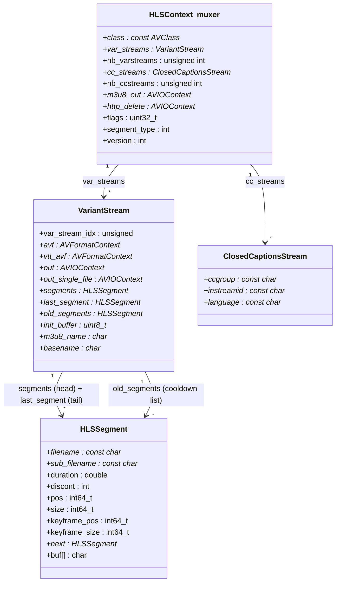

# Data Model — Full Struct and Enum Dictionary

> **Commit Anchor:** All source references in this document are anchored to commit `566ad786` (full hash `566ad7869ee3c8b6993e1f880e0a50eae18c66ac`). Line numbers cited as `[<path>:L<start>-L<end>]` are valid at this commit. See [`../README.md`](../README.md) for the documentation-set-wide commit-anchor convention and citation format.

---

## Overview

This document is the **canonical struct, enum, and constant dictionary** for the FFmpeg HLS pipeline. Every Layer 2 and Layer 3 document in this set (`codec-logic.md`, `process-flows.md`, `pipeline-orchestration.md`, `integration-interfaces.md`, `../api-contracts/functional-invariants.md`, `../api-contracts/data-contracts.md`, `../api-contracts/timing-dependencies.md`, `../api-contracts/integration-contracts.md`) references field definitions from this file rather than re-stating them inline. Readers consulting an unfamiliar struct field encountered in another document are expected to land here for the authoritative definition.

In plain language, the HLS muxer and demuxer carry a small number of large structs that together hold all of their per-instance state: the muxer's `HLSContext` holds the option values, the variant-stream array, the encryption state, and the global counters; each `VariantStream` holds one bitrate variant's child format context, its segment linked-list, and its filename templates; each `HLSSegment` is a single segment node in that linked-list. The demuxer mirrors the same shape with its own `HLSContext`, `playlist`, `segment`, `variant`, and `rendition` structs. A handful of small structs (`ClosedCaptionsStream`, `HLSCryptoContext`, `HLSAudioSetupInfo`) and several enums and constants round out the type universe.

The format of this dictionary is strict: **one table per struct or enum, one row per field — no grouping, no "and similar", no "see above"**, per the no-summarizing rule in `[../README.md]`'s citation discipline (AAP §0.10.9). C types are reproduced verbatim from source (no normalization of `int`/`int32_t` or `char *`/`const char *`). Each row carries either an inline source citation of the form `[<path>:L<n>]` or, in rare cases where a field's purpose is reasonably inferred from surrounding code rather than directly stated, the tag `[inferred — no direct source]`.

### Structs and Enums Covered

The following types are documented in this file, in the order they appear:

- Muxer-side structs: `HLSContext`, `VariantStream`, `HLSSegment`, `ClosedCaptionsStream`
- Demuxer-side structs: `HLSContext` (demuxer), `playlist`, `segment`, `variant`, `rendition`
- Sample-encryption structs: `HLSCryptoContext`, `HLSAudioSetupInfo`
- Enums: `HLSFlags`, `SegmentType`, `StartSequenceSourceType`, `CodecAttributeStatus`, `PlaylistType` (muxer-side), `PlaylistType` (demuxer-side), `KeyType` (demuxer)
- Constants: muxer (`KEYSIZE`, `LINE_BUFFER_SIZE`, `HLS_MICROSECOND_UNIT`, `BUFSIZE`, `POSTFIX_PATTERN`); sample-encryption (`HLS_MAX_ID3_TAGS_DATA_LEN`, `HLS_MAX_AUDIO_SETUP_DATA_LEN`); demuxer (`MPEG_TIME_BASE`, `MPEG_TIME_BASE_Q`, `INITIAL_BUFFER_SIZE`, `MAX_FIELD_LEN`, `MAX_CHARACTERISTICS_LEN`); MPEG-TS HLS Sample-Encryption stream-type values (`STREAM_TYPE_HLS_SE_*`)
- Referenced public FFmpeg fields: `AVFormatContext`, `AVStream`, `AVOutputFormat`, `AVOption`, `AVDictionary` (only the fields actually read or written by the HLS pipeline)
- One optional ownership diagram (`classDiagram`) showing the relationship `HLSContext` → `VariantStream` → `HLSSegment` plus `ClosedCaptionsStream`

The dictionary is exhaustive within the in-scope source surface. Fields that exist on referenced public FFmpeg structs but are **not touched** by HLS code are not enumerated here — they belong to the broader FFmpeg API documentation (Doxygen output) and are out of scope for this set.

---

## Struct — `HLSContext` (Muxer)

**Plain-language summary.** `HLSContext` is the per-muxer-instance private state. The HLS muxer allocates one `HLSContext` per `AVFormatContext` and stores it via `priv_data`. It holds every `AVOption` value (because the option offsets in the `options[]` array at `[libavformat/hlsenc.c:L3121-L3181]` resolve into `HLSContext` field offsets via the `offsetof(HLSContext, x)` macro), the dynamic array of `VariantStream` instances, the closed-captions stream descriptors, the encryption state shared across all variants, and several cross-variant counters and AVIOContext handles. When a porter or refactorer talks about "the HLS muxer's state", this is the struct they mean.

The struct is defined at `[libavformat/hlsenc.c:L202-L267]`.

| Field | C Type | Purpose | Source Citation |
|---|---|---|---|
| `class` | `const AVClass *` | AVOptions binding — points to `hls_class` defined at `[libavformat/hlsenc.c:L3183-L3188]` so that the FFmpeg option-parsing layer can locate option metadata for this private struct. | `[libavformat/hlsenc.c:L203]` |
| `start_sequence` | `int64_t` | Initial value of `EXT-X-MEDIA-SEQUENCE` for newly created playlists; settable via the `hls_start_number_source` mode and the `start_number` AVOption. | `[libavformat/hlsenc.c:L204]` |
| `start_sequence_source_type` | `uint32_t` | One of the `StartSequenceSourceType` enum values; selects how `start_sequence` is derived (literal number, seconds-since-epoch, formatted datetime, or microseconds-since-epoch). Settable via the `hls_start_number_source` AVOption. | `[libavformat/hlsenc.c:L205]` |
| `time` | `int64_t` | Target segment duration; `hls_time` AVOption. Stored in `AV_TIME_BASE` units (microseconds). Default is set by the AVOption table at `[libavformat/hlsenc.c:L3121-L3181]`. | `[libavformat/hlsenc.c:L207]` |
| `init_time` | `int64_t` | Initial target segment duration for the first few segments; `hls_init_time` AVOption. When non-zero, applies to segments before `init_list_dur` is reached. Stored in `AV_TIME_BASE` units. | `[libavformat/hlsenc.c:L208]` |
| `max_nb_segments` | `int` | Maximum number of segments retained in a live playlist before old segments age out; `hls_list_size` AVOption. A value of `0` disables sliding-window behavior (segments accumulate indefinitely). | `[libavformat/hlsenc.c:L209]` |
| `hls_delete_threshold` | `int` | When `HLS_DELETE_SEGMENTS` is set, retain this many extra old segments on disk past `max_nb_segments` before unlinking. Surfaced via the `hls_delete_threshold` AVOption. | `[libavformat/hlsenc.c:L210]` |
| `flags` | `uint32_t` | Bitfield of `HLSFlags` (`HLS_SINGLE_FILE`, `HLS_DELETE_SEGMENTS`, `HLS_ROUND_DURATIONS`, etc.). Set via the `hls_flags` AVOption which accepts comma-separated flag names. | `[libavformat/hlsenc.c:L211]` |
| `pl_type` | `uint32_t` | One of the `PlaylistType` enum values (`PLAYLIST_TYPE_NONE`, `_EVENT`, `_VOD`) — drives `EXT-X-PLAYLIST-TYPE` emission. Set via the `hls_playlist_type` AVOption. | `[libavformat/hlsenc.c:L212]` |
| `segment_filename` | `char *` | The `hls_segment_filename` AVOption — printf-style template for segment file paths, with `%d` / `%t` / `%s` and strftime expansions. | `[libavformat/hlsenc.c:L213]` |
| `fmp4_init_filename` | `char *` | The `hls_fmp4_init_filename` AVOption — name of the fMP4 initialization segment file (default `"init.mp4"`). Only meaningful when `segment_type == SEGMENT_TYPE_FMP4`. | `[libavformat/hlsenc.c:L214]` |
| `segment_type` | `int` | One of the `SegmentType` enum values (`SEGMENT_TYPE_MPEGTS` or `SEGMENT_TYPE_FMP4`). Drives whether the child mux is an MPEG-TS muxer or an fMP4 muxer. Set via the `hls_segment_type` AVOption. | `[libavformat/hlsenc.c:L215]` |
| `resend_init_file` | `int` | Boolean: when set, the fMP4 init segment is re-written to disk every time the master playlist is refreshed (useful for HTTP-fronted live origins). Surfaced as `hls_fmp4_init_resend`. | `[libavformat/hlsenc.c:L216]` |
| `use_localtime` | `int` | Boolean: when set, segment filenames are expanded with `strftime()` using the local clock at the time the segment is started. Surfaced as `use_localtime`. | `[libavformat/hlsenc.c:L218]` |
| `use_localtime_mkdir` | `int` | Boolean: when set together with `use_localtime`, the muxer issues `mkdir -p`-equivalent calls to create directory components implied by the strftime-expanded filename. Surfaced as `use_localtime_mkdir`. | `[libavformat/hlsenc.c:L219]` |
| `allowcache` | `int` | Tri-state: `-1` = AVOption unset (no `EXT-X-ALLOW-CACHE` emitted), `0` or `1` = explicit cache-allow flag in the playlist. Surfaced as `hls_allow_cache`. | `[libavformat/hlsenc.c:L220]` |
| `recording_time` | `int64_t` | Derived from `time * AV_TIME_BASE` and used as the segment-cut deadline inside the packet loop. Not a user-settable AVOption directly; computed from `time`. | `[libavformat/hlsenc.c:L221]` |
| `max_seg_size` | `int64_t` | Maximum byterange size per segment in byterange / single-file mode; `hls_segment_size` AVOption. When set, segments are cut by size as well as by time. | `[libavformat/hlsenc.c:L222]` |
| `baseurl` | `char *` | Optional URL prefix prepended to segment filenames inside the playlist; `hls_base_url` AVOption. Used when the playlist is published at a different URL hierarchy than the segments. | `[libavformat/hlsenc.c:L224]` |
| `vtt_format_options_str` | `char *` | Reserved for WebVTT child-muxer options expressed as a flat string (currently parsed into `vtt_format_options`). | `[libavformat/hlsenc.c:L225]` |
| `subtitle_filename` | `char *` | The `hls_subtitle_path` AVOption — base path for the WebVTT subtitle output. | `[libavformat/hlsenc.c:L226]` |
| `format_options` | `AVDictionary *` | The `hls_segment_options` AVOption (`AV_OPT_TYPE_DICT`) — key/value options forwarded to the sub-muxer (MPEG-TS or fMP4) via `av_dict_copy`. | `[libavformat/hlsenc.c:L227]` |
| `encrypt` | `int` | Boolean: when set, AES-128 encryption is enabled (a key is generated and an `EXT-X-KEY` line is emitted). Surfaced as `hls_enc`. | `[libavformat/hlsenc.c:L229]` |
| `key` | `char *` | The `hls_enc_key` AVOption — user-supplied AES-128 key as a 32-character hex string. When unset, a random key is generated. | `[libavformat/hlsenc.c:L230]` |
| `key_url` | `char *` | The `hls_enc_key_url` AVOption — URL that the playlist's `EXT-X-KEY` line advertises for the key. If unset, defaults to the key filename. | `[libavformat/hlsenc.c:L231]` |
| `iv` | `char *` | The `hls_enc_iv` AVOption — user-supplied 32-character hex IV. When unset, the IV is derived from the start sequence number. | `[libavformat/hlsenc.c:L232]` |
| `key_basename` | `char *` | Internal basename used when auto-generating `<basename>.key` files for the AES-128 mode (when no `hls_key_info_file` is supplied). | `[libavformat/hlsenc.c:L233]` |
| `encrypt_started` | `int` | Non-zero once the first segment of a key period has been written. Latches per-key-period to prevent re-emitting the `EXT-X-KEY` line. | `[libavformat/hlsenc.c:L234]` |
| `key_info_file` | `char *` | The `hls_key_info_file` AVOption — path to a 3-line text file containing the key URI, the local key path, and an optional IV. | `[libavformat/hlsenc.c:L236]` |
| `key_file` | `char[LINE_BUFFER_SIZE + 1]` | Buffer that holds the second line of `hls_key_info_file` (the local key file path). | `[libavformat/hlsenc.c:L237]` |
| `key_uri` | `char[LINE_BUFFER_SIZE + 1]` | Buffer that holds the first line of `hls_key_info_file` (the key URI as advertised in `EXT-X-KEY`). | `[libavformat/hlsenc.c:L238]` |
| `key_string` | `char[KEYSIZE*2 + 1]` | Hex-encoded current AES-128 key (32 characters + NUL). Populated either from `key`, from the file referenced by `hls_key_info_file`, or from a random source. | `[libavformat/hlsenc.c:L239]` |
| `iv_string` | `char[KEYSIZE*2 + 1]` | Hex-encoded current AES-128 IV (32 characters + NUL). | `[libavformat/hlsenc.c:L240]` |
| `vtt_format_options` | `AVDictionary *` | Parsed form of `vtt_format_options_str`, forwarded to the WebVTT child muxer. | `[libavformat/hlsenc.c:L241]` |
| `method` | `char *` | The `method` AVOption — HTTP method override for segment and playlist writes. Default behavior is `PUT` when not set; see `set_http_options` at `[libavformat/hlsenc.c]`. | `[libavformat/hlsenc.c:L243]` |
| `user_agent` | `char *` | The `user_agent` AVOption — HTTP User-Agent header override for HTTP-based output. | `[libavformat/hlsenc.c:L244]` |
| `var_streams` | `VariantStream *` | Dynamically allocated array of variant streams; length is `nb_varstreams`. Index `i` corresponds to the `i`th `v:` entry in `var_stream_map`. | `[libavformat/hlsenc.c:L246]` |
| `nb_varstreams` | `unsigned int` | Length of `var_streams`. Defaults to 1 (single anonymous variant) when no `var_stream_map` is supplied. | `[libavformat/hlsenc.c:L247]` |
| `cc_streams` | `ClosedCaptionsStream *` | Dynamically allocated array of closed-captions stream descriptors; length is `nb_ccstreams`. Each entry produces one `#EXT-X-MEDIA:TYPE=CLOSED-CAPTIONS` line in the master playlist. | `[libavformat/hlsenc.c:L248]` |
| `nb_ccstreams` | `unsigned int` | Length of `cc_streams`. | `[libavformat/hlsenc.c:L249]` |
| `master_m3u8_created` | `int` | Latching flag — non-zero once the master playlist has been written for the first time. Prevents duplicate creation across `hls_window` invocations. | `[libavformat/hlsenc.c:L251]` |
| `master_m3u8_url` | `char *` | Full URL of the master playlist (derived from the muxer's primary output URL and `master_pl_name`). | `[libavformat/hlsenc.c:L252]` |
| `version` | `int` | Internal state holding the negotiated `EXT-X-VERSION` value for the playlist. Not exposed as a user-facing AVOption. The value is established during `hls_window` from feature usage: initialized to 2 at `[libavformat/hlsenc.c:L1551]` and conditionally bumped to 3, 4, 6, or 7 at `[libavformat/hlsenc.c:L1551-L1571]` based on `HLS_ROUND_DURATIONS`, byterange mode, `HLS_I_FRAMES_ONLY`, `HLS_INDEPENDENT_SEGMENTS`, and `SEGMENT_TYPE_FMP4`. The chosen value is then written into the playlist by `ff_hls_write_playlist_version` at `[libavformat/hlsenc.c:L1396]`. | `[libavformat/hlsenc.c:L253]` |
| `var_stream_map` | `char *` | The `var_stream_map` AVOption — user-supplied space-separated list of `v:N a:N` mappings that group input streams into variants. | `[libavformat/hlsenc.c:L254]` |
| `cc_stream_map` | `char *` | The `cc_stream_map` AVOption — user-supplied closed-captions group definitions. | `[libavformat/hlsenc.c:L255]` |
| `master_pl_name` | `char *` | The `master_pl_name` AVOption — filename for the master playlist (e.g., `"master.m3u8"`). When unset, no master playlist is written. | `[libavformat/hlsenc.c:L256]` |
| `master_publish_rate` | `unsigned int` | The `master_pl_publish_rate` AVOption — re-publish cadence for the master playlist, expressed as "publish every N segments". | `[libavformat/hlsenc.c:L257]` |
| `http_persistent` | `int` | Boolean: when set, persistent HTTP connections (HTTP keepalive) are reused across segment and playlist writes via `ff_http_do_new_request`. Surfaced as `http_persistent`. | `[libavformat/hlsenc.c:L258]` |
| `m3u8_out` | `AVIOContext *` | Persistent AVIOContext used to write the per-variant media playlist when `http_persistent` is enabled. | `[libavformat/hlsenc.c:L259]` |
| `sub_m3u8_out` | `AVIOContext *` | Persistent AVIOContext used to write the WebVTT subtitle playlist when `http_persistent` is enabled. | `[libavformat/hlsenc.c:L260]` |
| `http_delete` | `AVIOContext *` | Persistent AVIOContext used to issue HTTP `DELETE` requests when `hls_flags=delete_segments` is enabled (live sliding-window mode). Allocated lazily on first delete. | `[libavformat/hlsenc.c:L261]` |
| `timeout` | `int64_t` | The `timeout` AVOption — HTTP / I/O timeout for all child operations. | `[libavformat/hlsenc.c:L262]` |
| `ignore_io_errors` | `int` | Boolean: when set, `AVERROR(*)` from segment or playlist I/O is suppressed (treated as a non-fatal warning); the muxer continues running. Surfaced as `ignore_io_errors`. | `[libavformat/hlsenc.c:L263]` |
| `headers` | `char *` | The `headers` AVOption — additional HTTP request headers (newline-delimited) sent on segment and playlist requests. | `[libavformat/hlsenc.c:L264]` |
| `has_default_key` | `int` | Internal flag: at least one entry in `var_stream_map` carried a `DEFAULT=YES` modifier (controls `EXT-X-MEDIA:DEFAULT=YES` emission). | `[libavformat/hlsenc.c:L265]` |
| `has_video_m3u8` | `int` | Internal flag: at least one variant carries a video stream and therefore receives a dedicated media playlist. Drives `EXT-X-INDEPENDENT-SEGMENTS` eligibility. | `[libavformat/hlsenc.c:L266]` |

---

## Struct — `VariantStream`

**Plain-language summary.** A `VariantStream` represents one bitrate/resolution variant of the HLS output. From the HLS spec's perspective, it is one `#EXT-X-STREAM-INF` entry in the master playlist plus the entire media playlist file that entry points to. From the muxer's perspective, it is the per-variant state: the child format context that actually does the MPEG-TS or fMP4 muxing, the per-variant AVIOContext, the segment linked-list, the filename templates, the per-variant encryption buffers, and the per-variant accumulators that feed the next playlist refresh. The muxer holds an array of these in `HLSContext::var_streams`; the array length is `HLSContext::nb_varstreams`.

The single most important field for any porter is `avf`: the HLS muxer is a **meta-muxer** — it doesn't write MPEG-TS or fMP4 bytes itself; instead, each `VariantStream::avf` is a fully-allocated `AVFormatContext` whose `oformat` is `ff_mpegts_muxer` or the fMP4 variant of `ff_mp4_muxer`. Packets that arrive at `hls_write_packet` are routed into the child mux via `av_write_frame(vs->avf, pkt)`, and the child mux's AVIOContext writes into a buffer that the HLS muxer then flushes into a segment file.

The struct is defined at `[libavformat/hlsenc.c:L120-L194]`.

| Field | C Type | Purpose | Source Citation |
|---|---|---|---|
| `var_stream_idx` | `unsigned` | Index of this variant within `HLSContext::var_streams`. Used to identify the variant when emitting per-variant log lines and when assigning segment files to a variant. | `[libavformat/hlsenc.c:L121]` |
| `number` | `unsigned` | Per-variant segment counter, incremented every time a new segment file is opened. Used in `POSTFIX_PATTERN` (`"_%d"`) filename expansion. | `[libavformat/hlsenc.c:L122]` |
| `sequence` | `int64_t` | Current `EXT-X-MEDIA-SEQUENCE` value for this variant's playlist. Initialized from `HLSContext::start_sequence` and advanced as old segments age out of the sliding window. | `[libavformat/hlsenc.c:L123]` |
| `oformat` | `const AVOutputFormat *` | Output format used by the child mux (`vs->avf`). Resolved at `hls_init` time based on `HLSContext::segment_type` — either `ff_mpegts_muxer` for MPEG-TS or the fMP4-capable form of `ff_mp4_muxer`. | `[libavformat/hlsenc.c:L124]` |
| `vtt_oformat` | `const AVOutputFormat *` | Output format used by the WebVTT child mux (`vs->vtt_avf`) when this variant carries a subtitle track. | `[libavformat/hlsenc.c:L125]` |
| `out` | `AVIOContext *` | Per-segment write context. Allocated when a new segment file is opened in `hls_start` and freed in the segment-finalization sequence inside `hls_write_packet`. | `[libavformat/hlsenc.c:L126]` |
| `out_single_file` | `AVIOContext *` | Single-file write context used when `HLS_SINGLE_FILE` is set — the entire variant is written to one file, with playlist entries pointing to byteranges inside it. | `[libavformat/hlsenc.c:L127]` |
| `packets_written` | `int` | Counter for packets written to the current segment. Used to gate "have we seen any packets yet?" decisions during segment lifecycle. | `[libavformat/hlsenc.c:L128]` |
| `init_range_length` | `int` | Byte length of the fMP4 initialization segment (the `init.mp4` file's MOOV box). Used to populate the `EXT-X-MAP` BYTERANGE attribute when single-file fMP4 mode is active. | `[libavformat/hlsenc.c:L129]` |
| `temp_buffer` | `uint8_t *` | Scratch buffer used to capture the child mux's output before it is written to disk (when buffering is required, e.g., for atomic temp-file rename). | `[libavformat/hlsenc.c:L130]` |
| `init_buffer` | `uint8_t *` | Buffer that holds the fMP4 MOOV box captured from the child mux when initializing fMP4 mode; later written as the init segment. | `[libavformat/hlsenc.c:L131]` |
| `avf` | `AVFormatContext *` | The child mux's `AVFormatContext`. This is the meta-muxer linkage: packets received by the HLS muxer are forwarded via `av_write_frame(vs->avf, pkt)` to the child mux, which actually writes MPEG-TS or fMP4 bytes. | `[libavformat/hlsenc.c:L133]` |
| `vtt_avf` | `AVFormatContext *` | The WebVTT child mux's `AVFormatContext`, used when this variant carries a subtitle track. | `[libavformat/hlsenc.c:L134]` |
| `has_video` | `int` | Set to non-zero when at least one of this variant's streams has `AVMEDIA_TYPE_VIDEO`. Controls `EXT-X-INDEPENDENT-SEGMENTS` emission and keyframe-aware segment cutting. | `[libavformat/hlsenc.c:L136]` |
| `has_subtitle` | `int` | Set to non-zero when at least one of this variant's streams has `AVMEDIA_TYPE_SUBTITLE`. Triggers `vtt_avf` initialization and `EXT-X-MEDIA:TYPE=SUBTITLES` emission. | `[libavformat/hlsenc.c:L137]` |
| `new_start` | `int` | Latch flag — set when a new segment begins; cleared once the first packet of that segment has been written. Used to defer per-segment bookkeeping until the first packet arrives. | `[libavformat/hlsenc.c:L138]` |
| `start_pts_from_audio` | `int` | Boolean: when the variant is audio-only or audio-leading, the segment start PTS is derived from the first audio packet rather than from video. | `[libavformat/hlsenc.c:L139]` |
| `dpp` | `double` | Duration-per-packet running average (in stream timebase units), used for forward-extrapolating the next packet's PTS during segment-cut decisions. | `[libavformat/hlsenc.c:L140]` |
| `start_pts` | `int64_t` | PTS of the first packet in the current segment (in the reference stream's timebase). | `[libavformat/hlsenc.c:L141]` |
| `end_pts` | `int64_t` | PTS at the end of the current segment (where the next segment is expected to start). | `[libavformat/hlsenc.c:L142]` |
| `video_lastpos` | `int64_t` | Byte position of the last seen video packet in the segment file — used for `EXT-X-BYTERANGE` and I-frame-only emission. | `[libavformat/hlsenc.c:L143]` |
| `video_keyframe_pos` | `int64_t` | Byte position of the last seen video keyframe in the segment file; used to emit per-keyframe byterange in `EXT-X-I-FRAMES-ONLY` playlists. | `[libavformat/hlsenc.c:L144]` |
| `video_keyframe_size` | `int64_t` | Byte size of the last seen video keyframe; paired with `video_keyframe_pos`. | `[libavformat/hlsenc.c:L145]` |
| `duration` | `double` | Computed duration of the current segment so far, in seconds. Used to drive the segment-cut decision and to populate `#EXTINF`. | `[libavformat/hlsenc.c:L146]` |
| `start_pos` | `int64_t` | Byte offset where the current segment starts in the single-file output (or `0` for multi-file mode). | `[libavformat/hlsenc.c:L147]` |
| `size` | `int64_t` | Byte size of the current segment (so far). | `[libavformat/hlsenc.c:L148]` |
| `nb_entries` | `int` | Number of segment entries currently in this variant's playlist (length of the `segments` linked-list). Used to compare against `HLSContext::max_nb_segments` for the sliding window. | `[libavformat/hlsenc.c:L149]` |
| `discontinuity_set` | `int` | Latch flag — set after the first `EXT-X-DISCONTINUITY` of this variant is emitted (used for the start-of-playlist case under `HLS_DISCONT_START`). | `[libavformat/hlsenc.c:L150]` |
| `discontinuity` | `int` | Boolean: when set, the next segment to be appended carries an `EXT-X-DISCONTINUITY` marker (mid-stream discontinuity propagation). | `[libavformat/hlsenc.c:L151]` |
| `reference_stream_index` | `int` | Index (within `vs->avf->streams`) of the stream whose timestamps are used as the "reference clock" for segment cuts — typically the first video stream when video is present, otherwise the first audio stream. | `[libavformat/hlsenc.c:L152]` |
| `total_size` | `int64_t` | Cumulative byte size across all segments produced so far for this variant. Used to compute average bitrate for `EXT-X-STREAM-INF:AVERAGE-BANDWIDTH`. | `[libavformat/hlsenc.c:L154]` |
| `total_duration` | `double` | Cumulative duration across all segments produced so far for this variant (seconds). | `[libavformat/hlsenc.c:L155]` |
| `avg_bitrate` | `int64_t` | Average bitrate of this variant (bytes-per-second × 8), computed from `total_size` and `total_duration`. Emitted as `AVERAGE-BANDWIDTH` in the master playlist. | `[libavformat/hlsenc.c:L156]` |
| `max_bitrate` | `int64_t` | Peak bitrate observed across all segments of this variant. Emitted as `BANDWIDTH` in the master playlist. | `[libavformat/hlsenc.c:L157]` |
| `segments` | `HLSSegment *` | Head of the doubly-tracked linked-list of live segment entries currently visible in the playlist. Tail is tracked separately in `last_segment`. | `[libavformat/hlsenc.c:L159]` |
| `last_segment` | `HLSSegment *` | Tail pointer of the live `segments` linked-list — appended to in `hls_append_segment`. | `[libavformat/hlsenc.c:L160]` |
| `old_segments` | `HLSSegment *` | Head of the cooldown linked-list — segments that have aged out of the playlist but are pending HTTP `DELETE` or `unlink()`. | `[libavformat/hlsenc.c:L161]` |
| `basename_tmp` | `char *` | Scratch buffer used to construct the temporary basename when computing per-variant filenames during `hls_init`. | `[libavformat/hlsenc.c:L163]` |
| `basename` | `char *` | Final basename for this variant's segment files (stripped of any extension; the muxer appends `POSTFIX_PATTERN` and the segment extension). | `[libavformat/hlsenc.c:L164]` |
| `vtt_basename` | `char *` | Basename for this variant's WebVTT subtitle segments. | `[libavformat/hlsenc.c:L165]` |
| `vtt_m3u8_name` | `char *` | Filename of this variant's WebVTT subtitle playlist (`*.m3u8`). | `[libavformat/hlsenc.c:L166]` |
| `m3u8_name` | `char *` | Filename of this variant's media playlist (`*.m3u8`). | `[libavformat/hlsenc.c:L167]` |
| `initial_prog_date_time` | `double` | Wall-clock time (Unix epoch seconds, fractional) corresponding to PTS=0 in this variant — used to emit `EXT-X-PROGRAM-DATE-TIME` for the first segment. | `[libavformat/hlsenc.c:L169]` |
| `current_segment_final_filename_fmt` | `char[MAX_URL_SIZE]` | Final-filename template used at segment-finalize time (after `HLS_TEMP_FILE` rename). Stored as a printf-format buffer with placeholders that resolve in the rename step. | `[libavformat/hlsenc.c:L170]` |
| `fmp4_init_filename` | `char *` | Filename of this variant's fMP4 init segment (typically `<basename>_init.mp4` or the `HLSContext::fmp4_init_filename` default). | `[libavformat/hlsenc.c:L172]` |
| `base_output_dirname` | `char *` | Directory portion (without trailing slash) where this variant's output is written. Computed once at `hls_init`. | `[libavformat/hlsenc.c:L173]` |
| `encrypt_started` | `int` | Per-variant equivalent of `HLSContext::encrypt_started` — non-zero once the first segment of the current key period has been written for this variant. | `[libavformat/hlsenc.c:L175]` |
| `key_file` | `char[LINE_BUFFER_SIZE + 1]` | Per-variant copy of the local key file path (mirrors `HLSContext::key_file`, sized for `LINE_BUFFER_SIZE` plus the NUL terminator). | `[libavformat/hlsenc.c:L177]` |
| `key_uri` | `char[LINE_BUFFER_SIZE + 1]` | Per-variant copy of the key URI advertised in `EXT-X-KEY`. | `[libavformat/hlsenc.c:L178]` |
| `key_string` | `char[KEYSIZE*2 + 1]` | Per-variant hex-encoded AES-128 key (32 chars + NUL). | `[libavformat/hlsenc.c:L179]` |
| `iv_string` | `char[KEYSIZE*2 + 1]` | Per-variant hex-encoded AES-128 IV (32 chars + NUL). | `[libavformat/hlsenc.c:L180]` |
| `streams` | `AVStream **` | Array of pointers into the parent `AVFormatContext::streams`, listing the streams that belong to this variant. Length is `nb_streams`. | `[libavformat/hlsenc.c:L182]` |
| `codec_attr` | `char[128]` | Pre-computed `CODECS=...` attribute string for this variant's `EXT-X-STREAM-INF` line. | `[libavformat/hlsenc.c:L183]` |
| `attr_status` | `CodecAttributeStatus` | Tracks whether `codec_attr` has been finalized and written. Values are `CODEC_ATTRIBUTE_WRITTEN` and `CODEC_ATTRIBUTE_WILL_NOT_BE_WRITTEN`. | `[libavformat/hlsenc.c:L184]` |
| `nb_streams` | `unsigned int` | Number of entries in `streams`. | `[libavformat/hlsenc.c:L185]` |
| `m3u8_created` | `int` | Latch flag — non-zero once this variant's media playlist has been written for the first time. | `[libavformat/hlsenc.c:L186]` |
| `is_default` | `int` | Boolean: set when the `var_stream_map` entry for this variant included `DEFAULT=YES`. Emitted as `DEFAULT=YES` in the master playlist's `EXT-X-MEDIA` entries. | `[libavformat/hlsenc.c:L187]` |
| `language` | `const char *` | Audio language code (BCP-47) for this variant — emitted as `LANGUAGE=...` in `EXT-X-MEDIA`. | `[libavformat/hlsenc.c:L188]` |
| `agroup` | `const char *` | Audio rendition group name for this variant — emitted as `GROUP-ID=...` in `EXT-X-MEDIA:TYPE=AUDIO` and referenced by `AUDIO=...` in `EXT-X-STREAM-INF`. | `[libavformat/hlsenc.c:L189]` |
| `sgroup` | `const char *` | Subtitle rendition group name — emitted as `GROUP-ID=...` in `EXT-X-MEDIA:TYPE=SUBTITLES` and referenced by `SUBTITLES=...` in `EXT-X-STREAM-INF`. | `[libavformat/hlsenc.c:L190]` |
| `ccgroup` | `const char *` | Closed-captions group name — referenced by `CLOSED-CAPTIONS=...` in `EXT-X-STREAM-INF`. | `[libavformat/hlsenc.c:L191]` |
| `varname` | `const char *` | Variant name as supplied by `var_stream_map` (the `name:` token). Used in filename templating when present. | `[libavformat/hlsenc.c:L192]` |
| `subtitle_varname` | `const char *` | Subtitle-specific variant name (the `sname:` token in `var_stream_map`). | `[libavformat/hlsenc.c:L193]` |

---

## Struct — `HLSSegment`

**Plain-language summary.** `HLSSegment` is a single segment node in the per-variant `segments` linked-list. Each entry corresponds to one `#EXTINF` line in the published media playlist and carries the filename, duration, byterange position/size (for `HLS_SINGLE_FILE` or `EXT-X-BYTERANGE` mode), the discontinuity flag, the I-frame metadata (for `EXT-X-I-FRAMES-ONLY` playlists), the per-segment key URI and IV (for `HLS_PERIODIC_REKEY`), and the wall-clock `EXT-X-PROGRAM-DATE-TIME` value when that mode is active.

The struct uses C's flexible-array-tail idiom: the `buf[]` declaration at the end means the struct is allocated with extra trailing storage that holds the actual bytes for the `filename`, `sub_filename`, and `key_uri` pointers (those `const char *` members point into the trailing buffer rather than into separately-allocated storage). Porters should preserve this allocation pattern — re-allocating `HLSSegment` as a fixed-size struct with separate string allocations would change the lifetime contract and break the `hls_append_segment` call site.

The struct is defined at `[libavformat/hlsenc.c:L76-L94]`.

| Field | C Type | Purpose | Source Citation |
|---|---|---|---|
| `filename` | `const char *` | Pointer into `buf[]` holding the segment file name as it should appear in the playlist (and as written on disk). | `[libavformat/hlsenc.c:L77]` |
| `sub_filename` | `const char *` | Pointer into `buf[]` holding the corresponding WebVTT subtitle segment filename, when this variant carries a subtitle track. | `[libavformat/hlsenc.c:L78]` |
| `duration` | `double` | Segment duration in seconds, used to populate the `#EXTINF` value. | `[libavformat/hlsenc.c:L79]` |
| `discont` | `int` | Non-zero when this segment is preceded by an `EXT-X-DISCONTINUITY` line in the playlist. | `[libavformat/hlsenc.c:L80]` |
| `pos` | `int64_t` | Byterange offset of this segment within its containing file. Meaningful only when `HLS_SINGLE_FILE` is set or when the segment is part of an fMP4 file with explicit byteranges. | `[libavformat/hlsenc.c:L81]` |
| `size` | `int64_t` | Byterange size of this segment in bytes. Emitted as `<size>@<offset>` in `EXT-X-BYTERANGE`. | `[libavformat/hlsenc.c:L82]` |
| `keyframe_pos` | `int64_t` | Byte offset of the segment's video keyframe within the segment file — used for `EXT-X-I-FRAMES-ONLY` byterange emission. | `[libavformat/hlsenc.c:L83]` |
| `keyframe_size` | `int64_t` | Byte size of the segment's video keyframe — paired with `keyframe_pos`. | `[libavformat/hlsenc.c:L84]` |
| `var_stream_idx` | `unsigned` | Index of the owning `VariantStream` within `HLSContext::var_streams`. Used during HTTP-DELETE bookkeeping to identify which variant a queued-for-deletion segment belongs to. | `[libavformat/hlsenc.c:L85]` |
| `key_uri` | `const char *` | Pointer into `buf[]` holding the segment-specific key URI (relevant when `HLS_PERIODIC_REKEY` is active and the key URI changes per-segment). NULL when the variant-level key URI applies. | `[libavformat/hlsenc.c:L87]` |
| `iv_string` | `char[KEYSIZE*2 + 1]` | Hex-encoded segment-specific IV (32 chars + NUL) when the segment carries its own IV. | `[libavformat/hlsenc.c:L88]` |
| `next` | `struct HLSSegment *` | Linked-list pointer to the next segment in the playlist (or in the `old_segments` cooldown list). | `[libavformat/hlsenc.c:L90]` |
| `discont_program_date_time` | `double` | Wall-clock value (Unix epoch fractional seconds) that should be emitted as `EXT-X-PROGRAM-DATE-TIME` for this segment when `HLS_PROGRAM_DATE_TIME` and a discontinuity coincide. Allows the date-time to be re-anchored across discontinuities. | `[libavformat/hlsenc.c:L91]` |
| `buf[]` | `char` (flexible array) | Trailing storage backing `filename`, `sub_filename`, and `key_uri`. The struct is allocated with `sizeof(HLSSegment) + <total string lengths + NULs>`; the flexible-array idiom yields one allocation per segment. | `[libavformat/hlsenc.c:L93]` |

---

## Struct — `ClosedCaptionsStream`

**Plain-language summary.** `ClosedCaptionsStream` is a small descriptor used only to emit `#EXT-X-MEDIA:TYPE=CLOSED-CAPTIONS:GROUP-ID=...:NAME=...:INSTREAM-ID=...:LANGUAGE=...` lines in the master playlist. There is no actual media payload associated with a closed-captions stream from the muxer's perspective — closed captions are transported in-band inside the H.264 SEI of the video stream (CEA-608/708); the master playlist entry merely tells the player that captions are available.

The muxer holds an array of these in `HLSContext::cc_streams`, populated from the `cc_stream_map` AVOption.

The struct is defined at `[libavformat/hlsenc.c:L196-L200]`.

| Field | C Type | Purpose | Source Citation |
|---|---|---|---|
| `ccgroup` | `const char *` | The `GROUP-ID` attribute value emitted in `EXT-X-MEDIA`. Used by `EXT-X-STREAM-INF` `CLOSED-CAPTIONS=...` to associate a variant with this group. | `[libavformat/hlsenc.c:L197]` |
| `instreamid` | `const char *` | The `INSTREAM-ID` attribute value (e.g., `"CC1"`, `"CC2"`, `"SERVICE1"` per the HLS spec / RFC 8216). Identifies which CEA-608/708 channel inside the video stream this entry refers to. | `[libavformat/hlsenc.c:L198]` |
| `language` | `const char *` | The `LANGUAGE` attribute value (BCP-47 language tag). | `[libavformat/hlsenc.c:L199]` |

---

## Struct — `HLSContext` (Demuxer)

**Plain-language summary.** The demuxer-side `HLSContext` holds the demuxer's private state: the list of variants discovered from the master playlist, the list of playlists currently being parsed, the list of alternate renditions, the current "play position" cursor, the AES-128 sample-encryption context for SAMPLE-AES streams, and the AVOptions that tune client behavior (extension allow-listing, max reload count, HTTP persistence, etc.).

The struct shares the type name `HLSContext` with the muxer's struct but is a distinct type — the two are defined in separate translation units (`libavformat/hls.c` and `libavformat/hlsenc.c`) and never interact. Throughout this document, the demuxer struct is referred to as `HLSContext` (Demuxer) when ambiguity could arise.

The struct is defined at `[libavformat/hls.c:L206-L236]`.

| Field | C Type | Purpose | Source Citation |
|---|---|---|---|
| `class` | `AVClass *` | AVOptions binding — points to the demuxer's `AVClass` so that option-parsing can locate option metadata. | `[libavformat/hls.c:L207]` |
| `ctx` | `AVFormatContext *` | Back-pointer to the parent `AVFormatContext`. Used to access I/O callbacks, the interrupt callback, and the public AVFormatContext fields (e.g., `nb_streams`). | `[libavformat/hls.c:L208]` |
| `n_variants` | `int` | Length of the `variants` array. | `[libavformat/hls.c:L209]` |
| `variants` | `struct variant **` | Dynamically allocated array of `variant *` — one entry per `EXT-X-STREAM-INF` in the master playlist (or one synthetic variant when the input is a media playlist with no master). | `[libavformat/hls.c:L210]` |
| `n_playlists` | `int` | Length of the `playlists` array. | `[libavformat/hls.c:L211]` |
| `playlists` | `struct playlist **` | Dynamically allocated array of all `playlist *` discovered — both the variant Media Playlists and any Alternative Rendition playlists. | `[libavformat/hls.c:L212]` |
| `n_renditions` | `int` | Length of the `renditions` array. | `[libavformat/hls.c:L213]` |
| `renditions` | `struct rendition **` | Dynamically allocated array of `rendition *` — one entry per `EXT-X-MEDIA` line in the master playlist. | `[libavformat/hls.c:L214]` |
| `cur_seq_no` | `int64_t` | Current sequence number cursor across the entire demuxer (used during seeking and live-stream startup to coordinate which segment each variant should be at). | `[libavformat/hls.c:L216]` |
| `m3u8_hold_counters` | `int` | Maximum number of consecutive m3u8 refreshes that may return no new segments before the demuxer gives up. Default `1000`; surfaced via the `m3u8_hold_counters` AVOption. | `[libavformat/hls.c:L217]` |
| `live_start_index` | `int` | Segment index to start at when consuming a live (non-finished) playlist. Negative values count from the end. Default `-3`; surfaced via the `live_start_index` AVOption. | `[libavformat/hls.c:L218]` |
| `prefer_x_start` | `int` | Boolean: when set, the demuxer honors `#EXT-X-START` from the playlist over `live_start_index`. Default `0`; surfaced via the `prefer_x_start` AVOption. | `[libavformat/hls.c:L219]` |
| `first_packet` | `int` | Latch flag — non-zero before the first packet is emitted to the caller; cleared after the first packet. Used to anchor the playback timeline. | `[libavformat/hls.c:L220]` |
| `first_timestamp` | `int64_t` | PTS of the first packet emitted (in `AV_TIME_BASE` units). Used as the offset for subsequent packet PTS normalization. | `[libavformat/hls.c:L221]` |
| `cur_timestamp` | `int64_t` | Current playback cursor timestamp (in `AV_TIME_BASE` units). Updated as packets are emitted. | `[libavformat/hls.c:L222]` |
| `interrupt_callback` | `AVIOInterruptCB *` | Pointer to the parent `AVFormatContext`'s interrupt callback. Propagated to child playlist/segment I/O so that interrupted reads can be cancelled. | `[libavformat/hls.c:L223]` |
| `avio_opts` | `AVDictionary *` | Options forwarded to every AVIOContext used by the demuxer (e.g., HTTP-specific timeouts, user-agent, headers). | `[libavformat/hls.c:L224]` |
| `seg_format_opts` | `AVDictionary *` | Options forwarded to every sub-format context opened to parse a segment's container (e.g., `mpegts` options). Surfaced via the `seg_format_options` AVOption. | `[libavformat/hls.c:L225]` |
| `allowed_extensions` | `char *` | Comma-separated list of allowed playlist-URL extensions. SSRF / file-scheme mitigation. Surfaced via the `allowed_extensions` AVOption. | `[libavformat/hls.c:L226]` |
| `allowed_segment_extensions` | `char *` | Comma-separated list of allowed segment-URL extensions. Mitigation for cross-protocol segment requests. Surfaced via the `allowed_segment_extensions` AVOption. | `[libavformat/hls.c:L227]` |
| `extension_picky` | `int` | Boolean: when set, all extensions referenced in the playlist must appear in `allowed_extensions` / `allowed_segment_extensions`. Default `1`; surfaced via the `extension_picky` AVOption. | `[libavformat/hls.c:L228]` |
| `max_reload` | `int` | Maximum number of times a playlist with insufficient entries will be re-fetched before the demuxer reports an error. Default `100`; surfaced via the `max_reload` AVOption. | `[libavformat/hls.c:L229]` |
| `http_persistent` | `int` | Boolean: when set, persistent HTTP connections are reused across segment fetches via the standard HTTP-persistence machinery. Default `1`; surfaced via the `http_persistent` AVOption. | `[libavformat/hls.c:L230]` |
| `http_multiple` | `int` | Tri-state: `-1` = auto-detect (HTTP/1.1 keepalive or HTTP/2), `0` = single connection, `1` = multiple parallel connections allowed. Default `-1`; surfaced via the `http_multiple` AVOption. | `[libavformat/hls.c:L231]` |
| `http_seekable` | `int` | Tri-state: `-1` = auto, `0` = use `Range:` requests disabled, `1` = enabled. Default `-1`; surfaced via the `http_seekable` AVOption. | `[libavformat/hls.c:L232]` |
| `seg_max_retry` | `int` | Maximum number of retries on a per-segment HTTP error before reporting failure. Default `0`; surfaced via the `seg_max_retry` AVOption. | `[libavformat/hls.c:L233]` |
| `playlist_pb` | `AVIOContext *` | Persistent AVIOContext used to fetch the master / variant playlists when `http_persistent` is set. | `[libavformat/hls.c:L234]` |
| `crypto_ctx` | `HLSCryptoContext` | Inline (not pointer) AES context used for SAMPLE-AES per-stream encryption. The AES handle inside the struct is allocated lazily when SAMPLE-AES content is detected. | `[libavformat/hls.c:L235]` |

---

## Struct — `playlist` (Demuxer)

**Plain-language summary.** `playlist` is per-variant demuxer state — one instance per variant Media Playlist (and one per Alternative Rendition playlist). It holds the playlist URL, the current AVIOContext for streamed segment reads, the sub-format context that parses segment payloads (MPEG-TS or fMP4), the array of segment descriptors parsed from the playlist text, the current segment cursor, the AES-128 full-segment key URI and key bytes, the EXT-X-MAP initialization section state, the ID3-timestamp tracking state for elementary-stream audio segments, the SAMPLE-AES audio setup info, the seek-pending state, and the rendition / init-section back-references.

The struct is defined at `[libavformat/hls.c:L102-L177]`.

| Field | C Type | Purpose | Source Citation |
|---|---|---|---|
| `url` | `char[MAX_URL_SIZE]` | Playlist URL — used to fetch the playlist and to resolve relative segment URLs. | `[libavformat/hls.c:L103]` |
| `pb` | `FFIOContext` | Inline `FFIOContext` (the internal extended form of `AVIOContext`) used as the public I/O channel for this playlist's emitted packets. | `[libavformat/hls.c:L104]` |
| `read_buffer` | `uint8_t *` | Backing buffer for `pb`'s read path — sized at `INITIAL_BUFFER_SIZE`. | `[libavformat/hls.c:L105]` |
| `input` | `AVIOContext *` | Current segment-read AVIOContext. Opened on demand when a new segment is requested. | `[libavformat/hls.c:L106]` |
| `input_read_done` | `int` | Latch flag — set when the current segment's bytes have been fully consumed. Triggers transition to the next segment. | `[libavformat/hls.c:L107]` |
| `input_next` | `AVIOContext *` | Next-segment AVIOContext, opened in advance when `http_multiple` is enabled. Reduces inter-segment latency by overlapping fetch with playback. | `[libavformat/hls.c:L108]` |
| `input_next_requested` | `int` | Latch flag — set when `input_next` has been opened. Prevents double-opening on the same segment boundary. | `[libavformat/hls.c:L109]` |
| `parent` | `AVFormatContext *` | Back-pointer to the parent (top-level) `AVFormatContext`. Used to forward log messages and to access shared dictionaries. | `[libavformat/hls.c:L110]` |
| `index` | `int` | Index of this playlist within `HLSContext::playlists`. | `[libavformat/hls.c:L111]` |
| `ctx` | `AVFormatContext *` | Sub-format context that parses this playlist's segment payloads — an `AVFormatContext` whose `iformat` is `ff_mpegts_demuxer` (for `.ts` segments) or the appropriate fMP4 demuxer. | `[libavformat/hls.c:L112]` |
| `pkt` | `AVPacket *` | Scratch `AVPacket` used to drain `ctx` between `av_read_frame` calls. | `[libavformat/hls.c:L113]` |
| `has_noheader_flag` | `int` | Boolean: set when the sub-format context has the `AVFMTCTX_NOHEADER` flag, meaning streams can appear dynamically. Used to coordinate stream registration with the parent context. | `[libavformat/hls.c:L114]` |
| `main_streams` | `AVStream **` | Array of pointers to the *parent* `AVFormatContext`'s `AVStream` entries that correspond to this playlist's substreams. Index `i` in `main_streams` aligns with index `i` in the sub-format context's `streams`. | `[libavformat/hls.c:L118]` |
| `n_main_streams` | `int` | Length of `main_streams`. | `[libavformat/hls.c:L119]` |
| `finished` | `int` | Boolean: set when the playlist text ended with `#EXT-X-ENDLIST` (i.e., a VOD playlist or a live stream that has ended). Drives the seek-availability flag and the reload-on-empty behavior. | `[libavformat/hls.c:L121]` |
| `type` | `enum PlaylistType` | One of `PLS_TYPE_UNSPECIFIED`, `PLS_TYPE_EVENT`, `PLS_TYPE_VOD` — drives demuxer behavior on `EXT-X-PLAYLIST-TYPE` content. | `[libavformat/hls.c:L122]` |
| `target_duration` | `int64_t` | Value parsed from `EXT-X-TARGETDURATION` (in `AV_TIME_BASE` units). Used to schedule playlist refresh in live mode and as a sanity cap on per-segment durations. | `[libavformat/hls.c:L123]` |
| `start_seq_no` | `int64_t` | First sequence number in the current playlist text (from `EXT-X-MEDIA-SEQUENCE`). | `[libavformat/hls.c:L124]` |
| `time_offset_flag` | `int` | Boolean: set when the playlist carried an `EXT-X-START:TIME-OFFSET=` attribute. Influenced by `prefer_x_start`. | `[libavformat/hls.c:L125]` |
| `start_time_offset` | `int64_t` | The `EXT-X-START:TIME-OFFSET` value when `time_offset_flag` is set (in `AV_TIME_BASE` units). | `[libavformat/hls.c:L126]` |
| `n_segments` | `int` | Length of the `segments` array. | `[libavformat/hls.c:L127]` |
| `segments` | `struct segment **` | Array of segment descriptors parsed from the playlist text. Each entry is one `#EXTINF`+URI pair. | `[libavformat/hls.c:L128]` |
| `needed` | `int` | Boolean: set when at least one consumer (in the parent context) needs packets from this playlist. Drives per-playlist activation. | `[libavformat/hls.c:L129]` |
| `broken` | `int` | Boolean: set when the playlist could not be parsed or its segments could not be opened. The demuxer continues with the remaining playlists. | `[libavformat/hls.c:L130]` |
| `cur_seq_no` | `int64_t` | Current sequence-number cursor for this playlist — index into `segments` (modulo `start_seq_no`). | `[libavformat/hls.c:L131]` |
| `last_seq_no` | `int64_t` | Last sequence number known to be available for this playlist. Updated on every playlist refresh. | `[libavformat/hls.c:L132]` |
| `m3u8_hold_counters` | `int` | Per-playlist counter that tracks consecutive empty refreshes; reaches `HLSContext::m3u8_hold_counters` to signal "give up". | `[libavformat/hls.c:L133]` |
| `cur_seg_offset` | `int64_t` | Byte offset within the current segment file at which the next read should happen. Supports mid-segment resumption after a network blip. | `[libavformat/hls.c:L134]` |
| `last_load_time` | `int64_t` | Wall-clock time (in `av_gettime`-relative units) of the last playlist fetch. Drives the `EXT-X-TARGETDURATION / 2` refresh cadence for live streams. | `[libavformat/hls.c:L135]` |
| `cur_init_section` | `struct segment *` | Pointer to the currently active `EXT-X-MAP` Media Initialization Section. Each segment carries its own `init_section` pointer; `cur_init_section` tracks the one currently loaded into `init_sec_buf`. | `[libavformat/hls.c:L138]` |
| `init_sec_buf` | `uint8_t *` | Buffer holding the currently loaded Media Initialization Section bytes (typically the fMP4 MOOV box). | `[libavformat/hls.c:L139]` |
| `init_sec_buf_size` | `unsigned int` | Allocated capacity of `init_sec_buf`. | `[libavformat/hls.c:L140]` |
| `init_sec_data_len` | `unsigned int` | Actual data length currently held in `init_sec_buf` (≤ `init_sec_buf_size`). | `[libavformat/hls.c:L141]` |
| `init_sec_buf_read_offset` | `unsigned int` | Read cursor within `init_sec_buf` — used when the sub-format context needs to re-read the init section between segments. | `[libavformat/hls.c:L142]` |
| `key_url` | `char[MAX_URL_SIZE]` | URL of the AES-128 full-segment key (parsed from `EXT-X-KEY:URI=...`). | `[libavformat/hls.c:L144]` |
| `key` | `uint8_t[16]` | Cached 16-byte AES-128 key bytes — fetched once from `key_url` and reused until the URL changes. | `[libavformat/hls.c:L145]` |
| `is_id3_timestamped` | `int` | Tri-state: `-1` = not yet determined, `0` = no ID3 timestamps, `1` = ID3 timestamps present. Detected on the first segment by scanning for an ID3v2 PRIV `com.apple.streaming.transportStreamTimestamp` frame. | `[libavformat/hls.c:L149]` |
| `id3_mpegts_timestamp` | `int64_t` | The 33-bit MPEG-TS-style PTS extracted from the ID3 PRIV frame (in `MPEG_TIME_BASE` units, i.e., 90 kHz). Used to anchor packet PTS for elementary-audio playlists. | `[libavformat/hls.c:L150]` |
| `id3_offset` | `int64_t` | Offset (in the stream's original timebase) by which packet PTS must be shifted to align with `id3_mpegts_timestamp`. | `[libavformat/hls.c:L151]` |
| `id3_buf` | `uint8_t *` | Scratch buffer used during ID3 tag parsing. | `[libavformat/hls.c:L152]` |
| `id3_buf_size` | `unsigned int` | Capacity of `id3_buf`. | `[libavformat/hls.c:L153]` |
| `id3_initial` | `AVDictionary *` | Key/value metadata parsed from the first segment's ID3v2 frames. Carried into the parent `AVFormatContext`'s metadata once the streams are resolved. | `[libavformat/hls.c:L154]` |
| `id3_found` | `int` | Latch flag — set once any ID3 frame has been parsed (i.e., the playlist's audio streams carry timed metadata). | `[libavformat/hls.c:L155]` |
| `id3_changed` | `int` | Boolean — set when the most recently parsed ID3 metadata differs from `id3_initial`. Triggers metadata-update events to the consumer. | `[libavformat/hls.c:L156]` |
| `id3_deferred_extra` | `ID3v2ExtraMeta *` | Linked list of ID3 frames that could not be promoted to the parent `AVFormatContext` yet because the sub-demuxer's streams were not registered. Drained when streams become available. | `[libavformat/hls.c:L157]` |
| `audio_setup_info` | `HLSAudioSetupInfo` | Inline SAMPLE-AES audio setup descriptor (codec_id, codec_tag, priming, version, setup_data). Populated when SAMPLE-AES audio is encountered. | `[libavformat/hls.c:L159]` |
| `seek_timestamp` | `int64_t` | Pending seek target timestamp (in stream timebase). Cleared once the seek is satisfied by a successful segment open. | `[libavformat/hls.c:L161]` |
| `seek_flags` | `int` | Flags accompanying the pending seek (e.g., `AVSEEK_FLAG_BACKWARD`, `AVSEEK_FLAG_ANY`). | `[libavformat/hls.c:L162]` |
| `seek_stream_index` | `int` | Index into the sub-format context's `streams` array that the pending seek targets. | `[libavformat/hls.c:L163]` |
| `n_renditions` | `int` | Length of `renditions`. | `[libavformat/hls.c:L169]` |
| `renditions` | `struct rendition **` | Renditions associated with this playlist — for alternative-rendition playlists, this is a single rendition; for a variant's main playlist, it may be multiple. | `[libavformat/hls.c:L170]` |
| `n_init_sections` | `int` | Length of `init_sections`. | `[libavformat/hls.c:L174]` |
| `init_sections` | `struct segment **` | Array of all Media Initialization Sections (`EXT-X-MAP`) ever referenced by this playlist. Each segment's `init_section` pointer points into this array. Allocated as needed. | `[libavformat/hls.c:L175]` |
| `is_subtitle` | `int` | Boolean: set when this playlist is for a subtitle alternative rendition (WebVTT). Drives subtitle-specific stream registration. | `[libavformat/hls.c:L176]` |

---

## Struct — `segment` (Demuxer)

**Plain-language summary.** Each `segment` is a single demuxer-side segment descriptor — one entry per `#EXTINF` line in the parsed M3U8. It holds the segment URL (which may be absolute, relative to the playlist, or a `data:` URI), the byterange offset and size (when `EXT-X-BYTERANGE` is present), the encryption key URL and IV (when `EXT-X-KEY` is in scope), the key type (`KEY_NONE`, `KEY_AES_128`, or `KEY_SAMPLE_AES`), and the back-pointer to the Media Initialization Section that this segment should be prefixed with (when `EXT-X-MAP` is in scope).

The struct is defined at `[libavformat/hls.c:L77-L87]`.

| Field | C Type | Purpose | Source Citation |
|---|---|---|---|
| `duration` | `int64_t` | Segment duration (in `AV_TIME_BASE` units) — parsed from the `#EXTINF` value. | `[libavformat/hls.c:L78]` |
| `url_offset` | `int64_t` | Byterange offset within the segment file — parsed from `EXT-X-BYTERANGE:<size>@<offset>`. Zero when no byterange is in scope. | `[libavformat/hls.c:L79]` |
| `size` | `int64_t` | Byterange size in bytes — parsed from `EXT-X-BYTERANGE`. `-1` (sentinel) when no byterange is in scope. | `[libavformat/hls.c:L80]` |
| `url` | `char *` | Segment URL — may be absolute, relative to the playlist, or contain a scheme (`http://`, `https://`, `file://`, `crypto:`, `data:`). | `[libavformat/hls.c:L81]` |
| `key` | `char *` | URL of the segment's encryption key. Inherited from the most recent `EXT-X-KEY:URI=...` in the playlist text; NULL when no encryption is active. | `[libavformat/hls.c:L82]` |
| `key_type` | `enum KeyType` | One of `KEY_NONE`, `KEY_AES_128`, `KEY_SAMPLE_AES`. Selects the decryption path. | `[libavformat/hls.c:L83]` |
| `iv` | `uint8_t[16]` | 16-byte AES-128 IV. Either parsed from the `IV=0x...` attribute of `EXT-X-KEY` or derived from the segment's sequence number when no explicit IV is present. | `[libavformat/hls.c:L84]` |
| `init_section` | `struct segment *` | Back-pointer to the associated Media Initialization Section (parsed from `EXT-X-MAP`). NULL when no init section is in scope. Note: an init section is itself represented as a `struct segment` with its own URL and byterange. | `[libavformat/hls.c:L86]` |

---

## Struct — `variant` (Demuxer)

**Plain-language summary.** Each `variant` represents one `#EXT-X-STREAM-INF` line in the master playlist. It carries the advertised bandwidth, the array of playlists that constitute this variant (typically just the main media playlist at index 0, with optional alternative-rendition playlists appended), and the three rendition-group attribute strings (`AUDIO`, `VIDEO`, `SUBTITLES`) that map this variant to its `EXT-X-MEDIA` companions.

The struct is defined at `[libavformat/hls.c:L194-L204]`.

| Field | C Type | Purpose | Source Citation |
|---|---|---|---|
| `bandwidth` | `int` | Bandwidth declared by `#EXT-X-STREAM-INF:BANDWIDTH=...` (bits per second). | `[libavformat/hls.c:L195]` |
| `n_playlists` | `int` | Length of `playlists`. Always at least 1 (the main media playlist). | `[libavformat/hls.c:L198]` |
| `playlists` | `struct playlist **` | Array of playlists associated with this variant. Index 0 is the main Media Playlist; subsequent entries are alternative-rendition playlists referenced via `AUDIO=`, `SUBTITLES=`, etc. | `[libavformat/hls.c:L199]` |
| `audio_group` | `char[MAX_FIELD_LEN]` | The `AUDIO=...` group-id from `#EXT-X-STREAM-INF`. References an `EXT-X-MEDIA:TYPE=AUDIO:GROUP-ID=...` rendition. | `[libavformat/hls.c:L201]` |
| `video_group` | `char[MAX_FIELD_LEN]` | The `VIDEO=...` group-id from `#EXT-X-STREAM-INF`. References an `EXT-X-MEDIA:TYPE=VIDEO:GROUP-ID=...` rendition. | `[libavformat/hls.c:L202]` |
| `subtitles_group` | `char[MAX_FIELD_LEN]` | The `SUBTITLES=...` group-id from `#EXT-X-STREAM-INF`. References an `EXT-X-MEDIA:TYPE=SUBTITLES:GROUP-ID=...` rendition. | `[libavformat/hls.c:L203]` |

---

## Struct — `rendition` (Demuxer)

**Plain-language summary.** Each `rendition` represents one `#EXT-X-MEDIA` line in the master playlist (an audio, video, subtitle, or closed-captions alternate track). It carries the media type, the back-pointer to the rendition's own playlist (when the rendition has an external playlist URL — typical for audio and subtitles), the group-id used to associate it with one or more variants, the language and human-readable name, and the disposition flags derived from `DEFAULT`, `AUTOSELECT`, `FORCED`, etc.

The struct is defined at `[libavformat/hls.c:L185-L192]`.

| Field | C Type | Purpose | Source Citation |
|---|---|---|---|
| `type` | `enum AVMediaType` | One of `AVMEDIA_TYPE_AUDIO`, `AVMEDIA_TYPE_VIDEO`, `AVMEDIA_TYPE_SUBTITLE` (closed captions are typically handled as in-band CEA-608/708 inside the video stream rather than via a separate rendition playlist). | `[libavformat/hls.c:L186]` |
| `playlist` | `struct playlist *` | Back-pointer to this rendition's playlist when it has its own external `URI=` (external rendition). NULL when the rendition's media is inlined in the variant's main playlist. | `[libavformat/hls.c:L187]` |
| `group_id` | `char[MAX_FIELD_LEN]` | The `GROUP-ID=...` value from `#EXT-X-MEDIA`. Variants reference this via `AUDIO=`, `VIDEO=`, `SUBTITLES=`. | `[libavformat/hls.c:L188]` |
| `language` | `char[MAX_FIELD_LEN]` | The `LANGUAGE=...` BCP-47 language tag. | `[libavformat/hls.c:L189]` |
| `name` | `char[MAX_FIELD_LEN]` | The `NAME=...` human-readable rendition name. | `[libavformat/hls.c:L190]` |
| `disposition` | `int` | Bitfield of `AV_DISPOSITION_*` flags — set from `DEFAULT=YES`, `AUTOSELECT=YES`, `FORCED=YES`, and `CHARACTERISTICS=...` attributes. | `[libavformat/hls.c:L191]` |

---

## Struct — `HLSCryptoContext`

**Plain-language summary.** `HLSCryptoContext` is the per-stream AES context used by the HLS demuxer's SAMPLE-AES path (`libavformat/hls_sample_encryption.c`). Unlike the full-segment AES-128 mode (where the entire segment file is encrypted in CBC mode), SAMPLE-AES encrypts individual samples (frames) inside the MPEG-TS payload in place, with stream-type values listed under `STREAM_TYPE_HLS_SE_*` (see below). Each demuxer-side stream that consumes SAMPLE-AES content holds its own `HLSCryptoContext`.

The struct is defined at `[libavformat/hls_sample_encryption.h:L43-L47]`.

| Field | C Type | Purpose | Source Citation |
|---|---|---|---|
| `aes_ctx` | `struct AVAES *` | Heap-allocated AES context returned by `av_aes_alloc` (`[libavutil/aes.h:L41]`). Initialized via `av_aes_init` (`[libavutil/aes.h:L51]`) once the key and direction (decrypt) are known. | `[libavformat/hls_sample_encryption.h:L44]` |
| `key` | `uint8_t[16]` | 16-byte AES-128 key bytes for SAMPLE-AES. Sourced from `EXT-X-KEY:METHOD=SAMPLE-AES:URI=...`. | `[libavformat/hls_sample_encryption.h:L45]` |
| `iv` | `uint8_t[16]` | 16-byte AES-128 IV used for SAMPLE-AES CBC operation on each encrypted sample. | `[libavformat/hls_sample_encryption.h:L46]` |

---

## Struct — `HLSAudioSetupInfo`

**Plain-language summary.** `HLSAudioSetupInfo` carries the audio-codec setup data delivered out-of-band for SAMPLE-AES audio streams. For AAC streams under SAMPLE-AES, the AudioSpecificConfig is delivered via this struct rather than inline in the bitstream; the codec, codec tag, decoder priming (samples to discard at the start), version, and the payload-length-prefixed setup data are exposed for the demuxer to install on the relevant `AVStream`.

The struct is defined at `[libavformat/hls_sample_encryption.h:L49-L56]`.

| Field | C Type | Purpose | Source Citation |
|---|---|---|---|
| `codec_id` | `enum AVCodecID` | Codec identifier of the SAMPLE-AES audio stream (e.g., `AV_CODEC_ID_AAC`, `AV_CODEC_ID_AC3`, `AV_CODEC_ID_EAC3`). | `[libavformat/hls_sample_encryption.h:L50]` |
| `codec_tag` | `uint32_t` | FourCC-style codec tag delivered alongside the codec_id for downstream consumers that key off `codec_tag`. | `[libavformat/hls_sample_encryption.h:L51]` |
| `priming` | `uint16_t` | Decoder priming sample count — the number of samples at the start of the decoded audio that should be discarded by the decoder before producing playable output. | `[libavformat/hls_sample_encryption.h:L52]` |
| `version` | `uint8_t` | Version field of the SAMPLE-AES audio setup data structure (for future-proofing the wire layout). | `[libavformat/hls_sample_encryption.h:L53]` |
| `setup_data_length` | `uint8_t` | Number of valid bytes in `setup_data` (at most `HLS_MAX_AUDIO_SETUP_DATA_LEN`). | `[libavformat/hls_sample_encryption.h:L54]` |
| `setup_data` | `uint8_t[HLS_MAX_AUDIO_SETUP_DATA_LEN + AV_INPUT_BUFFER_PADDING_SIZE]` | Codec setup payload (e.g., AAC `AudioSpecificConfig` bytes). Sized to `HLS_MAX_AUDIO_SETUP_DATA_LEN` plus the FFmpeg input-buffer padding requirement. | `[libavformat/hls_sample_encryption.h:L55]` |

---

## Enum — `HLSFlags`

**Plain-language summary.** `HLSFlags` is the bitfield enumerated for the `hls_flags` AVOption. Setting `hls_flags single_file+delete_segments+temp_file` causes the muxer to OR `HLS_SINGLE_FILE | HLS_DELETE_SEGMENTS | HLS_TEMP_FILE` into `HLSContext::flags`. The flags drive most non-default behavior of the muxer: byterange-mode output, sliding-window cleanup, integer-rounded durations, discontinuity emission, playlist trailer suppression, non-keyframe segment splitting, append-list resume, program-date-time emission, second-level filename templating, atomic temp-file rename, periodic key rotation, independent-segments emission, and I-frame-only playlists.

The enum has **fifteen** values (`HLS_SINGLE_FILE` through `HLS_I_FRAMES_ONLY`). The enum is defined at `[libavformat/hlsenc.c:L96-L113]`.

| Flag | Value | Meaning | Source Citation |
|---|---|---|---|
| `HLS_SINGLE_FILE` | `1 << 0` | Generate a single media file and use byteranges in the playlist (each `EXT-X-BYTERANGE` references a span of the same file). | `[libavformat/hlsenc.c:L98]` |
| `HLS_DELETE_SEGMENTS` | `1 << 1` | Delete old segments from disk (or via HTTP DELETE) once they age out of the playlist's `hls_list_size` window. | `[libavformat/hlsenc.c:L99]` |
| `HLS_ROUND_DURATIONS` | `1 << 2` | Round each segment's `#EXTINF` duration to an integer second value (legacy player compatibility). | `[libavformat/hlsenc.c:L100]` |
| `HLS_DISCONT_START` | `1 << 3` | Emit `EXT-X-DISCONTINUITY` immediately before the first segment of the playlist (sequence start). Used when resuming a stream with a known discontinuity. | `[libavformat/hlsenc.c:L101]` |
| `HLS_OMIT_ENDLIST` | `1 << 4` | Suppress `EXT-X-ENDLIST` at the end of the stream. Useful when external orchestration knows the stream will resume. | `[libavformat/hlsenc.c:L102]` |
| `HLS_SPLIT_BY_TIME` | `1 << 5` | Allow segment cuts on non-keyframe packet boundaries (default is keyframe-only). Cuts strictly on the time budget; produces non-spec-compliant streams unless decoder can resync without a keyframe. | `[libavformat/hlsenc.c:L103]` |
| `HLS_APPEND_LIST` | `1 << 6` | Resume from an existing M3U8 playlist (parses the existing file, continues from the next sequence number). Disables `init_time` per `[libavformat/hlsenc.c:L3104-L3105]`. | `[libavformat/hlsenc.c:L104]` |
| `HLS_PROGRAM_DATE_TIME` | `1 << 7` | Emit `EXT-X-PROGRAM-DATE-TIME` for each segment. The wall-clock anchor is taken at write_header time and advanced by accumulated segment duration. | `[libavformat/hlsenc.c:L105]` |
| `HLS_SECOND_LEVEL_SEGMENT_INDEX` | `1 << 8` | Include the segment index as a printf `%d` expansion in segment filenames when `use_localtime` is also set (e.g., `out-2023-01-15-%03d.ts`). | `[libavformat/hlsenc.c:L106]` |
| `HLS_SECOND_LEVEL_SEGMENT_DURATION` | `1 << 9` | Include the segment duration (microseconds) as a `%t` expansion in segment filenames when `use_localtime` is also set. | `[libavformat/hlsenc.c:L107]` |
| `HLS_SECOND_LEVEL_SEGMENT_SIZE` | `1 << 10` | Include the segment size (bytes) as a `%s` expansion in segment filenames when `use_localtime` is also set. | `[libavformat/hlsenc.c:L108]` |
| `HLS_TEMP_FILE` | `1 << 11` | Write each segment to a `<filename>.tmp` and rename to `<filename>` once complete (atomic publish). Prevents partial reads by HLS clients. | `[libavformat/hlsenc.c:L109]` |
| `HLS_PERIODIC_REKEY` | `1 << 12` | Re-read `hls_key_info_file` before each segment is written and rotate the key if the file's contents have changed. | `[libavformat/hlsenc.c:L110]` |
| `HLS_INDEPENDENT_SEGMENTS` | `1 << 13` | Emit `EXT-X-INDEPENDENT-SEGMENTS` in the playlist (and in the master playlist) when the variant carries video — declares that every segment starts with a self-contained keyframe. | `[libavformat/hlsenc.c:L111]` |
| `HLS_I_FRAMES_ONLY` | `1 << 14` | Produce an I-frame-only media playlist via `EXT-X-I-FRAMES-ONLY`, with `EXT-X-BYTERANGE` entries pointing at each keyframe. Forces `EXT-X-VERSION` to at least 4. | `[libavformat/hlsenc.c:L112]` |

---

## Enum — `SegmentType`

**Plain-language summary.** Selects the segment container format produced by the muxer. The choice cascades through the entire muxer: which child mux is allocated for `VariantStream::avf`, whether `EXT-X-MAP` is emitted, the minimum `EXT-X-VERSION` required, and whether the playlist references `.ts` or `.m4s` segments.

The enum is defined at `[libavformat/hlsenc.c:L115-L118]`.

| Value | Integer | Meaning | Source Citation |
|---|---|---|---|
| `SEGMENT_TYPE_MPEGTS` | `0` | MPEG-TS `.ts` segments. The child mux is `ff_mpegts_muxer`. No `EXT-X-MAP` is emitted. Minimum `EXT-X-VERSION` is `3` (or `4` when byterange mode is active). | `[libavformat/hlsenc.c:L116]` |
| `SEGMENT_TYPE_FMP4` | `1` | fMP4 (`.m4s`) segments with a separate `init.mp4` initialization segment referenced via `EXT-X-MAP`. The child mux is the fMP4 form of `ff_mp4_muxer`. Forces `EXT-X-VERSION` to at least `7`. | `[libavformat/hlsenc.c:L117]` |

---

## Enum — `StartSequenceSourceType`

**Plain-language summary.** Determines how `HLSContext::start_sequence` is derived. Set via the `hls_start_number_source` AVOption.

The enum is defined at `[libavformat/hlsenc.c:L57-L63]`.

| Value | Integer | Meaning | Source Citation |
|---|---|---|---|
| `HLS_START_SEQUENCE_AS_START_NUMBER` | `0` | `start_sequence` is the literal value passed via the `start_number` AVOption (the default). | `[libavformat/hlsenc.c:L58]` |
| `HLS_START_SEQUENCE_AS_SECONDS_SINCE_EPOCH` | `1` | `start_sequence` is computed as the current Unix epoch time in seconds, captured at `hls_init`. | `[libavformat/hlsenc.c:L59]` |
| `HLS_START_SEQUENCE_AS_FORMATTED_DATETIME` | `2` | `start_sequence` is encoded as a `YYYYMMDDhhmmss` integer (a date-time literal cast to an integer). Captured at `hls_init`. | `[libavformat/hlsenc.c:L60]` |
| `HLS_START_SEQUENCE_AS_MICROSECONDS_SINCE_EPOCH` | `3` | `start_sequence` is computed as the current Unix epoch time in microseconds (Unix-time × `HLS_MICROSECOND_UNIT`), captured at `hls_init`. | `[libavformat/hlsenc.c:L61]` |
| `HLS_START_SEQUENCE_LAST` | `4` (unused) | Sentinel — not a valid setting; reserved for bounds-checking the enum. | `[libavformat/hlsenc.c:L62]` |

---

## Enum — `CodecAttributeStatus`

**Plain-language summary.** Tracks whether a given `VariantStream`'s `codec_attr` string (the `CODECS=...` attribute of `EXT-X-STREAM-INF`) has been finalized for the master playlist. Used so that `hls_window` and the master-playlist publisher don't re-emit codec data unnecessarily.

The enum is defined at `[libavformat/hlsenc.c:L65-L68]`.

| Value | Integer | Meaning | Source Citation |
|---|---|---|---|
| `CODEC_ATTRIBUTE_WRITTEN` | `0` | The codec attribute string has been computed and written to `codec_attr`. The master playlist may emit it. | `[libavformat/hlsenc.c:L66]` |
| `CODEC_ATTRIBUTE_WILL_NOT_BE_WRITTEN` | `1` | The codec attribute string cannot be derived for this variant (e.g., a codec the muxer cannot describe in `RFC 6381` syntax). The master playlist will omit the `CODECS=` attribute. | `[libavformat/hlsenc.c:L67]` |

---

## Enum — `PlaylistType` (Muxer-Side)

**Plain-language summary.** Selects which `EXT-X-PLAYLIST-TYPE` value (if any) is emitted by the muxer in each media playlist. Settable via the `hls_playlist_type` AVOption. Note that the muxer's `PlaylistType` enum and the demuxer's `PlaylistType` enum are separate types — they coincide semantically but have different identifier prefixes (`PLAYLIST_TYPE_*` vs `PLS_TYPE_*`).

The enum is defined at `[libavformat/hlsplaylist.h:L31-L36]`.

| Value | Integer | Meaning | Source Citation |
|---|---|---|---|
| `PLAYLIST_TYPE_NONE` | `0` | No `EXT-X-PLAYLIST-TYPE` is emitted. Treated as a live/general playlist with no explicit type. | `[libavformat/hlsplaylist.h:L32]` |
| `PLAYLIST_TYPE_EVENT` | `1` | Emit `EXT-X-PLAYLIST-TYPE:EVENT`. Segments may only be appended; existing segments may not change or be removed. | `[libavformat/hlsplaylist.h:L33]` |
| `PLAYLIST_TYPE_VOD` | `2` | Emit `EXT-X-PLAYLIST-TYPE:VOD`. The full playlist is final; the muxer is expected to emit `EXT-X-ENDLIST` once complete. | `[libavformat/hlsplaylist.h:L34]` |
| `PLAYLIST_TYPE_NB` | `3` | Sentinel — number of valid values (used for bounds-checking the AVOption). | `[libavformat/hlsplaylist.h:L35]` |

---

## Enum — `PlaylistType` (Demuxer-Side)

**Plain-language summary.** Demuxer-side mirror of the muxer's `PlaylistType`, named with a different identifier prefix (`PLS_TYPE_*`). Populated by parsing `EXT-X-PLAYLIST-TYPE` from the input M3U8.

The enum is defined at `[libavformat/hls.c:L91-L95]`.

| Value | Integer | Meaning | Source Citation |
|---|---|---|---|
| `PLS_TYPE_UNSPECIFIED` | `0` | The playlist did not declare `EXT-X-PLAYLIST-TYPE`. | `[libavformat/hls.c:L92]` |
| `PLS_TYPE_EVENT` | `1` | The playlist declared `EXT-X-PLAYLIST-TYPE:EVENT`. | `[libavformat/hls.c:L93]` |
| `PLS_TYPE_VOD` | `2` | The playlist declared `EXT-X-PLAYLIST-TYPE:VOD`. The demuxer expects `EXT-X-ENDLIST` and may seek freely. | `[libavformat/hls.c:L94]` |

---

## Enum — `KeyType` (Demuxer)

**Plain-language summary.** Selects which decryption scheme applies to a demuxer-side segment. Parsed from the `METHOD=` attribute of `EXT-X-KEY`.

The enum is defined at `[libavformat/hls.c:L71-L75]`.

| Value | Integer | Meaning | Source Citation |
|---|---|---|---|
| `KEY_NONE` | `0` | No encryption. The segment is consumed as-is. | `[libavformat/hls.c:L72]` |
| `KEY_AES_128` | `1` | Full-segment AES-128 CBC encryption (`METHOD=AES-128`). The segment file is decrypted in one pass before being parsed by the sub-format context. | `[libavformat/hls.c:L73]` |
| `KEY_SAMPLE_AES` | `2` | Per-sample AES-128 encryption (`METHOD=SAMPLE-AES`). Decryption happens inside `libavformat/hls_sample_encryption.c` per-frame and depends on the codec's sample structure. | `[libavformat/hls.c:L74]` |

---

## Constants — Muxer

The muxer-side `#define` constants control buffer sizes, the AES-128 key length, and the segment filename pattern. They are not user-tunable — they are compile-time bindings.

| Constant | Value | Purpose | Source Citation |
|---|---|---|---|
| `KEYSIZE` | `16` | AES-128 key/IV byte length. Drives the size of `key_string` and `iv_string` buffers (`KEYSIZE*2 + 1` hex chars including the NUL). | `[libavformat/hlsenc.c:L70]` |
| `LINE_BUFFER_SIZE` | `MAX_URL_SIZE` | Maximum line length read from `hls_key_info_file` (the key URI, the key file path, and the optional IV are each at most `MAX_URL_SIZE` characters). Aliases `MAX_URL_SIZE` (defined in `libavformat/internal.h`). | `[libavformat/hlsenc.c:L71]` |
| `HLS_MICROSECOND_UNIT` | `1000000` | Microseconds-per-second multiplier used when `start_sequence_source_type == HLS_START_SEQUENCE_AS_MICROSECONDS_SINCE_EPOCH`. | `[libavformat/hlsenc.c:L72]` |
| `BUFSIZE` | `(16 * 1024)` | I/O buffer size (16 KiB) allocated for AVIOContext buffers used by the muxer's segment and playlist writers. | `[libavformat/hlsenc.c:L73]` |
| `POSTFIX_PATTERN` | `"_%d"` | Default segment filename suffix used when the user did not supply `hls_segment_filename` — appended to the variant's basename to form `<basename>_<N>.<ext>`. | `[libavformat/hlsenc.c:L74]` |

---

## Constants — HLS Sample Encryption

Compile-time bounds for the SAMPLE-AES sub-system.

| Constant | Value | Purpose | Source Citation |
|---|---|---|---|
| `HLS_MAX_ID3_TAGS_DATA_LEN` | `138` | Maximum total byte length of the ID3 tags emitted alongside SAMPLE-AES audio (per the Apple HLS Sample Encryption spec). Sized to fit the largest expected `TXXX` + `PRIV` payload. | `[libavformat/hls_sample_encryption.h:L40]` |
| `HLS_MAX_AUDIO_SETUP_DATA_LEN` | `10` | Maximum byte length of the codec setup payload (`HLSAudioSetupInfo::setup_data`) — chosen to fit typical AAC `AudioSpecificConfig` bytes. | `[libavformat/hls_sample_encryption.h:L41]` |

---

## Constants — Demuxer

Compile-time bounds and timebase constants used by the demuxer's parser and packet emitter.

| Constant | Value | Purpose | Source Citation |
|---|---|---|---|
| `INITIAL_BUFFER_SIZE` | `32768` | Initial allocation size (in bytes) for the AVIOContext read buffer wrapping segment-read I/O. May grow on demand. | `[libavformat/hls.c:L51]` |
| `MAX_FIELD_LEN` | `64` | Maximum length of attribute values parsed from M3U8 lines (e.g., the `GROUP-ID=...` value). Drives the `char[MAX_FIELD_LEN]` arrays in `variant` and `rendition`. | `[libavformat/hls.c:L53]` |
| `MAX_CHARACTERISTICS_LEN` | `512` | Maximum length of the `CHARACTERISTICS=...` attribute value (which may contain multiple comma-separated tokens, hence the larger budget). | `[libavformat/hls.c:L54]` |
| `MPEG_TIME_BASE` | `90000` | Hz for the MPEG-2 PTS clock — anchor for `id3_mpegts_timestamp` and any 33-bit MPEG-style PTS extracted from ID3 PRIV frames. | `[libavformat/hls.c:L56]` |
| `MPEG_TIME_BASE_Q` | `(AVRational){1, MPEG_TIME_BASE}` | `AVRational` time-base form of `MPEG_TIME_BASE` — used when calling `av_rescale_q` between MPEG-TS-style time and other timebases. | `[libavformat/hls.c:L57]` |

---

## Constants — MPEG-TS Stream Types Used by HLS

**Plain-language summary.** Apple's HLS Sample Encryption specification defines four MPEG-TS stream-type values that signal a SAMPLE-AES-encrypted elementary stream inside the Program Map Table (PMT). The HLS demuxer recognizes these stream-type values and routes their payloads through `libavformat/hls_sample_encryption.c` instead of the standard MPEG-TS PES parser.

These constants are not specific to FFmpeg's HLS code — they are general MPEG-TS stream-type values registered in `libavformat/mpegts.h`, but they originate from the Apple HLS Sample Encryption document, and they only carry meaning inside the HLS pipeline.

| Constant | Hex Value | Codec | Source Citation |
|---|---|---|---|
| `STREAM_TYPE_HLS_SE_VIDEO_H264` | `0xdb` | H.264 video, SAMPLE-AES encrypted. | `[libavformat/mpegts.h:L177]` |
| `STREAM_TYPE_HLS_SE_AUDIO_AAC` | `0xcf` | AAC audio, SAMPLE-AES encrypted. | `[libavformat/mpegts.h:L178]` |
| `STREAM_TYPE_HLS_SE_AUDIO_AC3` | `0xc1` | AC-3 audio, SAMPLE-AES encrypted. | `[libavformat/mpegts.h:L179]` |
| `STREAM_TYPE_HLS_SE_AUDIO_EAC3` | `0xc2` | E-AC-3 audio, SAMPLE-AES encrypted. | `[libavformat/mpegts.h:L180]` |

---

## Referenced `AVFormatContext` Fields

**Plain-language summary.** The HLS muxer's `HLSContext` is reached through `AVFormatContext::priv_data`; the muxer reads and writes a small set of public `AVFormatContext` fields during its lifecycle. The table below lists only the fields the HLS pipeline (muxer or demuxer) actually touches — it is **not** the full `AVFormatContext` field list. The full list is documented by the standard FFmpeg Doxygen output for `libavformat/avformat.h`.

The `AVFormatContext` struct is defined at `[libavformat/avformat.h:L1265-L1892]`.

| Field | C Type | Purpose (HLS use) | Source Citation |
|---|---|---|---|
| `av_class` | `const AVClass *` | AVOptions binding for the format context's AVOptions infrastructure. Used by the muxer/demuxer option-parsing path. | `[libavformat/avformat.h:L1270]` |
| `iformat` | `const struct AVInputFormat *` | Pointer to the input format (`ff_hls_demuxer` for the HLS demuxer). Set by `avformat_open_input`. | `[libavformat/avformat.h:L1277]` |
| `oformat` | `const struct AVOutputFormat *` | Pointer to the output format (`ff_hls_muxer` for the HLS muxer). Set by the caller before `avformat_write_header`. | `[libavformat/avformat.h:L1284]` |
| `priv_data` | `void *` | Points to the `HLSContext` (muxer or demuxer). Sized via `FFOutputFormat::priv_data_size` / `FFInputFormat::priv_data_size`. | `[libavformat/avformat.h:L1293]` |
| `pb` | `AVIOContext *` | Top-level I/O context. For the HLS muxer, this is the playlist-write channel (because `AVFMT_NOFILE` is set on the format, segments use separate AVIOContexts). For the HLS demuxer, this is the input-playlist read channel. | `[libavformat/avformat.h:L1307]` |
| `ctx_flags` | `int` | Combination of `AVFMTCTX_*` flags (e.g., `AVFMTCTX_NOHEADER`). Tested by the demuxer when promoting sub-format streams. | `[libavformat/avformat.h:L1314]` |
| `nb_streams` | `unsigned int` | Number of `AVStream` entries in `streams`. Read by the muxer to iterate the input streams; updated by the demuxer as it promotes sub-format streams. | `[libavformat/avformat.h:L1321]` |
| `streams` | `AVStream **` | Array of `AVStream *` pointers. The muxer reads (input streams configured by the caller); the demuxer writes (creates entries via `avformat_new_stream`). | `[libavformat/avformat.h:L1333]` |
| `url` | `char *` | Top-level output URL (muxer) or input URL (demuxer). Used to derive `base_output_dirname` and to resolve relative segment URLs. | `[libavformat/avformat.h:L1381]` |
| `interrupt_callback` | `AVIOInterruptCB` | Interrupt callback used by the demuxer to cancel in-flight playlist / segment reads (e.g., from a user-pressed Ctrl-C). Propagated into every child AVIOContext. | `[libavformat/avformat.h:L1535]` |
| `io_open` | `int (*)(struct AVFormatContext *s, AVIOContext **pb, const char *url, int flags, AVDictionary **options)` | I/O-open callback. The HLS muxer uses `hlsenc_io_open` which respects `http_persistent` and `ignore_io_errors`; the demuxer uses similar logic on the read side. | `[libavformat/avformat.h:L1866]` |
| `io_close2` | `int (*)(struct AVFormatContext *s, AVIOContext *pb)` | I/O-close callback that returns an error code (replaces the older void-returning `io_close`). Used by `hlsenc_io_close`. | `[libavformat/avformat.h:L1876]` |

---

## Referenced `AVStream` Fields

**Plain-language summary.** The HLS muxer reads `AVStream` fields supplied by the caller; the HLS demuxer creates `AVStream` entries via `avformat_new_stream` and populates the same fields from the parsed M3U8 plus the sub-format context.

The `AVStream` struct is defined at `[libavformat/avformat.h:L746-L890]`.

| Field | C Type | Purpose (HLS use) | Source Citation |
|---|---|---|---|
| `av_class` | `const AVClass *` | AVOptions binding for per-stream options. | `[libavformat/avformat.h:L750]` |
| `index` | `int` | Index of the stream within `AVFormatContext::streams`. Used by the muxer to identify streams in log messages and by the demuxer to track which sub-format stream maps to which main stream. | `[libavformat/avformat.h:L752]` |
| `id` | `int` | Format-specific stream ID. The muxer leaves it as set by the caller (or 0); the demuxer copies the sub-format stream's `id` to the main stream. | `[libavformat/avformat.h:L758]` |
| `codecpar` | `AVCodecParameters *` | Codec parameters (codec_id, codec_tag, dimensions, sample rate, channel layout, extradata, etc.). The muxer reads this to populate the `codec_attr` string and route packets; the demuxer copies it from the sub-format stream. | `[libavformat/avformat.h:L769]` |
| `time_base` | `AVRational` | Stream's timestamp time-base. The muxer reads this to compare PTS during segment-cut decisions; the demuxer sets it from the sub-format stream. | `[libavformat/avformat.h:L785]` |
| `start_time` | `int64_t` | PTS of the first frame. The demuxer sets it on first-packet emission for live anchoring. | `[libavformat/avformat.h:L795]` |
| `duration` | `int64_t` | Stream duration in `time_base` units. The demuxer fills it from accumulated segment durations once `EXT-X-ENDLIST` is seen. | `[libavformat/avformat.h:L805]` |
| `nb_frames` | `int64_t` | Number of frames in this stream (if known). Used by the demuxer when the underlying container provides this. | `[libavformat/avformat.h:L807]` |
| `disposition` | `int` | Bitfield of `AV_DISPOSITION_*` flags (e.g., `AV_DISPOSITION_DEFAULT`, `AV_DISPOSITION_FORCED`). The demuxer derives this from rendition attributes. | `[libavformat/avformat.h:L815]` |
| `metadata` | `AVDictionary *` | Key/value metadata for the stream. The demuxer populates this from ID3 frames (live audio) and from rendition attributes (`LANGUAGE`, `NAME`, etc.). | `[libavformat/avformat.h:L826]` |

---

## Referenced `AVOutputFormat` Fields

**Plain-language summary.** The HLS muxer's `FFOutputFormat ff_hls_muxer` is the muxer registration. `FFOutputFormat` is the internal extended form of the public `AVOutputFormat`, accessed via the `.p` member (`AVOutputFormat` is the public-API subset; `FFOutputFormat` adds internal callbacks and flags). The table below documents the values set on `ff_hls_muxer`.

The `AVOutputFormat` struct is defined at `[libavformat/avformat.h:L505-L535]`. The `FFOutputFormat` extension is internal (`libavformat/mux.h`) and is not part of the public ABI.

| Field | Value Assigned | Source Citation |
|---|---|---|
| `.p.name` | `"hls"` | `[libavformat/hlsenc.c:L3192]` |
| `.p.long_name` | `NULL_IF_CONFIG_SMALL("Apple HTTP Live Streaming")` | `[libavformat/hlsenc.c:L3193]` |
| `.p.extensions` | `"m3u8"` | `[libavformat/hlsenc.c:L3194]` |
| `.p.audio_codec` | `AV_CODEC_ID_AAC` | `[libavformat/hlsenc.c:L3195]` |
| `.p.video_codec` | `AV_CODEC_ID_H264` | `[libavformat/hlsenc.c:L3196]` |
| `.p.subtitle_codec` | `AV_CODEC_ID_WEBVTT` | `[libavformat/hlsenc.c:L3197]` |
| `.p.flags` | `AVFMT_NOFILE \| AVFMT_GLOBALHEADER \| AVFMT_NODIMENSIONS` | `[libavformat/hlsenc.c:L3198]` |
| `.p.priv_class` | `&hls_class` (the AVClass at `[libavformat/hlsenc.c:L3183]`) | `[libavformat/hlsenc.c:L3199]` |
| `.flags_internal` | `FF_OFMT_FLAG_ALLOW_FLUSH` | `[libavformat/hlsenc.c:L3200]` |
| `.priv_data_size` | `sizeof(HLSContext)` | `[libavformat/hlsenc.c:L3201]` |
| `.init` | `hls_init` | `[libavformat/hlsenc.c:L3202]` |
| `.write_header` | `hls_write_header` | `[libavformat/hlsenc.c:L3203]` |
| `.write_packet` | `hls_write_packet` | `[libavformat/hlsenc.c:L3204]` |
| `.write_trailer` | `hls_write_trailer` | `[libavformat/hlsenc.c:L3205]` |
| `.deinit` | `hls_deinit` | `[libavformat/hlsenc.c:L3206]` |

The HLS demuxer registers `FFInputFormat ff_hls_demuxer` symmetrically; its public-side `name` is `"hls"` and its read-callbacks are `hls_probe`, `hls_read_header`, `hls_read_packet`, `hls_close`, and `hls_read_seek`. The full demuxer-side `FFInputFormat` assignment is documented in `pipeline-orchestration.md` as part of the lifecycle narrative.

The base `AVOutputFormat` public-API fields read by FFmpeg-internal callers are defined as follows:

| Field | C Type | Source Citation |
|---|---|---|
| `name` | `const char *` | `[libavformat/avformat.h:L506]` |
| `long_name` | `const char *` | `[libavformat/avformat.h:L512]` |
| `mime_type` | `const char *` | `[libavformat/avformat.h:L513]` |
| `extensions` | `const char *` | `[libavformat/avformat.h:L514]` |
| `audio_codec` | `enum AVCodecID` | `[libavformat/avformat.h:L516]` |
| `video_codec` | `enum AVCodecID` | `[libavformat/avformat.h:L517]` |
| `subtitle_codec` | `enum AVCodecID` | `[libavformat/avformat.h:L518]` |
| `flags` | `int` | `[libavformat/avformat.h:L525]` |
| `codec_tag` | `const struct AVCodecTag * const *` | `[libavformat/avformat.h:L531]` |
| `priv_class` | `const AVClass *` | `[libavformat/avformat.h:L534]` |

---

## Referenced `AVOption` Fields (from `libavutil/opt.h`)

**Plain-language summary.** The HLS muxer's option table at `[libavformat/hlsenc.c:L3121-L3181]` is an array of `AVOption` structs. The fields of `AVOption` below are the ones used by the option array entries; the FFmpeg AVOptions infrastructure reads them when parsing command-line `-hls_*` flags and when the API caller sets options via `av_opt_set*` functions.

The `AVOption` struct is defined at `[libavutil/opt.h:L429-L480]`.

| Field | C Type | Purpose (HLS use) | Source Citation |
|---|---|---|---|
| `name` | `const char *` | Option name (e.g., `"hls_time"`, `"hls_segment_filename"`). Used as the lookup key by `av_opt_set` and as the displayed flag name in command-line parsing. | `[libavutil/opt.h:L430]` |
| `help` | `const char *` | Short English help text shown by `ffmpeg -h muxer=hls`. | `[libavutil/opt.h:L436]` |
| `offset` | `int` | Byte offset within `HLSContext` (or another struct) at which the option's value is stored. Resolved via `offsetof(HLSContext, x)` in the `OFFSET(x)` macro. | `[libavutil/opt.h:L444]` |
| `type` | `enum AVOptionType` | One of `AV_OPT_TYPE_INT`, `AV_OPT_TYPE_INT64`, `AV_OPT_TYPE_DOUBLE`, `AV_OPT_TYPE_STRING`, `AV_OPT_TYPE_DICT`, `AV_OPT_TYPE_FLAGS`, `AV_OPT_TYPE_CONST`, etc. Drives parsing and storage. | `[libavutil/opt.h:L445]` |
| `default_val` | `union { int64_t i64; double dbl; const char *str; AVRational q; const AVOptionArrayDef *arr; }` | Default value for the option. The union variant selected depends on `type`. | `[libavutil/opt.h:L451-L465]` |
| `min` | `double` | Minimum valid value (for numeric types). Inclusive bound. | `[libavutil/opt.h:L466]` |
| `max` | `double` | Maximum valid value (for numeric types). Inclusive bound. | `[libavutil/opt.h:L467]` |
| `flags` | `int` | Bitfield of `AV_OPT_FLAG_*` (e.g., `AV_OPT_FLAG_ENCODING_PARAM`). Drives visibility per encoder/decoder/muxer/demuxer context. | `[libavutil/opt.h:L472]` |
| `unit` | `const char *` | Logical "unit" string that groups related options and named constants. Non-NULL for `AV_OPT_TYPE_FLAGS` and for the named constants that follow flag options. | `[libavutil/opt.h:L479]` |

---

## Referenced `AVDictionary` Usage

**Plain-language summary.** `AVDictionary` is FFmpeg's standard key/value dictionary type, used by the HLS pipeline to (a) propagate the `hls_segment_options` AVOption (an `AV_OPT_TYPE_DICT`) to the sub-muxer when each segment is opened, (b) carry HTTP method / header / user-agent overrides into child AVIOContexts, and (c) carry `seg_format_opts` from the demuxer to its sub-format context.

`AVDictionary` is an opaque type — the public header `[libavutil/dict.h:L95]` declares only the forward-declared `typedef struct AVDictionary AVDictionary;`. The companion `AVDictionaryEntry` is the only struct with publicly visible fields.

The HLS code uses the standard `av_dict_set` / `av_dict_set_int` / `av_dict_get` / `av_dict_iterate` / `av_dict_copy` / `av_dict_free` API and does not define new fields on `AVDictionary`.

| Type | Field | C Type | Purpose | Source Citation |
|---|---|---|---|---|
| `AVDictionaryEntry` | `key` | `char *` | Key string. The HLS pipeline reads entry keys (e.g., `"method"`, `"user-agent"`, `"headers"`) when forwarding options to AVIOContext open calls. | `[libavutil/dict.h:L91]` |
| `AVDictionaryEntry` | `value` | `char *` | Value string paired with `key`. | `[libavutil/dict.h:L92]` |
| `AVDictionary` | (opaque) | `struct AVDictionary` | Opaque struct holding a sequence of `AVDictionaryEntry` records. The HLS pipeline holds pointers to `AVDictionary *` in `HLSContext::format_options`, `HLSContext::vtt_format_options` (muxer), and `HLSContext::avio_opts` / `HLSContext::seg_format_opts` (demuxer). | `[libavutil/dict.h:L95]` |

---

## Ownership Diagram

The diagram below visualizes the muxer-side ownership hierarchy from `HLSContext` (muxer) down to `HLSSegment`. The demuxer side mirrors this shape with `HLSContext` (demuxer) → `variant`/`rendition`/`playlist` → `segment` and is omitted here for brevity.

**Reading the diagram.** A single `HLSContext` (muxer) owns an array of `VariantStream` (length `nb_varstreams`) and an array of `ClosedCaptionsStream` (length `nb_ccstreams`). Each `VariantStream` owns three linked-lists of `HLSSegment` nodes: the live `segments` list (currently visible in the playlist), the `last_segment` tail pointer into that list, and the `old_segments` cooldown list (segments awaiting `unlink()` or HTTP `DELETE`). Each `VariantStream` also owns a child `AVFormatContext *avf` (and optionally `vtt_avf`) — the actual MPEG-TS or fMP4 muxer that writes segment bytes; the diagram does not visualize this pointer because `AVFormatContext` is outside this struct dictionary's scope.

---

## Cross-References

Field definitions documented above are referenced from the following sibling documents in the documentation set:

- [`codec-logic.md`](codec-logic.md) — for branch behaviors keyed off enum values (e.g., `SegmentType`, `HLSFlags`, `StartSequenceSourceType`, `KeyType`).
- [`process-flows.md`](process-flows.md) — for Mermaid flowcharts that animate the lifecycle of `VariantStream::out`, `VariantStream::avf`, `HLSSegment` linked-lists, and `HLSContext::http_delete`.
- [`pipeline-orchestration.md`](pipeline-orchestration.md) — for the lifecycle narrative covering `HLSContext` and `VariantStream` allocation/initialization/teardown (`hls_init` → `hls_write_header` → `hls_write_packet` → `hls_write_trailer` → `hls_deinit`).
- [`integration-interfaces.md`](integration-interfaces.md) — for the AVIOContext touchpoints (`out`, `out_single_file`, `m3u8_out`, `http_delete`) and their protocol-specific behavior.
- [`../api-contracts/data-contracts.md`](../api-contracts/data-contracts.md) — for the binary layout invariants on `HLSSegment`, `HLSCryptoContext`, and `HLSAudioSetupInfo`, plus the byterange-pair encoding (`pos`/`size`).
- [`../api-contracts/functional-invariants.md`](../api-contracts/functional-invariants.md) — for the conditional emission rules tied to `HLSFlags` values and to the `flags`/`pl_type`/`segment_type` fields of `HLSContext` (muxer).
- [`../api-contracts/timing-dependencies.md`](../api-contracts/timing-dependencies.md) — for the ordering constraints on `VariantStream::start_pts`/`end_pts`/`duration` updates relative to playlist publication.
- [`../api-contracts/integration-contracts.md`](../api-contracts/integration-contracts.md) — for the external-system contracts on `HLSCryptoContext` (AES key shape), `HLSAudioSetupInfo` (SAMPLE-AES wire format), and the `STREAM_TYPE_HLS_SE_*` MPEG-TS values.
