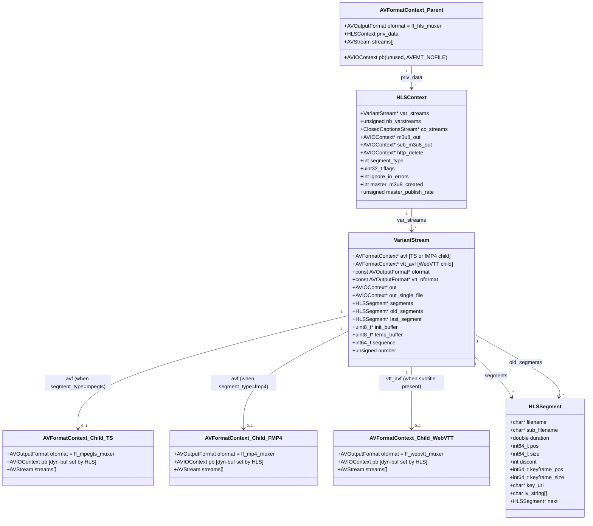

# Pipeline Orchestration — Lifecycle and Callback Chain

> **Commit Anchor:** All source references in this document are anchored to commit `566ad786` (full hash `566ad7869ee3c8b6993e1f880e0a50eae18c66ac`). Line numbers cited as `[<path>:L<start>-L<end>]` are valid at this commit. See [`../README.md`](../README.md) for the documentation-set-wide commit-anchor convention and citation format.

---

## Overview

### Plain-Language Summary

This document describes the runtime lifecycle of the FFmpeg HLS muxer and demuxer — the sequence in which libavformat invokes the muxer's and demuxer's callbacks, the chain of internal helpers each top-level callback dispatches to, and the ownership relationship between the HLS muxer and its embedded child format contexts. The audience is engineers planning a port, rewrite, or substantial extension of the HLS subsystem who need to know *when* each piece of code runs and *what calls what*. The companion document `process-flows.md` (a Layer 2 sibling) renders the same lifecycle as data-flow diagrams; this document is the narrative and ownership view.

The single most important architectural insight is the **meta-muxer pattern**: the HLS muxer does *not* produce MPEG-TS or fMP4 bytes itself. For every variant stream it owns, it allocates a child `AVFormatContext` whose output format is either `ff_mpegts_muxer` or `ff_mp4_muxer`. HLS forwards each AVPacket to the child via `ff_write_chained`; the child writes payload bytes into an AVIOContext that HLS retains and controls. The HLS code therefore owns *only* segmentation (segment-cut decisions, playlist construction, encryption-key install, sliding-window cleanup) while the child owns container payload. Refactoring HLS without preserving this boundary is the most common pitfall in a port.

The muxer lifecycle has five phases driven by callbacks registered in the `FFOutputFormat ff_hls_muxer` table at `[libavformat/hlsenc.c:L3191-L3207]`:

1. **`init`** — `hls_init` `[libavformat/hlsenc.c:L2866-L3117]`. Allocates and configures per-variant `VariantStream` slots, allocates each variant's child `AVFormatContext`, opens the first segment file.
2. **`write_header`** — `hls_write_header` `[libavformat/hlsenc.c:L2301-L2360]`. Calls `avformat_write_header` on each child so the child writes its container header (TS PAT/PMT or fMP4 moov box) before any media is forwarded.
3. **`write_packet`** (loop) — `hls_write_packet` `[libavformat/hlsenc.c:L2410-L2691]`. For every packet, determines the variant, decides whether to cut a new segment, optionally publishes the playlist, and forwards the packet to the child.
4. **`write_trailer`** — `hls_write_trailer` `[libavformat/hlsenc.c:L2727-L2863]`. Finalizes the last segment per variant, writes the final playlist (with `EXT-X-ENDLIST` when appropriate), and publishes the master playlist one final time.
5. **`deinit`** — `hls_deinit` `[libavformat/hlsenc.c:L2693-L2725]`. Frees per-variant resources: child format contexts, segment linked-lists, dynamically allocated strings, and shared AVIOContext handles.

The demuxer lifecycle mirrors the muxer with five `FFInputFormat ff_hls_demuxer` callbacks at `[libavformat/hls.c:L2900-L2912]`:

1. **`read_probe`** — `hls_probe` `[libavformat/hls.c:L2814-L2848]`. Detects HLS content by examining the buffer prefix and MIME type.
2. **`read_header`** — `hls_read_header` `[libavformat/hls.c:L2144-L2460]`. Parses the master and media playlists, allocates `playlist` structs per variant, opens segment-format child demuxers.
3. **`read_packet`** (loop) — `hls_read_packet` `[libavformat/hls.c:L2546-L2707]`. Fetches segments, demuxes them through child format contexts, and returns AVPackets in playlist time order.
4. **`read_seek`** — `hls_read_seek` `[libavformat/hls.c:L2709-L2812]`. Rejects byte-position seeks, validates the timestamp range, snaps to a keyframe inside the selected playlist.
5. **`read_close`** — `hls_close` `[libavformat/hls.c:L2127-L2142]`. Frees playlists, variants, renditions, and the AES context.

Phase ordering is not optional and is not under HLS's control: libavformat enforces the order via the public muxing API summarized at `[libavformat/avformat.h:L186-L188]` (`avformat_write_header()` for the header, `av_write_frame()` / `av_interleaved_write_frame()` for packets, `av_write_trailer()` for the trailer). The HLS callbacks fire from inside those public-API functions and cannot reorder themselves.

### Cross-Document References

| For | See |
|-----|-----|
| Mermaid data-flow diagrams of each phase (segment generation, playlist update, sliding window, encryption rotation) | [`process-flows.md`](process-flows.md) |
| Decision tables for phase-internal branches (segment cut, fMP4 vs TS, EXT-X-ENDLIST emission, etc.) | [`codec-logic.md`](codec-logic.md) |
| Struct and field definitions for `HLSContext`, `VariantStream`, `HLSSegment`, demuxer structs | [`data-model.md`](data-model.md) |
| AVIOContext, sub-muxer, AES, and HTTP interface descriptions | [`integration-interfaces.md`](integration-interfaces.md) |
| Ordering invariants reframed as Layer 3 timing contracts | [`../api-contracts/timing-dependencies.md`](../api-contracts/timing-dependencies.md) |
| Failure scenarios with `AVERROR(*)` mappings | [`../functionality/exception-handling.md`](../functionality/exception-handling.md) |

---

## Lifecycle Entry Points

### Plain-Language Summary

The HLS muxer announces itself to libavformat by populating an `FFOutputFormat` table whose public-facing fields name the format ("hls"), its extensions ("m3u8"), the default audio/video/subtitle codecs (AAC/H.264/WebVTT), and a small set of behavioral flags. Below the public fields, the same table assigns five function-pointer callbacks — `init`, `write_header`, `write_packet`, `write_trailer`, `deinit` — that libavformat invokes in a fixed order. The HLS demuxer is registered via a parallel `FFInputFormat` table with `read_probe`, `read_header`, `read_packet`, `read_close`, and `read_seek`.

Library integrators do not call any of these callbacks directly. They call the public `avformat_*` API documented at `[libavformat/avformat.h:L186-L188]`; libavformat dispatches into the HLS callbacks at the appropriate times.

### Technical Detail

The muxer registration spans `[libavformat/hlsenc.c:L3191-L3207]`:

| Field | Value | Source Line |
|---|---|---|
| `.p.name` | `"hls"` | `[libavformat/hlsenc.c:L3192]` |
| `.p.long_name` | `NULL_IF_CONFIG_SMALL("Apple HTTP Live Streaming")` | `[libavformat/hlsenc.c:L3193]` |
| `.p.extensions` | `"m3u8"` | `[libavformat/hlsenc.c:L3194]` |
| `.p.audio_codec` | `AV_CODEC_ID_AAC` | `[libavformat/hlsenc.c:L3195]` |
| `.p.video_codec` | `AV_CODEC_ID_H264` | `[libavformat/hlsenc.c:L3196]` |
| `.p.subtitle_codec` | `AV_CODEC_ID_WEBVTT` | `[libavformat/hlsenc.c:L3197]` |
| `.p.flags` | `AVFMT_NOFILE \| AVFMT_GLOBALHEADER \| AVFMT_NODIMENSIONS` | `[libavformat/hlsenc.c:L3198]` |
| `.p.priv_class` | `&hls_class` (the AVOption class) | `[libavformat/hlsenc.c:L3199]` |
| `.flags_internal` | `FF_OFMT_FLAG_ALLOW_FLUSH` | `[libavformat/hlsenc.c:L3200]` |
| `.priv_data_size` | `sizeof(HLSContext)` | `[libavformat/hlsenc.c:L3201]` |
| `.init` | `hls_init` | `[libavformat/hlsenc.c:L3202]` |
| `.write_header` | `hls_write_header` | `[libavformat/hlsenc.c:L3203]` |
| `.write_packet` | `hls_write_packet` | `[libavformat/hlsenc.c:L3204]` |
| `.write_trailer` | `hls_write_trailer` | `[libavformat/hlsenc.c:L3205]` |
| `.deinit` | `hls_deinit` | `[libavformat/hlsenc.c:L3206]` |

Each callback row maps to one phase section below. The `AVFMT_NOFILE` flag tells libavformat that the HLS muxer manages its own file I/O — libavformat will not open or write to `AVFormatContext::pb` on the muxer's behalf. The `AVFMT_GLOBALHEADER` flag instructs the encoder to place codec extradata in `AVCodecParameters::extradata` instead of in-band (an invariant cited in [`../api-contracts/functional-invariants.md`](../api-contracts/functional-invariants.md)). The `FF_OFMT_FLAG_ALLOW_FLUSH` flag in `flags_internal` allows `hls_write_packet` to be called with `pkt == NULL` as a flush signal.

The demuxer registration spans `[libavformat/hls.c:L2900-L2912]`:

| Field | Value | Source Line |
|---|---|---|
| `.p.name` | `"hls"` | `[libavformat/hls.c:L2901]` |
| `.p.long_name` | `NULL_IF_CONFIG_SMALL("Apple HTTP Live Streaming")` | `[libavformat/hls.c:L2902]` |
| `.p.priv_class` | `&hls_class` | `[libavformat/hls.c:L2903]` |
| `.p.flags` | `AVFMT_NOGENSEARCH \| AVFMT_TS_DISCONT \| AVFMT_NO_BYTE_SEEK \| AVFMT_SHOW_IDS` | `[libavformat/hls.c:L2904]` |
| `.priv_data_size` | `sizeof(HLSContext)` | `[libavformat/hls.c:L2905]` |
| `.flags_internal` | `FF_INFMT_FLAG_INIT_CLEANUP` | `[libavformat/hls.c:L2906]` |
| `.read_probe` | `hls_probe` | `[libavformat/hls.c:L2907]` |
| `.read_header` | `hls_read_header` | `[libavformat/hls.c:L2908]` |
| `.read_packet` | `hls_read_packet` | `[libavformat/hls.c:L2909]` |
| `.read_close` | `hls_close` | `[libavformat/hls.c:L2910]` |
| `.read_seek` | `hls_read_seek` | `[libavformat/hls.c:L2911]` |

`AVFMT_NO_BYTE_SEEK` declares that the demuxer rejects `AVSEEK_FLAG_BYTE` — confirmed in the seek implementation, where any byte-flag request returns `AVERROR(ENOSYS)` at `[libavformat/hls.c:L2719-L2720]`. `AVFMT_TS_DISCONT` tells the higher-level layers that timestamp discontinuities are expected and not an error (HLS segments may legitimately jump in time across `EXT-X-DISCONTINUITY` boundaries). `FF_INFMT_FLAG_INIT_CLEANUP` instructs libavformat to call `read_close` even if `read_header` fails, so the demuxer's partial allocations are reclaimed on initialization failure.

---

## Phase — `init` (Muxer)

### Plain-Language Summary

The `init` phase fires the moment a caller invokes `avformat_write_header()` on an HLS muxer context. Its job is to translate AVOption values into per-instance state, validate the option combinations, parse the optional `var_stream_map` and `cc_stream_map` strings into `VariantStream` and `ClosedCaptionsStream` arrays, allocate each variant's child format context, and open the first segment file for each variant. After `init` returns, every variant has a fully wired-up `VariantStream::avf` pointing at an MPEG-TS or fMP4 muxer ready to accept its header.

Crucially, `init` does *not* call `avformat_write_header` on the child format contexts — that happens in the next phase, `hls_write_header`. The separation lets HLS validate every variant's configuration before any container bytes are written, so that an invalid configuration can be reported to the caller without leaving partial files on disk.

### Technical Detail

`hls_init` is defined at `[libavformat/hlsenc.c:L2866-L3117]`. Its high-level structure is:

1. **Parameter parsing and validation.** A working time pattern is chosen based on whether `use_localtime` is set at `[libavformat/hlsenc.c:L2879-L2880]`. The `master_pl_name`, `fmp4_init_filename`, and option-based filename templates are validated as the function proceeds.
2. **Start-sequence derivation.** When `start_sequence_source_type` is one of `HLS_START_SEQUENCE_AS_SECONDS_SINCE_EPOCH`, `HLS_START_SEQUENCE_AS_MICROSECONDS_SINCE_EPOCH`, or `HLS_START_SEQUENCE_AS_FORMATTED_DATETIME` at `[libavformat/hlsenc.c:L2931-L2947]`, the muxer overrides the user-provided `start_number` option by reading the wall clock and computing the appropriate sequence value. The microsecond mode at `[libavformat/hlsenc.c:L2935-L2936]` assigns `hls->start_sequence = av_gettime();`. The seconds mode at `[libavformat/hlsenc.c:L2937-L2938]` casts the same call's result divided by `AV_TIME_BASE`. The formatted-datetime mode at `[libavformat/hlsenc.c:L2939-L2946]` formats the current time as `YYYYMMDDhhmmss` and parses it back as a 14-digit integer.
3. **Variant-stream parsing.** The `var_stream_map` and `cc_stream_map` strings (option-supplied) are split into per-variant configurations, and the `VariantStream` array (`hls->var_streams`) is allocated with `hls->nb_varstreams` entries. The parsing helper `parse_variant_stream_mapstring` lives at `[libavformat/hlsenc.c:L1998-L2142]` and is called via the validation path at `[libavformat/hlsenc.c:L2234]`. After parsing, each variant's `oformat` field is resolved against either `ff_mpegts_muxer` or `ff_mp4_muxer` depending on `hls->segment_type`.
4. **Per-variant initialization.** A loop at `[libavformat/hlsenc.c:L2961-L3114]` iterates over every variant slot and performs the following sub-steps:
   - Compute the m3u8 filename via `format_name` at `[libavformat/hlsenc.c:L2964]`.
   - Initialize per-variant counters (`vs->sequence = hls->start_sequence`, `vs->start_pts = AV_NOPTS_VALUE`, `vs->end_pts = AV_NOPTS_VALUE`) at `[libavformat/hlsenc.c:L2968-L2970]`.
   - Compute the segment-filename basename via `format_name(hls->segment_filename, ...)` at `[libavformat/hlsenc.c:L2999]`.
   - For fMP4: compute the init-segment filename via `format_name(hls->fmp4_init_filename, ...)` at `[libavformat/hlsenc.c:L3031]`.
   - For WebVTT subtitles: compute the `vtt_m3u8_name` via `format_name(hls->subtitle_filename, ...)` at `[libavformat/hlsenc.c:L3085]`.
   - Allocate the child format context: `hls_mux_init(s, vs)` at `[libavformat/hlsenc.c:L3097]`. This is the call that materializes `vs->avf` via `avformat_alloc_output_context2` at `[libavformat/hlsenc.c:L783]`.
   - If `HLS_APPEND_LIST` is set, re-parse any pre-existing playlist via `parse_playlist(s, vs->m3u8_name, vs)` at `[libavformat/hlsenc.c:L3101]` and set `vs->discontinuity = 1` so the new segments are marked as a continuation across the append boundary. The same branch logs a warning and zeros `hls->init_time` if both options were set, because `init_time` is incompatible with append mode at `[libavformat/hlsenc.c:L3103-L3108]`.
   - Open the first segment file for the variant: `hls_start(s, vs)` at `[libavformat/hlsenc.c:L3111]`. This call also resolves the segment URL (handling `HLS_SINGLE_FILE`, `use_localtime` strftime expansion, and the `crypto:` URL prefix when AES-128 is active).
   - Increment `vs->number++` at `[libavformat/hlsenc.c:L3113]` so the next packet starts at segment index 1.

`hls_init` returns `0` on success or a negative `AVERROR(*)` on any failure. Importantly, when `init` fails after partial allocation, libavformat will still call `hls_deinit` (because of the `init` callback semantics described at `[libavformat/mux.h]`-resident comments; see also the `FF_INFMT_FLAG_INIT_CLEANUP` equivalent for inputs) — `hls_deinit` is therefore responsible for releasing every resource that `hls_init` may have allocated, including partially constructed child contexts.

What `hls_init` does *not* do:

- It does not call `avformat_write_header(vs->avf, NULL)` on the child. That call happens in the next phase, `hls_write_header`, at `[libavformat/hlsenc.c:L2311]`.
- It does not write any container bytes to disk or HTTP. The first segment file is opened via `hls_start`, but no payload is written; the child's header is only emitted when `hls_write_header` calls `avformat_write_header` on the child.
- It does not emit any M3U8 playlist text. Playlist construction happens later via `hls_window`, first called from inside `hls_write_packet` at `[libavformat/hlsenc.c:L2628]`.

---

## Phase — `write_header` (Muxer)

### Plain-Language Summary

After `init` returns successfully, libavformat invokes the `write_header` callback. HLS's implementation, `hls_write_header`, has one primary responsibility: for every variant stream, call `avformat_write_header` on the child format context so the child writes its container header (TS PAT/PMT for MPEG-TS, the moov box for fMP4). In the same pass, HLS walks each variant's stream list to compute the `CODECS` attribute string that will later appear in the master playlist's `EXT-X-STREAM-INF` lines, and propagates the child's pts wrap-bits and time base into the parent context's `AVStream` entries.

### Technical Detail

`hls_write_header` is defined at `[libavformat/hlsenc.c:L2301-L2360]`. The function iterates over every variant stream at `[libavformat/hlsenc.c:L2307-L2357]` and performs:

1. **Child header write.** `avformat_write_header(vs->avf, NULL)` at `[libavformat/hlsenc.c:L2311]` causes the child MPEG-TS or fMP4 muxer to emit its container header. For MPEG-TS this is the PAT (Program Association Table) and PMT (Program Map Table). For fMP4, because `vs->avf->pb` was set to a dynamic in-memory buffer by `avio_open_dyn_buf` in `hls_mux_init` at `[libavformat/hlsenc.c:L857]`, the resulting moov box ends up in memory inside the child's pb, where `hls_write_packet` later captures it via `avio_close_dyn_buf` at `[libavformat/hlsenc.c:L2513]`.
2. **Segment-size sanity check.** When `hls->max_seg_size > 0`, the muxer compares each video stream's bitrate against the requested byterange size at `[libavformat/hlsenc.c:L2320-L2326]`. If the bitrate exceeds the per-segment byte budget, a warning is logged but the muxing continues (the cut happens by size, so segments will be short).
3. **Stream-pair binding and pts wrapping.** For each outer (parent) stream, the corresponding inner (child) stream is located. Non-subtitle streams pair with `vs->avf->streams[j - subtitle_streams]` at `[libavformat/hlsenc.c:L2328-L2329]`; subtitle streams pair with `vs->vtt_avf->streams[0]` when a WebVTT child context exists at `[libavformat/hlsenc.c:L2330-L2332]`. The `avpriv_set_pts_info` call at `[libavformat/hlsenc.c:L2338]` then propagates the inner stream's pts wrap-bits and time base to the outer stream, which is what causes the public `AVFormatContext` to expose the correct time base to the application after `avformat_write_header` returns.
4. **HEVC tag warning.** When an outer stream is HEVC and the codec tag is not `hvc1`, a warning is logged at `[libavformat/hlsenc.c:L2339-L2342]` to alert the user that HLS expects `hvc1`-tagged HEVC.
5. **Codec attribute computation.** `write_codec_attr(outer_st, vs)` at `[libavformat/hlsenc.c:L2343]` builds the `CODECS="avc1.640028,mp4a.40.2"`-style attribute string into `vs->codec_attr` for later emission in the master playlist by `ff_hls_write_stream_info`.
6. **Audio-group attribute synchronization.** When the current variant is a video variant with an `agroup` audio-group association, the muxer walks all other variants to find audio-only variants assigned to the same group and re-runs `write_codec_attr` for them at `[libavformat/hlsenc.c:L2347-L2356]`. This ensures the master playlist's audio renditions and video variants share consistent codec strings.

`hls_write_header` returns `0` on success. If any child's `avformat_write_header` fails, the function returns the child's error code immediately at `[libavformat/hlsenc.c:L2312-L2313]`, leaving partially initialized variants behind for `hls_deinit` to clean up.

### Sub-Muxer Header Side Effects

The act of calling `avformat_write_header` on the child has different observable effects depending on `hls->segment_type`:

| `segment_type` | What the child writes | Where it lands |
|---|---|---|
| `SEGMENT_TYPE_MPEGTS` | TS PAT + PMT (typically 188 bytes × 2) | Directly into the child's `pb` AVIOContext, which is HLS-owned and points to the open segment file (or the `crypto:` URL for AES-128) |
| `SEGMENT_TYPE_FMP4` | ISO BMFF init structures: `ftyp` box, `moov` box | Into the dynamic in-memory buffer that `hls_mux_init` set as the child's `pb` at `[libavformat/hlsenc.c:L857]`. The buffer is later flushed by `hls_write_packet` on the first segment cut at `[libavformat/hlsenc.c:L2513-L2517]` |

The fMP4 indirection is the reason `vs->init_buffer` exists as a field on `VariantStream`: the moov box must be written to disk *as an initialization segment*, not concatenated with media data, so HLS routes it through dynamic memory rather than directly to the segment file.

---

## Phase — `write_packet` (Muxer, Loop)

### Plain-Language Summary

`hls_write_packet` is the heart of the HLS muxer. Every call delivers one AVPacket from the application; for every packet, the muxer must (1) identify which variant stream the packet belongs to via the packet's `stream_index`, (2) decide whether the packet's PTS crosses the configured segment boundary, (3) if a cut is needed, finalize the current segment (flush sub-muxer, close the segment file, append the segment to the linked-list, publish the playlist, optionally resend the fMP4 init segment, open the next segment file), and (4) forward the packet to the child sub-muxer's writer via `ff_write_chained`. The function returns `0` on success or a negative `AVERROR(*)` on failure, with the `ignore_io_errors` flag controlling whether transient I/O failures abort or are swallowed.

### Technical Detail

`hls_write_packet` is defined at `[libavformat/hlsenc.c:L2410-L2691]`. Its execution divides into four logical sections.

#### Section 1 — Variant Lookup

The loop at `[libavformat/hlsenc.c:L2425-L2446]` walks every variant in `hls->var_streams` and inside each variant walks every stream. When a stream pointer match is found against `s->streams[pkt->stream_index]`, the destination child context is set: `oc = vs->vtt_avf` for a subtitle stream at `[libavformat/hlsenc.c:L2434]` or `oc = vs->avf` for any other media at `[libavformat/hlsenc.c:L2437]`. The `stream_index` local is adjusted so the subtitle stream maps to index 0 of the WebVTT child, while audio/video streams index into the TS or fMP4 child after subtracting the number of subtitle streams that preceded them in the parent's list.

If no match is found by the end of the loop, the function returns `AVERROR(ENOMEM)` at `[libavformat/hlsenc.c:L2450]` after logging "Unable to find mapping variant stream" — the error name is a slight misnomer (it is more semantically a lookup failure than an allocation failure), but the negative-return is the public-API signal that the application's packet does not map to any configured variant.

#### Section 2 — Per-Packet State Update

After variant lookup, `end_pts = hls->recording_time * vs->number` at `[libavformat/hlsenc.c:L2453]` computes the absolute PTS at which the current segment is scheduled to end. The `hls_init_time` interaction at `[libavformat/hlsenc.c:L2455-L2461]` overrides `end_pts` for the first few segments: when the variant has emitted fewer than its quota of "init-time" segments, `end_pts` is computed as `init_time * nb_entries + (sequence - start_sequence - nb_entries) * time`, allowing the first segments to be shorter than the steady-state `hls_time` for faster player startup.

The first-packet branch at `[libavformat/hlsenc.c:L2463-L2467]` latches `vs->start_pts` from the packet's PTS when the variant has not yet seen any media. If the first packet is audio, `vs->start_pts_from_audio = 1` is set; this state lets the audio-only fast path emit a segment immediately when the first video packet later arrives with a smaller PTS, by re-latching `vs->start_pts` and clearing the flag at `[libavformat/hlsenc.c:L2468-L2471]`.

The `vs->has_video` branch at `[libavformat/hlsenc.c:L2473-L2476]` computes the candidate `can_split` flag: cuts are allowed at a video keyframe or, when `HLS_SPLIT_BY_TIME` is set, at any video boundary irrespective of keyframe status. For audio-only streams (when `vs->has_video == 0`), the `can_split` default is left at the loop entry's value of `1`, meaning the cut decision falls through to the time-based check only.

#### Section 3 — Segment-Cut Decision and Cut Path

The cut condition at `[libavformat/hlsenc.c:L2501-L2502]` is:

```text
vs->packets_written && can_split && (pkt->pts - vs->end_pts > 0) &&
av_compare_ts(pkt->pts - vs->start_pts, st->time_base, end_pts, AV_TIME_BASE_Q) >= 0
```

When this evaluates true, the cut path at `[libavformat/hlsenc.c:L2503-L2675]` runs:

1. **Flush the child sub-muxer.** `av_write_frame(oc, NULL)` at `[libavformat/hlsenc.c:L2507]` instructs the child to emit any buffered output. The child's AVIOContext position is captured via `avio_tell(oc->pb)` at `[libavformat/hlsenc.c:L2508]`, becoming the new segment's start position for byterange mode. `avio_flush(oc->pb)` at `[libavformat/hlsenc.c:L2510]` pushes any buffered AVIOContext bytes to the underlying file or HTTP socket.
2. **Capture the fMP4 init segment (first cut only).** When `segment_type == SEGMENT_TYPE_FMP4 && !vs->init_range_length`, the dynamic buffer holding the moov box is closed and dumped to `vs->out` (the HLS-owned segment-file AVIOContext) at `[libavformat/hlsenc.c:L2511-L2526]`. The captured bytes are stashed in `vs->init_buffer` only when `hls->resend_init_file` is set so the init can be re-emitted later (see `hls_init_file_resend`). A fresh dynamic buffer is then opened on the child via `avio_open_dyn_buf(&oc->pb)` at `[libavformat/hlsenc.c:L2520]` so subsequent media goes to a per-segment buffer rather than appending to the init.
3. **HLS_SINGLE_FILE flush path.** When `HLS_SINGLE_FILE` is set, the muxer flushes the dynamic buffer to the single-file AVIOContext via `flush_dynbuf(vs, &range_length)` at `[libavformat/hlsenc.c:L2535]`. When encryption is enabled, the encrypted output is appended via `append_single_file(s, vs)` at `[libavformat/hlsenc.c:L2542]`. In this branch no per-segment file is closed because the single file stays open for the entire run.
4. **Per-segment open/close path (default).** Outside of `HLS_SINGLE_FILE` mode, the muxer opens a per-segment AVIOContext, optionally prefixed with the `crypto:` protocol when encryption is active, at `[libavformat/hlsenc.c:L2546-L2578]`. The dynamic buffer is flushed via `flush_dynbuf` at `[libavformat/hlsenc.c:L2582]`. The segment file is then closed via `hlsenc_io_close(s, &vs->out, filename)` at `[libavformat/hlsenc.c:L2589]`. On HTTP close failure, the muxer retries with a fresh HTTP session at `[libavformat/hlsenc.c:L2590-L2599]`. When `HLS_TEMP_FILE` is set and the segment was written to a `.tmp` temporary file, `hls_rename_temp_file` is called at `[libavformat/hlsenc.c:L2606]` to atomically rename the temp file to its final name.
5. **Append the segment to the linked-list.** `hls_append_segment(s, hls, vs, cur_duration, vs->start_pos, vs->size)` at `[libavformat/hlsenc.c:L2618]` creates a new `HLSSegment` node, applies any second-level filename templating, and links the node into `vs->segments`. The new segment's duration is computed from `(pkt->pts - vs->end_pts) * st->time_base.num / st->time_base.den` at `[libavformat/hlsenc.c:L2617]`. After append, `vs->end_pts = pkt->pts` and `vs->duration = 0` reset the per-segment accumulators at `[libavformat/hlsenc.c:L2619-L2620]`.
6. **Publish the playlist.** When `hls->pl_type != PLAYLIST_TYPE_VOD`, `hls_window(s, 0, vs)` at `[libavformat/hlsenc.c:L2628]` re-writes the variant's m3u8 with the updated segment list. The `0` argument tells `hls_window` that this is not the final publish (so `EXT-X-ENDLIST` is suppressed). On HTTP playlist-upload failure, the function retries once after closing and reopening the AVIOContext at `[libavformat/hlsenc.c:L2629-L2635]`. For VOD playlists, the m3u8 is written only once at the end (in `hls_write_trailer`), so the `hls_window` call is skipped here.
7. **Resend the fMP4 init segment when required.** When `hls->resend_init_file && segment_type == SEGMENT_TYPE_FMP4`, `hls_init_file_resend(s, vs)` at `[libavformat/hlsenc.c:L2639]` re-writes the init segment to its file URL using the buffered init bytes. The function is defined at `[libavformat/hlsenc.c:L2362-L2377]` and exists to support HTTP-fronted live origins that lose state across player refreshes.
8. **Open the next segment.** Depending on mode, the next segment AVIOContext is opened. In `HLS_SINGLE_FILE` with encryption, `hls_start(s, vs)` at `[libavformat/hlsenc.c:L2649]` is called to rotate the encryption state. In byterange mode that has reached the byte budget, `vs->sequence++` is incremented and `hls_start` opens the next file at `[libavformat/hlsenc.c:L2655-L2659]`. In the default path, `hls_start` at `[libavformat/hlsenc.c:L2667]` opens the next per-segment file. After every branch, `vs->number++` at `[libavformat/hlsenc.c:L2669]` advances the segment count.

#### Section 4 — Packet Forwarding

After the cut path completes (or was skipped because no cut was needed), the packet is forwarded to the child via `ret = ff_write_chained(oc, stream_index, pkt, s, 0)` at `[libavformat/hlsenc.c:L2679]`. The `ff_write_chained` helper applies the time-base conversion from the parent's `AVStream` to the child's `AVStream` and then calls the child's `write_packet` callback. The HLS muxer never touches the packet payload — it only routes the packet to the correct child.

After `ff_write_chained`, `vs->packets_written++` increments at `[libavformat/hlsenc.c:L2677]` (the increment is unconditional and runs even when `oc->pb` is null, then the `ff_write_chained` call and keyframe accounting are gated by `if (oc->pb)` at `[libavformat/hlsenc.c:L2678]`). The video keyframe accounting at `[libavformat/hlsenc.c:L2680-L2685]` populates the `EXT-X-BYTERANGE` line for I-frame-only playlists, when applicable. Finally, the `ignore_io_errors` override at `[libavformat/hlsenc.c:L2686-L2687]` zeros the return code when set, so transient HTTP failures during forwarding do not propagate as `AVERROR(*)` to the application.

---

## Phase — `write_trailer` (Muxer)

### Plain-Language Summary

`hls_write_trailer` runs when the application calls `av_write_trailer()` to finalize the muxing session. The HLS muxer's responsibilities are: flush each variant's pending sub-muxer output, write the final segment file, append the final `HLSSegment` to the linked-list, publish the playlist one last time (with `EXT-X-ENDLIST` when appropriate), and publish the master playlist a final time. After this phase, no more packets will arrive — the next callback libavformat will invoke is `deinit`.

### Technical Detail

`hls_write_trailer` is defined at `[libavformat/hlsenc.c:L2727-L2863]`. The function iterates over every variant at `[libavformat/hlsenc.c:L2741-L2860]` and performs:

1. **Save the final URL.** `old_filename = av_strdup(oc->url)` at `[libavformat/hlsenc.c:L2746]` captures the URL of the current (final) segment so `sls_flag_file_rename` can later move it if temp-file or second-level renaming applies.
2. **Build the open URL.** When AES-128 encryption is configured (either via `hls->key_info_file` or via the `hls->encrypt` flag at `[libavformat/hlsenc.c:L2752-L2755]`), the final-segment URL is prefixed with `"crypto:"` so the `crypto:` protocol handler intercepts the write path. Otherwise the URL is used as-is.
3. **Capture the fMP4 init.** When `segment_type == SEGMENT_TYPE_FMP4` and the init has not been emitted yet (`!vs->init_range_length`), the function flushes the child and closes the dynamic buffer to retrieve the moov box at `[libavformat/hlsenc.c:L2765-L2780]`. The captured buffer is written to `vs->out` and a fresh dynamic buffer is opened for the (still-pending) final media segment.
4. **Open the final segment file.** When not in `HLS_SINGLE_FILE` mode, `hlsenc_io_open(s, &vs->out, filename, &options)` at `[libavformat/hlsenc.c:L2786]` opens the final segment's AVIOContext (file or HTTP). The fMP4 `styp` box is written via `write_styp(vs->out)` at `[libavformat/hlsenc.c:L2792]` when applicable.
5. **Flush the final media.** `flush_dynbuf(vs, &range_length)` at `[libavformat/hlsenc.c:L2794]` copies the buffered media from the child's dynamic AVIOContext to `vs->out`. The segment size becomes `range_length`.
6. **Close the final segment file.** `hlsenc_io_close(s, &vs->out, filename)` at `[libavformat/hlsenc.c:L2799]` closes the file. On HTTP close failure, the function retries once with a fresh session at `[libavformat/hlsenc.c:L2800-L2812]`.
7. **Finalize the single file.** When `HLS_SINGLE_FILE` is set, `append_single_file` re-encrypts the appended block (if encryption is enabled) and `hlsenc_io_close(s, &vs->out_single_file, vs->basename)` at `[libavformat/hlsenc.c:L2817]` closes the long-lived single-file AVIOContext (within the `HLS_SINGLE_FILE` block at `[libavformat/hlsenc.c:L2813-L2818]`).
8. **Write the child's trailer.** `av_write_trailer(oc)` at `[libavformat/hlsenc.c:L2823]` causes the child to emit any container trailer bytes (fMP4 places an `mfra` box, MPEG-TS typically writes nothing). The bytes go into the same dynamic buffer; they are *not* attached to any segment but are still part of the final captured state.
9. **Optional temp-file rename.** When `HLS_TEMP_FILE` is set on a `file:` protocol and the muxer is not in single-file mode, `hls_rename_temp_file(s, oc)` at `[libavformat/hlsenc.c:L2831]` atomically renames the `.tmp` file to its final name. The post-rename URL is re-captured into `old_filename` at `[libavformat/hlsenc.c:L2832-L2837]`.
10. **Append the final segment.** `hls_append_segment(s, hls, vs, vs->duration + vs->dpp, vs->start_pos, vs->size)` at `[libavformat/hlsenc.c:L2841]` adds the final segment node to the linked-list. The final-segment duration is biased up by one `dpp` (duration-per-packet) because the last packet's duration has not yet been folded in.
11. **Apply second-level renaming.** `sls_flag_file_rename(hls, vs, old_filename)` at `[libavformat/hlsenc.c:L2843]` performs `%d`/`%t`/`%s` filename templating on the just-finalized segment if `HLS_SECOND_LEVEL_SEGMENT_*` flags are set.
12. **WebVTT trailer.** When `vtt_oc` exists, `av_write_trailer(vtt_oc)` at `[libavformat/hlsenc.c:L2847]` writes the WebVTT trailer and `ff_format_io_close(s, &vtt_oc->pb)` at `[libavformat/hlsenc.c:L2849]` closes the subtitle AVIOContext.
13. **Final playlist publish.** `hls_window(s, 1, vs)` at `[libavformat/hlsenc.c:L2851]` writes the playlist with the `last = 1` argument. The `last` argument is what enables `EXT-X-ENDLIST` emission at `[libavformat/hlsenc.c:L1629-L1630]` (only when `!HLS_OMIT_ENDLIST`). On HTTP failure, the function retries once at `[libavformat/hlsenc.c:L2852-L2855]`. The same call at the end of every variant publishes the master playlist as a side effect via `create_master_playlist` at `[libavformat/hlsenc.c:L1669]`.
14. **Free per-variant temporaries.** `ffio_free_dyn_buf(&oc->pb)` at `[libavformat/hlsenc.c:L2857]` releases the child's dynamic buffer, and `av_free(old_filename)` at `[libavformat/hlsenc.c:L2859]` releases the saved URL.

`hls_write_trailer` always returns `0` from the per-variant loop's normal exit — failures in I/O during the trailer are logged as warnings and propagated only via the `failed:` label at `[libavformat/hlsenc.c:L2819-L2823]`, which still falls through to the per-variant cleanup. The contract here is "best effort": once `av_write_trailer` is called, the muxer tries hard to publish a finished playlist even if the network is failing.

---

## Phase — `deinit` (Muxer)

### Plain-Language Summary

`hls_deinit` is the final phase. libavformat calls it after `write_trailer` (or after `init` fails) to release every resource the HLS muxer allocated. It walks every variant slot and frees the variant's basename strings, the child format contexts, the segment linked-lists (current and old), and any AVIOContext handles still open. After `hls_deinit` returns, the muxer's private `HLSContext` is fully released and libavformat will free the parent `AVFormatContext::priv_data` block.

### Technical Detail

`hls_deinit` is defined at `[libavformat/hlsenc.c:L2693-L2725]`. Its responsibilities, in source order:

1. **Per-variant string release.** For each variant the function frees the dynamically allocated path strings at `[libavformat/hlsenc.c:L2702-L2706]`: `basename`, `base_output_dirname`, `fmp4_init_filename`, `vtt_basename`, `vtt_m3u8_name`.
2. **Child format contexts.** `avformat_free_context(vs->vtt_avf)` at `[libavformat/hlsenc.c:L2708]` releases the subtitle child if one was allocated. `avformat_free_context(vs->avf)` at `[libavformat/hlsenc.c:L2709]` releases the primary child (TS or fMP4). Both are safe to call when the pointer is `NULL` because `avformat_free_context` is null-safe.
3. **fMP4 init buffer.** When `hls->resend_init_file` is set, `av_freep(&vs->init_buffer)` at `[libavformat/hlsenc.c:L2710-L2711]` releases the captured moov-box memory. When `resend_init_file` is unset, the buffer was already freed inside `hls_write_packet` immediately after the first cut.
4. **Segment linked-lists.** `hls_free_segments(vs->segments)` at `[libavformat/hlsenc.c:L2712]` walks the active segment list and frees every `HLSSegment` node; `hls_free_segments(vs->old_segments)` at `[libavformat/hlsenc.c:L2713]` does the same for the rolled-off list. `hls_free_segments` itself is defined at `[libavformat/hlsenc.c:L1289-L1298]`.
5. **Variant-level remainders.** `av_freep(&vs->m3u8_name)` at `[libavformat/hlsenc.c:L2714]` and `av_freep(&vs->streams)` at `[libavformat/hlsenc.c:L2715]` complete the per-variant cleanup.
6. **Shared AVIOContext handles.** Three shared handles are closed after the variant loop:
   - `ff_format_io_close(s, &hls->m3u8_out)` at `[libavformat/hlsenc.c:L2718]` closes the master playlist writer.
   - `ff_format_io_close(s, &hls->sub_m3u8_out)` at `[libavformat/hlsenc.c:L2719]` closes the subtitle playlist writer.
   - `ff_format_io_close(s, &hls->http_delete)` at `[libavformat/hlsenc.c:L2720]` closes the persistent HTTP DELETE channel used for sliding-window segment cleanup.
7. **Top-level allocations.** `av_freep(&hls->key_basename)` at `[libavformat/hlsenc.c:L2721]` releases the encryption key basename. `av_freep(&hls->var_streams)` at `[libavformat/hlsenc.c:L2722]` releases the variant-stream array itself. `av_freep(&hls->cc_streams)` at `[libavformat/hlsenc.c:L2723]` releases the closed-captions descriptor array. `av_freep(&hls->master_m3u8_url)` at `[libavformat/hlsenc.c:L2724]` releases the master playlist URL.

`hls_deinit` returns `void`. It does not propagate failure — the function performs best-effort release and accepts that some operations (e.g., HTTP shutdown of a persistent connection) may fail silently. Because libavformat guarantees `deinit` is called even after a partial `init` failure, every release statement must tolerate the resource being `NULL` or already freed.

---

## Internal Callback Chain

### Plain-Language Summary

Within `hls_write_packet`, a segment cut triggers a fixed sequence of helper calls: append the segment to the linked-list, apply filename templating, publish the playlist, open the next segment file. Each helper has one clear responsibility and they always run in this order. The chain is sequential and synchronous — there is no pipelining, no asynchronous work queue, and no callback indirection.

### Technical Detail

The internal call-graph for a single segment cut, as observed in `hls_write_packet` and its callees:

| Caller | Callee | Call Site | Purpose |
|---|---|---|---|
| `hls_write_packet` | `av_write_frame(oc, NULL)` | `[libavformat/hlsenc.c:L2507]` | Flush sub-muxer buffered data |
| `hls_write_packet` | `avio_close_dyn_buf(oc->pb, &vs->init_buffer)` | `[libavformat/hlsenc.c:L2513]` | Capture fMP4 init segment on first cut |
| `hls_write_packet` | `avio_open_dyn_buf(&oc->pb)` | `[libavformat/hlsenc.c:L2520]` | Reset child dynamic buffer for media |
| `hls_write_packet` | `flush_dynbuf(vs, &range_length)` | `[libavformat/hlsenc.c:L2535, L2582]` | Move buffered media to segment file |
| `hls_write_packet` | `hlsenc_io_open(s, &vs->out, ...)` | `[libavformat/hlsenc.c:L2571]` | Open segment file or HTTP target |
| `hls_write_packet` | `hlsenc_io_close(s, &vs->out, filename)` | `[libavformat/hlsenc.c:L2589]` | Close segment file or HTTP target |
| `hls_write_packet` | `hls_rename_temp_file(s, oc)` | `[libavformat/hlsenc.c:L2606]` | Rename `.tmp` to final name (when HLS_TEMP_FILE) |
| `hls_write_packet` | `hls_append_segment(s, hls, vs, ...)` | `[libavformat/hlsenc.c:L2618]` | Link new HLSSegment node into vs->segments |
| `hls_append_segment` | `sls_flags_filename_process(s, hls, vs, ...)` | `[libavformat/hlsenc.c:L1066]` | Apply `%d`/`%t`/`%s` templating on segment name |
| `hls_write_packet` | `hls_window(s, 0, vs)` | `[libavformat/hlsenc.c:L2628, L2631]` | Re-write the variant's m3u8 from current linked-list |
| `hls_window` | `create_master_playlist(s, vs, last)` | `[libavformat/hlsenc.c:L1669]` | Conditionally re-write master m3u8 |
| `hls_write_packet` | `hls_init_file_resend(s, vs)` | `[libavformat/hlsenc.c:L2639]` | Resend fMP4 init when `hls_fmp4_init_resend` is on |
| `hls_write_packet` | `hls_start(s, vs)` | `[libavformat/hlsenc.c:L2649, L2657, L2667]` | Open the next segment file |
| `hls_write_packet` | `ff_write_chained(oc, stream_index, pkt, s, 0)` | `[libavformat/hlsenc.c:L2679]` | Forward AVPacket to child sub-muxer |

The helpers are defined at:

- `hls_append_segment` — `[libavformat/hlsenc.c:L1042-L1144]`. Creates the `HLSSegment` node, computes bitrate accumulators (`vs->total_size`, `vs->total_duration`, `vs->avg_bitrate`, `vs->max_bitrate`), calls `sls_flags_filename_process` for templating at `[libavformat/hlsenc.c:L1066]`, populates the segment URL via `av_basename(vs->avf->url)` at `[libavformat/hlsenc.c:L1070]`, emits a "Duplicated segment filename detected" warning when a name collision is observed in the existing or rolled-off linked-lists at `[libavformat/hlsenc.c:L1075-L1077]`, and links the new node at the tail of `vs->segments`. It also handles `HLS_DELETE_SEGMENTS` aging by calling `hls_delete_old_segments` when the active linked-list exceeds `max_nb_segments + hls_delete_threshold`.
- `sls_flags_filename_process` — `[libavformat/hlsenc.c:L908-L1039]`. Applies second-level filename templating when one or more of `HLS_SECOND_LEVEL_SEGMENT_INDEX`, `HLS_SECOND_LEVEL_SEGMENT_DURATION`, or `HLS_SECOND_LEVEL_SEGMENT_SIZE` is set. The substitutions are: `%%d` for segment index, `%%t` for segment duration in microseconds, `%%s` for segment size in bytes. The function also handles HLS_TEMP_FILE renaming when both flags interact.
- `hls_window` — `[libavformat/hlsenc.c:L1531-L1673]`. Builds the variant's m3u8 from the current linked-list state. Computes `target_duration = max(target_duration, lrint(en->duration))` at `[libavformat/hlsenc.c:L1584-L1587]` by walking the linked-list. Emits header tags (`EXT-X-VERSION`, `EXT-X-TARGETDURATION`, `EXT-X-MEDIA-SEQUENCE`, `EXT-X-PLAYLIST-TYPE`, `EXT-X-ALLOW-CACHE`, `EXT-X-INDEPENDENT-SEGMENTS`, `EXT-X-DISCONTINUITY-SEQUENCE`, `EXT-X-MAP` when fMP4) followed by per-segment `EXTINF` lines (with optional `EXT-X-DISCONTINUITY`, `EXT-X-PROGRAM-DATE-TIME`, `EXT-X-KEY` prefix lines). Conditionally emits `EXT-X-ENDLIST` when `last && !HLS_OMIT_ENDLIST` at `[libavformat/hlsenc.c:L1629-L1630]`. Calls `create_master_playlist(s, vs, last)` at `[libavformat/hlsenc.c:L1669]` to publish the master m3u8 when the rate-limited conditions in `create_master_playlist` allow.
- `hls_start` — `[libavformat/hlsenc.c:L1675-L1858]`. Opens the next segment AVIOContext. Resolves the segment URL via `format_name`, `strftime_expand` (when `use_localtime`), `replace_int_data_in_filename` / `replace_str_data_in_filename` (for `%d` / `%v` / `%s` segment templating), and the `crypto:` URL prefix when AES-128 is active. Handles `HLS_SINGLE_FILE` (re-uses an existing AVIOContext), `HLS_TEMP_FILE` (suffixes the URL with `.tmp`), and `use_localtime_mkdir` (creates intermediate directories). For variants that have transitioned past their first segment, calls `hls_encryption_start` to refresh the AES key when `HLS_PERIODIC_REKEY` is active.

The chain is **synchronous and ordered**. There is no thread or queue between the steps: `hls_append_segment` returns before `hls_window` runs; `hls_window` returns before `hls_start` runs. This makes the playlist publish "race-free with respect to itself" — every m3u8 written reflects the linked-list state at the moment of publish, and the next m3u8 cannot interleave with the current one.

---

## Segment Finalization Sequence

### Plain-Language Summary

Closing a segment is a four-step pipeline: flush the sub-muxer, optionally capture the fMP4 init, flush the AVIOContext buffer, then close the AVIOContext. The steps must execute in this order because each step relies on the previous step's side effects: the sub-muxer flush makes the dynamic buffer's content complete, the init capture preserves the moov-box bytes from being mixed with media, the AVIOContext flush pushes any retained bytes through to the file or HTTP socket, and the close releases the underlying file descriptor or shuts down the HTTP write side. For `HLS_SINGLE_FILE` mode the close step is skipped because the file stays open across segment boundaries.

### Technical Detail

The finalization sequence as it appears inside `hls_write_packet`'s cut path:

1. **Sub-muxer flush.** `av_write_frame(oc, NULL)` at `[libavformat/hlsenc.c:L2507]`. The NULL packet is the public-API flush signal honored by the `FF_OFMT_FLAG_ALLOW_FLUSH` declaration on the HLS muxer's `flags_internal` at `[libavformat/hlsenc.c:L3200]`. The MPEG-TS or fMP4 child responds by emitting any partial PES packets or fragments that have been buffered internally. After this call, the child's `pb` (dynamic buffer) holds the complete bytes for the segment.
2. **fMP4 init capture (first-cut only).** When `segment_type == SEGMENT_TYPE_FMP4 && !vs->init_range_length`, `range_length = avio_close_dyn_buf(oc->pb, &vs->init_buffer)` at `[libavformat/hlsenc.c:L2513]` finalizes the dynamic buffer and returns its byte count. The buffer is then written to `vs->out` (the segment-file AVIOContext) via `avio_write(vs->out, vs->init_buffer, range_length)` at `[libavformat/hlsenc.c:L2516]`. The init buffer is freed at `[libavformat/hlsenc.c:L2517-L2518]` unless `hls->resend_init_file` is set, in which case it stays around for later use by `hls_init_file_resend`. A fresh dynamic buffer is opened on `oc->pb` via `avio_open_dyn_buf` at `[libavformat/hlsenc.c:L2520]` so subsequent media accumulates in a per-segment buffer rather than appending to the init.
3. **AVIOContext flush.** `avio_flush(oc->pb)` at `[libavformat/hlsenc.c:L2510]` (for the byterange and SEGMENT_TYPE_MPEGTS paths). This step pushes any AVIOContext-internal buffer to the underlying URLContext, which in turn writes to the file descriptor or HTTP socket.
4. **AVIOContext close.** `hlsenc_io_close(s, &vs->out, filename)` at `[libavformat/hlsenc.c:L2589]`. The behavior depends on the underlying protocol: for `file:` URIs it issues a `close(2)` syscall and clears `vs->out`; for `http:` and `https:` URIs with `hls->http_persistent` active, the helper at `[libavformat/hlsenc.c:L313-L331]` invokes the HTTP-shutdown path to half-close the connection while leaving the underlying TCP socket alive for reuse on the next `hls_start`. Without `http_persistent`, the close routes through `ff_format_io_close`, which fully closes and releases the URLContext.

For `HLS_SINGLE_FILE` mode, steps 2 and 3 still run but step 4 is skipped — `vs->out_single_file` stays open until `hls_write_trailer` finally closes it at `[libavformat/hlsenc.c:L2817]`. The single-file mode therefore amortizes the file-handle cost across the entire muxing session.

The ordering of steps 1 through 4 is enforced by the source-line ordering inside `hls_write_packet`; there is no concurrency between them. A refactor that re-orders these steps (e.g., to overlap the close with the next segment's open) would break the invariant cited in [`../api-contracts/timing-dependencies.md`](../api-contracts/timing-dependencies.md) that the segment file is fully written and closed before the playlist update references it.

---

## Playlist Flush Timing

### Plain-Language Summary

The variant's m3u8 is re-written after every segment cut. The master m3u8 is re-written less frequently: by default after every variant's first segment (to ensure the master exists before any player tries to fetch it), and thereafter at a configurable cadence controlled by the `master_pl_publish_rate` AVOption. This rate-limiting matters for large multi-variant deployments where re-writing the master playlist on every cut would generate excessive HTTP traffic with no perceptible client benefit.

### Technical Detail

Variant playlist publishing happens inside `hls_write_packet` on every successful cut:

- `hls_window(s, 0, vs)` at `[libavformat/hlsenc.c:L2628]` (and the retry at `[libavformat/hlsenc.c:L2631]`). This call is gated only by `hls->pl_type != PLAYLIST_TYPE_VOD` at `[libavformat/hlsenc.c:L2627]` — VOD playlists are not republished on every cut because the whole playlist is written once at the end.

The retry at L2631 is invoked when the first `hls_window` returns a negative `AVERROR(*)` and `ff_format_io_close(s, &vs->out)` is called at `[libavformat/hlsenc.c:L2630]` to drop the failed AVIOContext so the retry can open a fresh session. This is the principal mechanism by which HLS recovers from transient CDN PUT failures during live publishing.

Master playlist publishing is the side effect of every `hls_window` call. `hls_window` at `[libavformat/hlsenc.c:L1668]` checks `if (ret >= 0 && hls->master_pl_name)` and then invokes `create_master_playlist(s, vs, last)` at `[libavformat/hlsenc.c:L1669]`. The rate-limiting logic lives inside `create_master_playlist` at `[libavformat/hlsenc.c:L1374-L1384]`:

- On the very first publish (`!hls->master_m3u8_created`), the function waits until all variants have produced at least one media playlist. The check at `[libavformat/hlsenc.c:L1376-L1378]` returns early until every `var_streams[i].m3u8_created` is true. The master is then written and `hls->master_m3u8_created = 1` is latched at `[libavformat/hlsenc.c:L1523]`.
- On subsequent publishes, the function gates by `master_pl_publish_rate` at `[libavformat/hlsenc.c:L1381-L1383]`. The master is re-written only when the current variant is `&hls->var_streams[0]` *and* (`!master_publish_rate` is false *or* `input_vs->number % master_publish_rate == 0` is true) *or* this is the final publish (`final == 1`, passed as the `last` argument from `hls_write_trailer`). The result is that master republishes occur every `master_publish_rate` segments of variant 0, or never (when the rate is 0 and this is not the final publish).

Variant publishes therefore happen at the segment-cut cadence; master publishes happen at most once per `master_publish_rate` segments of the first variant. This asymmetry is the reason large multi-variant live deployments tune `master_pl_publish_rate` upward (e.g., to 10) — it caps master playlist write rate without affecting the variant m3u8 freshness players actually consume.

---

## Restart / Recovery Behavior

### Plain-Language Summary

The HLS muxer can be configured to tolerate transient I/O failures (e.g., CDN PUT failures during a long-running live encode) without aborting the muxing session. The toggle is the `ignore_io_errors` AVOption. With the option off (its default), any I/O failure in `hlsenc_io_open`, `hlsenc_io_close`, `hls_window`, or `hls_write_packet` propagates upward as a negative `AVERROR(*)` and the caller's `av_interleaved_write_frame` returns the error. With the option on, the muxer logs a warning and continues from the next packet as if the I/O had succeeded.

This toggle is *not* a general "ignore everything" lever — it is specifically scoped to I/O failures. Memory allocation failures (`AVERROR(ENOMEM)`), parameter errors (`AVERROR(EINVAL)`), and muxer-not-found errors (`AVERROR_MUXER_NOT_FOUND`) propagate unconditionally regardless of `ignore_io_errors`.

### Technical Detail

The field is declared at `[libavformat/hlsenc.c:L263]` as `int ignore_io_errors` inside `HLSContext`. The AVOption that exposes it is at `[libavformat/hlsenc.c:L3178]`:

```text
{"ignore_io_errors", "Ignore IO errors for stable long-duration runs with network output",
 OFFSET(ignore_io_errors), AV_OPT_TYPE_BOOL, { .i64 = 0 }, 0, 1, E },
```

The default is `0` (errors propagate). When the option is set to `1`, the following call sites swallow I/O failures:

| Call Site | What is swallowed | Citation |
|---|---|---|
| `hls_delete_old_segments` HTTP DELETE failure | Returns success (the segment file is left in place on the CDN) | `[libavformat/hlsenc.c:L520]` |
| `hls_start` segment open failure | Returns success after logging a warning; the next packet retries | `[libavformat/hlsenc.c:L1824-L1830]` |
| `hls_start` WebVTT subtitle context open failure | Returns success after logging a warning; the variant's subtitle track is skipped until retry | `[libavformat/hlsenc.c:L1839-L1842]` |
| `hls_write_packet` segment-open failure (during the cut path) | Returns `0` instead of the error code from `hlsenc_io_open` | `[libavformat/hlsenc.c:L2576-L2577]` |
| `hls_write_packet` packet-forward failure (after `ff_write_chained`) | Returns `0` instead of the forwarded error | `[libavformat/hlsenc.c:L2686-L2687]` |

In the cut-path open-failure case the muxer logs at `AV_LOG_WARNING` instead of `AV_LOG_ERROR` to reflect the "best effort" mode. The log level is conditional at `[libavformat/hlsenc.c:L2573]`: when `ignore_io_errors` is set the log level is `WARNING`, when unset it is `ERROR`.

What does **not** get swallowed even with `ignore_io_errors = 1`:

- `AVERROR(ENOMEM)` from any allocation in `hls_init`, `hls_write_header`, `hls_write_packet`, or `hls_write_trailer`. Memory failures are unrecoverable for the in-process structures.
- `AVERROR(EINVAL)` from option parsing or input-packet validation (e.g., the empty key URL check at `[libavformat/hlsenc.c:L744, L749]`). Parameter errors indicate misconfiguration that retry will not resolve.
- `AVERROR_MUXER_NOT_FOUND` from `hls_init`'s child-format resolution path. The child format is selected from compile-time configuration and cannot become available at runtime.

The practical recommendation in [`../functionality/exception-handling.md`](../functionality/exception-handling.md) is that live streamers set `ignore_io_errors = 1` to keep the encode running through transient CDN outages, while VOD encodes leave the default of `0` so disk-write failures abort the run and surface to the caller.

---

## Demuxer Lifecycle

### Plain-Language Summary

The HLS demuxer follows a five-phase lifecycle that mirrors the muxer's five callbacks: probe (is this an HLS playlist?), read_header (parse the master and media playlists, open per-variant demuxer contexts), read_packet (fetch segments, demux them, emit packets in playlist order), read_seek (optional, snap to a keyframe at a target timestamp), read_close (release every per-variant resource).

### Technical Detail

#### `read_probe` — `hls_probe`

Defined at `[libavformat/hls.c:L2814-L2848]`. The probe is conservative: it requires `"#EXTM3U"` as the very first 7 bytes of the buffer at `[libavformat/hls.c:L2818-L2819]`. If that prefix is present, the function searches the buffer for one of `"#EXT-X-STREAM-INF:"`, `"#EXT-X-TARGETDURATION:"`, or `"#EXT-X-MEDIA-SEQUENCE:"` at `[libavformat/hls.c:L2821-L2823]` to distinguish HLS from generic M3U.

If a discriminating tag is found, the probe additionally inspects the MIME type. The expected MIME types are `application/vnd.apple.mpegurl` and `audio/mpegurl` at `[libavformat/hls.c:L2826-L2829]`; deprecated alternatives `audio/x-mpegurl` and `application/x-mpegurl` are accepted with a warning at `[libavformat/hls.c:L2831-L2833, L2842-L2843]`. If neither the MIME type nor the filename extension matches, the probe declines at `[libavformat/hls.c:L2835-L2839]` with an "Not detecting m3u8/hls with non standard extension and non standard mime type" error log.

On full match, the probe returns `AVPROBE_SCORE_MAX` at `[libavformat/hls.c:L2845]`. On any mismatch, it returns `0`.

#### `read_header` — `hls_read_header`

Defined at `[libavformat/hls.c:L2144-L2460]`. Its high-level structure:

1. **Context initialization.** At `[libavformat/hls.c:L2150-L2155]`, the demuxer stashes the parent `AVFormatContext` in `c->ctx`, propagates the parent's interrupt callback into `c->interrupt_callback`, latches `c->first_packet = 1`, and seeds the timestamp accumulators with `AV_NOPTS_VALUE`.
2. **AVIO option duplication.** `ffio_copy_url_options(s->pb, &c->avio_opts)` at `[libavformat/hls.c:L2157]` copies the parent's URL-protocol options into a private dictionary the demuxer will pass through to every segment open.
3. **HTTP-feature auto-detection.** `ffio_geturlcontext(s->pb)` at `[libavformat/hls.c:L2163]` queries whether the input AVIOContext is backed by the built-in URLContext machinery. If not (e.g., a custom `io_open` callback), the demuxer disables `http_persistent` and `http_multiple` because those optimizations depend on `URLContext` internals.
4. **Top-level playlist parse and variant allocation** (continued through `[libavformat/hls.c:L2460]`). The parser walks the master m3u8, recognizes `EXT-X-STREAM-INF` and `EXT-X-MEDIA` tags, and allocates a `playlist` struct per variant via `new_playlist`. For each playlist it then either parses the inline media playlist (single-playlist case) or fetches the variant playlist URL with `parse_playlist`. Segment metadata, key information, init-section references, and ID3 timestamp ranges are populated into the `playlist` structs as parsing proceeds.

`hls_read_header` returns `0` on success or a negative `AVERROR(*)` on parsing or allocation failure. Because the demuxer is registered with `FF_INFMT_FLAG_INIT_CLEANUP`, any failure causes libavformat to invoke `hls_close` for cleanup of partial state.

#### `read_packet` — `hls_read_packet`

Defined at `[libavformat/hls.c:L2546-L2707]`. The core loop:

1. **Discard-flag recheck.** `recheck_discard_flags(s, c->first_packet)` at `[libavformat/hls.c:L2551]`. On the first packet, this opens the playlists whose streams have not been marked `AVDISCARD_ALL`. On subsequent calls, it adjusts active playlists if the application's discard mask changes mid-stream.
2. **Per-playlist packet buffering.** The loop at `[libavformat/hls.c:L2554-L2646]` walks every playlist; for each `needed` playlist whose buffer is empty (`!pls->pkt->data`), it calls `av_read_frame(pls->ctx, pls->pkt)` at `[libavformat/hls.c:L2566]` to pull one packet from the child format context. Subtitle playlists go through `read_subtitle_packet(pls, pls->pkt)` instead at `[libavformat/hls.c:L2564]`.
3. **Minplaylist selection and emit.** After every playlist has a buffered packet (or has hit EOF), the loop emits the packet from the playlist with the lowest timestamp (in `AV_TIME_BASE_Q`), copies it to the caller's `pkt`, and clears the playlist's buffer so the next iteration re-pulls.

Because each playlist runs its own child demuxer (an MPEG-TS demuxer for `.ts`, an MP4 demuxer for `.mp4`/`.m4s`), the HLS demuxer is itself a "meta-demuxer" — symmetric with the muxer's meta-muxer pattern. The forward path is `av_read_frame -> child demuxer's read_packet`, mirroring the muxer's `ff_write_chained -> child muxer's write_packet`.

#### `read_seek` — `hls_read_seek`

Defined at `[libavformat/hls.c:L2709-L2812]`. The seek procedure:

1. **Byte-flag rejection.** `if ((flags & AVSEEK_FLAG_BYTE) || (c->ctx->ctx_flags & AVFMTCTX_UNSEEKABLE)) return AVERROR(ENOSYS);` at `[libavformat/hls.c:L2719-L2720]`. HLS is not byte-seekable because segments are referenced by URL, not by file offset; the `AVFMT_NO_BYTE_SEEK` flag on the demuxer registration was the public-facing announcement of this.
2. **Timestamp normalization.** `first_timestamp` is taken from `c->first_timestamp` (or zero if unset) at `[libavformat/hls.c:L2722-L2723]`. `seek_timestamp = av_rescale_rnd(timestamp, AV_TIME_BASE, time_base.den, AV_ROUND_DOWN)` at `[libavformat/hls.c:L2725-L2727]` converts the application's seek target into the demuxer's internal `AV_TIME_BASE_Q` units.
3. **Bound check.** `if (0 < duration && duration < seek_timestamp - first_timestamp) return AVERROR(EIO);` at `[libavformat/hls.c:L2732-L2733]`. A seek past the playlist's duration is rejected as I/O error.
4. **Playlist selection.** The loop at `[libavformat/hls.c:L2736-L2745]` walks every playlist's `main_streams` list to find the one containing `s->streams[stream_index]`. That playlist (`seek_pls`) becomes the seek anchor.
5. **Segment search and snap.** The remaining body (through `[libavformat/hls.c:L2812]`) finds the segment whose `[start_time, end_time)` interval contains the seek target, sets `pls->cur_seq_no` to that segment's index, and propagates a `seek_timestamp` value to every other playlist so the next `read_packet` call re-syncs them. The `AVSEEK_FLAG_BACKWARD` semantics are enforced: the seek snaps to the segment whose start time is the largest value ≤ the requested timestamp.

#### `read_close` — `hls_close`

Defined at `[libavformat/hls.c:L2127-L2142]`. The close procedure:

1. `free_playlist_list(c)` at `[libavformat/hls.c:L2131]` (defined at `[libavformat/hls.c:L267-L294]`) walks `c->playlists`, freeing each playlist's segments, init sections, ID3 buffers, render contexts, AVPacket, child format context, AVIOContext, and the playlist itself.
2. `free_variant_list(c)` at `[libavformat/hls.c:L2132]` (defined at `[libavformat/hls.c:L296-L306]`) frees the variant descriptor array.
3. `free_rendition_list(c)` at `[libavformat/hls.c:L2133]` (defined at `[libavformat/hls.c:L308-L315]`) frees the rendition descriptor array.
4. `if (c->crypto_ctx.aes_ctx) av_free(c->crypto_ctx.aes_ctx);` at `[libavformat/hls.c:L2135-L2136]` releases the sample-encryption AES context. (Per-playlist AES contexts are released inside `free_playlist_list`.)
5. `av_dict_free(&c->avio_opts)` at `[libavformat/hls.c:L2138]` releases the AVIO option dictionary cloned in `hls_read_header`.
6. `ff_format_io_close(c->ctx, &c->playlist_pb)` at `[libavformat/hls.c:L2139]` closes the master-playlist AVIOContext.

The function always returns `0`. As with `hls_deinit` on the muxer side, the close is best-effort: every release must tolerate the resource being `NULL` or already freed because libavformat may call it after a partial `read_header` failure.

---

## Child Muxer Relationship — The Meta-Muxer Pattern

### Plain-Language Summary

The HLS muxer does not produce MPEG-TS or fMP4 bytes. For each variant stream, it allocates a child `AVFormatContext` whose output format is either `ff_mpegts_muxer` (for `segment_type=mpegts`, the default) or `ff_mp4_muxer` (for `segment_type=fmp4`). HLS forwards every packet to the child via `ff_write_chained`; the child writes container bytes to an AVIOContext that HLS retains and controls. The HLS code owns *only* segmentation, playlist construction, encryption-key install, and sliding-window cleanup; the child owns the container payload.

This separation is the meta-muxer pattern. Understanding it is the prerequisite for any port of the HLS subsystem: a faithful port must reproduce the same separation between segmentation logic and container payload, even if the new platform names its components differently.

### Technical Detail

The child format context is held in `VariantStream::avf`, declared at `[libavformat/hlsenc.c:L133]`:

```text
AVFormatContext *avf;
AVFormatContext *vtt_avf;
```

The companion `vtt_avf` field at `[libavformat/hlsenc.c:L134]` holds a *second* child context per variant, used for the WebVTT subtitle stream when the variant carries one. The WebVTT child is structurally identical to the primary child — same allocation, same `avformat_write_header`, same `ff_write_chained` path — but its output format is `ff_webvtt_muxer` rather than `ff_mpegts_muxer` or `ff_mp4_muxer`.

The allocation pathway is:

1. **Format-name resolution** — In `hls_init`, the per-variant `vs->oformat` field is set to `av_guess_format("mpegts", NULL, NULL)` or `av_guess_format("mp4", NULL, NULL)` (or the WebVTT muxer for subtitles) depending on `hls->segment_type`. The guess returns a pointer to the registered `AVOutputFormat` for the chosen container.
2. **Context allocation** — `hls_mux_init(s, vs)` at `[libavformat/hlsenc.c:L773-L896]`, called from `hls_init` at `[libavformat/hlsenc.c:L3097]`, executes `ret = avformat_alloc_output_context2(&vs->avf, vs->oformat, NULL, NULL);` at `[libavformat/hlsenc.c:L783]`. This populates `vs->avf` with a freshly allocated `AVFormatContext` whose `oformat` field is the resolved child format. When `vs->vtt_oformat` is non-NULL (the variant carries a subtitle stream), the second allocation `ret = avformat_alloc_output_context2(&vs->vtt_avf, vs->vtt_oformat, NULL, NULL);` runs at `[libavformat/hlsenc.c:L801]`.
3. **Property propagation** — `hls_mux_init` then propagates a small set of properties from the parent context to each child: `url`, `interrupt_callback`, `max_delay`, `opaque`, `io_open`, `io_close2`, `strict_std_compliance`, and a copy of the metadata dictionary at `[libavformat/hlsenc.c:L788-L798]`. These are the properties the child needs to perform I/O and emit metadata consistently with the parent.
4. **AVIOContext setup** — `avio_open_dyn_buf(&oc->pb)` at `[libavformat/hlsenc.c:L857]` allocates a dynamic in-memory AVIOContext as the child's output buffer. This indirection is essential for fMP4: the moov box must be captured separately from media bytes, and capturing it via a dynamic buffer (then writing it to disk through `vs->out` later) is how the HLS muxer maintains that separation. For MPEG-TS the dynamic buffer is also used, but the resulting bytes are forwarded to `vs->out` synchronously inside the cut path.
5. **Header emission** — `hls_write_header` calls `avformat_write_header(vs->avf, NULL)` at `[libavformat/hlsenc.c:L2311]`. The child writes its header (PAT/PMT or ftyp+moov) to the dynamic AVIOContext.

The forward path is `ff_write_chained(oc, stream_index, pkt, s, 0)` at `[libavformat/hlsenc.c:L2679]`. The arguments are:

| Arg | Meaning |
|---|---|
| `oc` | The child format context (`vs->avf` for media, `vs->vtt_avf` for subtitles) |
| `stream_index` | The index of the stream within the *child*, not the parent |
| `pkt` | The AVPacket from the application |
| `s` | The parent format context, used for time-base translation and logging |
| `0` | An integer flag (`0` = use the parent's time base for the conversion) |

`ff_write_chained` adjusts the packet's PTS/DTS from the parent stream's time base to the child stream's time base and calls the child's `write_packet` callback (either `mpegts_write_packet` for the TS child or `mov_write_packet` for the mp4 child).

The cleanup pathway is symmetric: `hls_deinit` calls `avformat_free_context(vs->avf)` at `[libavformat/hlsenc.c:L2709]` and `avformat_free_context(vs->vtt_avf)` at `[libavformat/hlsenc.c:L2708]`. Both calls cascade down to release the child's allocated streams, options, and AVIOContext.

### Ownership Boundary

What the HLS muxer owns:

- Variant-stream array (`hls->var_streams`)
- Per-variant child format contexts (`vs->avf`, `vs->vtt_avf`)
- Per-variant segment-file AVIOContexts (`vs->out`, `vs->out_single_file`)
- Per-variant segment linked-lists (`vs->segments`, `vs->old_segments`)
- Per-variant init buffer for fMP4 (`vs->init_buffer`)
- Encryption key state (`vs->key_string`, `vs->iv_string`, `vs->encrypt_started`)
- Master playlist AVIOContext (`hls->m3u8_out`)
- Subtitle master playlist AVIOContext (`hls->sub_m3u8_out`)
- HTTP DELETE AVIOContext (`hls->http_delete`)

What the child format context owns:

- Container-specific encoder state (TS PAT/PMT timing, fMP4 fragment state, etc.)
- Per-stream codec parameters and bitstream filters
- The dynamic in-memory AVIOContext for the current segment

What is shared:

- The interrupt callback, set on the child from the parent at `[libavformat/hlsenc.c:L792]`
- The `io_open` / `io_close2` callbacks, propagated from parent to child at `[libavformat/hlsenc.c:L795-L796]`
- The strict-compliance setting at `[libavformat/hlsenc.c:L797]`
- Metadata, copied from parent to child at `[libavformat/hlsenc.c:L798]`

A port that respects these ownership boundaries can swap out the MPEG-TS or fMP4 sub-muxer for a third-party container without rewriting the HLS code — exactly as the existing implementation does today by selecting between `ff_mpegts_muxer` and `ff_mp4_muxer` at runtime based on the `hls_segment_type` AVOption.

---

## Diagram — Lifecycle DAG

The diagram below shows the muxer's five-phase lifecycle and the internal callback chain that fires inside `hls_write_packet`'s cut path. The diagram is intentionally end-to-end so a reader can trace one full muxing session from `avformat_write_header` through to `hls_deinit`.

```mermaid
flowchart TB
    Start([Application calls avformat_write_header])
    Start --> Init["hls_init L2866<br/>Validate options, allocate VariantStreams,<br/>open first segment per variant"]
    Init --> Header["hls_write_header L2301<br/>avformat_write_header on each vs->avf child<br/>(TS PAT/PMT or fMP4 moov to dyn-buf)"]
    Header --> PktLoop{"Application calls<br/>av_interleaved_write_frame()"}
    PktLoop --> Pkt["hls_write_packet L2410"]
    Pkt --> Lookup["Variant lookup<br/>L2425-L2446"]
    Lookup --> Cut{"Segment cut?<br/>can_split AND pts >= end_pts<br/>L2501-L2502"}
    Cut -- "No cut" --> Forward["ff_write_chained L2679<br/>Forward AVPacket to child sub-muxer"]
    Cut -- "Cut" --> Flush["av_write_frame(oc, NULL) L2507<br/>Flush child sub-muxer"]
    Flush --> InitCapture{"fMP4 AND first cut?"}
    InitCapture -- "Yes" --> Capture["avio_close_dyn_buf L2513<br/>Capture fMP4 init segment"]
    InitCapture -- "No" --> Close["hlsenc_io_close L2589<br/>Close current segment file<br/>(skipped in HLS_SINGLE_FILE mode)"]
    Capture --> Close
    Close --> Append["hls_append_segment L2618<br/>Link new HLSSegment to vs->segments"]
    Append --> Tmpl["sls_flags_filename_process L1066<br/>%d/%t/%s templating (when configured)"]
    Tmpl --> Window["hls_window L2628<br/>Re-write variant m3u8<br/>(also triggers create_master_playlist L1669)"]
    Window --> Resend{"resend_init_file<br/>AND fMP4?"}
    Resend -- "Yes" --> InitResend["hls_init_file_resend L2639<br/>Re-write init.mp4"]
    Resend -- "No" --> Open["hls_start L2667<br/>Open next segment file"]
    InitResend --> Open
    Open --> Forward
    Forward --> More{"More packets?"}
    More -- "Yes" --> Pkt
    More -- "No, application calls av_write_trailer" --> Trailer["hls_write_trailer L2727<br/>Final segment per variant<br/>Final hls_window(last=1)<br/>EXT-X-ENDLIST when !HLS_OMIT_ENDLIST"]
    Trailer --> Deinit["hls_deinit L2693<br/>Free all per-variant resources<br/>Close shared AVIOContexts"]
    Deinit --> End([Done])
```



Reading the diagram: every solid arrow is a control-flow edge in source order; every diamond is a runtime decision; every rectangle labeled with a line number names the function or call site that fires. The `Forward` node sits at the bottom of the cut path because the packet is forwarded to the child *after* the new segment file is open and ready to receive its bytes — the ordering invariant cited in [`../api-contracts/timing-dependencies.md`](../api-contracts/timing-dependencies.md).

---

## Diagram — Child-Muxer Ownership

The diagram below shows the ownership relationships among the parent `AVFormatContext` (the HLS muxer), its private `HLSContext`, the per-variant `VariantStream` slots, and the child format contexts that produce TS or fMP4 bytes. This is the static structural view that complements the dynamic lifecycle view above.



Reading the diagram:

- `AVFormatContext_Parent` is the public face the application interacts with. Its `priv_data` field points to one `HLSContext` instance, which holds every per-instance HLS state.
- The `HLSContext` aggregates a dynamic array of `VariantStream` (one per output variant, as configured by the `var_stream_map` option) plus shared AVIOContext handles for the master and subtitle playlists and for HTTP DELETE.
- Each `VariantStream` aggregates one or two child `AVFormatContext` (`avf` plus optionally `vtt_avf`), one or two segment-file AVIOContexts (`out` and optionally `out_single_file`), and two linked-lists of `HLSSegment` (active and rolled-off).
- The child `AVFormatContext_Child_TS` / `_FMP4` / `_WebVTT` produce the actual container bytes; the HLS muxer routes packets to them via `ff_write_chained` and reads back the bytes via the dynamic AVIOContext.

Notably absent from the diagram: the application's `AVPacket`. Packets are *not* owned by any of these structs — they pass through `hls_write_packet` ephemerally and are owned by the application throughout the call.

The relationship `VariantStream "1" --> "0..1" AVFormatContext_Child_TS` and `VariantStream "1" --> "0..1" AVFormatContext_Child_FMP4` is exclusive: a variant has *either* a TS child *or* an fMP4 child, never both, controlled by `hls->segment_type`. The `0..1` cardinality reflects that a variant can also fail allocation, in which case the field is `NULL` until cleanup.

---

## Cross-References

| For | See |
|-----|-----|
| Data-flow diagrams of each phase (segment generation, playlist update, sliding window, encryption rotation) | [`process-flows.md`](process-flows.md) |
| Decision tables for the segment-cut, fMP4-vs-TS, EXT-X-ENDLIST, EXT-X-DISCONTINUITY, EXT-X-MAP, EXT-X-BYTERANGE, EXT-X-TARGETDURATION, and HLS-version branches | [`codec-logic.md`](codec-logic.md) |
| Full field-level definitions of `HLSContext`, `VariantStream`, `HLSSegment`, `ClosedCaptionsStream`, demuxer `playlist`, `segment`, `variant`, `rendition` | [`data-model.md`](data-model.md) |
| AVIOContext file and HTTP interfaces, AES-128 crypto pipeline, fMP4 init-segment resend, HTTP DELETE for sliding-window cleanup | [`integration-interfaces.md`](integration-interfaces.md) |
| Zero-deviation behavior invariants (M3U8 header order, EXT-X-VERSION negotiation, EXT-X-ENDLIST emission conditions) | [`../api-contracts/functional-invariants.md`](../api-contracts/functional-invariants.md) |
| Ordering and timing contracts (segment-write-before-publish, keyframe-before-cut, fMP4-init-before-media) | [`../api-contracts/timing-dependencies.md`](../api-contracts/timing-dependencies.md) |
| Failure scenarios with `AVERROR(*)` mappings and recovery paths | [`../functionality/exception-handling.md`](../functionality/exception-handling.md) |
| External-system contracts (AES-128 key URI, HTTP chunked transfer, fMP4 init delivery, BANDWIDTH annotation) | [`../api-contracts/integration-contracts.md`](../api-contracts/integration-contracts.md) |
