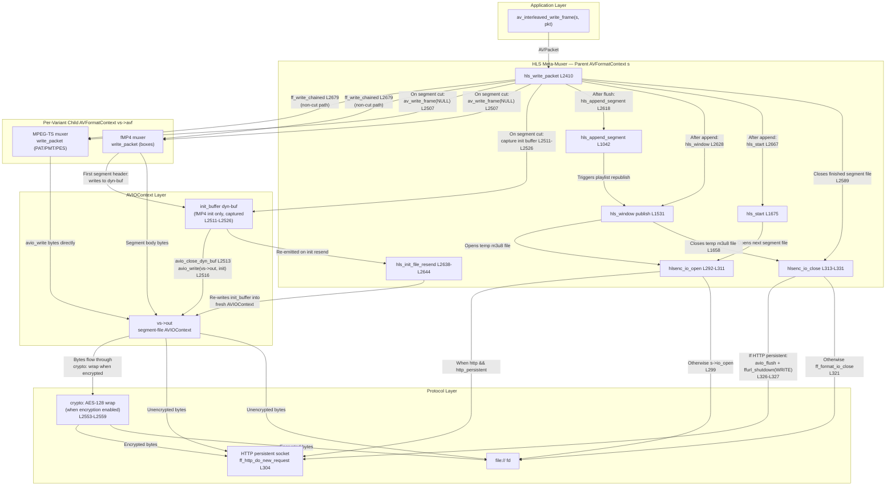

# Process Flows — End-to-End Data Movement Through the HLS Pipeline

> **Commit Anchor:** All source references in this document are anchored to commit `566ad786` (full hash `566ad7869ee3c8b6993e1f880e0a50eae18c66ac`). Line numbers cited as `[<path>:L<start>-L<end>]` are valid at this commit. See [`../README.md`](../README.md) for the documentation-set-wide commit-anchor convention and citation format.

---

## Overview

### Plain-Language Summary

This document renders the FFmpeg HLS muxer's major runtime processes as Mermaid data-flow diagrams. The audience is engineers who need to understand *how data moves* through the pipeline before reading source — what arrives where, what triggers what, and which branches the implementation actually takes at runtime. The companion document [`pipeline-orchestration.md`](pipeline-orchestration.md) describes the same lifecycle as a narrative of callback phases and ownership; the companion document [`codec-logic.md`](codec-logic.md) enumerates the decision branches as exhaustive decision tables. This document is the diagram view that sits between them.

Five processes are diagrammed here, each as one Mermaid flowchart. Two of the five are marked **Risk: HIGH** because their failure modes leave the muxer in indeterminate or hard-to-recover states (the live sliding-window deletion path and the encryption key rotation path). The remaining three are LOW-risk by comparison but are the load-bearing flows that drive every HLS publication.

The diagrams are deliberately authored as flowcharts rather than sequence diagrams. Flowcharts emphasize *control flow* (what decides what) and *data movement* (where bytes go) rather than wall-clock ordering. Where wall-clock ordering is the constraint of interest, see the Mermaid `sequenceDiagram` in [`../api-contracts/timing-dependencies.md`](../api-contracts/timing-dependencies.md). All diagrams use Mermaid fenced `mermaid` blocks per the documentation-set-wide Mermaid-only rule (AAP §0.10.2), and every diagram node that names a function or callsite carries the source-line citation inline so a reader can `git show 566ad786:libavformat/hlsenc.c | sed -n '<start>,<end>p'` directly from a node label.

### Processes Covered

The five processes documented below are presented in order of increasing scope. Each is a top-level `##` section.

1. **Segment Generation** — the per-packet hot path that decides whether to cut a segment, forwards bytes to the child sub-muxer, and finalizes the segment file when the time budget elapses.
2. **Playlist Update** — the per-segment publication of the `.m3u8` manifest with all conditional tag emissions (`EXT-X-VERSION`, `EXT-X-TARGETDURATION`, `EXT-X-KEY`, `EXT-X-DISCONTINUITY`, `EXT-X-INDEPENDENT-SEGMENTS`, `EXT-X-ENDLIST`).
3. **Live Sliding Window** — **Risk: HIGH** — the live-mode deletion path that retires old segments from the playlist and the disk while honoring `hls_delete_threshold`.
4. **Encryption Key Rotation** — **Risk: HIGH** — the periodic-rekey path that re-reads `hls_key_info_file` at each segment boundary and emits a fresh `EXT-X-KEY` line when the URI, key, or IV has changed.
5. **AVFormatContext ⇄ AVIOContext ⇄ Segment File Writer** — the meta-muxer interaction view, showing how the HLS parent context, the per-variant child format context, and the shared AVIOContext layer cooperate to write segment bytes to disk or HTTP.

### Cross-Document References

| For | See |
|-----|-----|
| Decision tables for branches shown in these diagrams (segment cut, version cascade, segment-type, EXT-X-ENDLIST emission, periodic rekey gate) | [`codec-logic.md`](codec-logic.md) |
| Lifecycle DAG, callback chain, and child-muxer ownership view | [`pipeline-orchestration.md`](pipeline-orchestration.md) |
| Field-level definitions of `HLSContext`, `VariantStream`, `HLSSegment`, `AVFormatContext`, `AVIOContext` | [`data-model.md`](data-model.md) |
| The same ordering relationships expressed as Layer 3 timing contracts (with a Mermaid `sequenceDiagram`) | [`../api-contracts/timing-dependencies.md`](../api-contracts/timing-dependencies.md) |
| Per-interface external touchpoints (file I/O, HTTP, AES crypto, sub-muxer) | [`integration-interfaces.md`](integration-interfaces.md) |
| `AVERROR(*)` codes returned by each process | [`../functionality/exception-handling.md`](../functionality/exception-handling.md) |

---

## Process — Segment Generation

### Plain-Language Summary

Segment generation is the per-packet hot path of the HLS muxer. When the application calls `av_interleaved_write_frame()` and libavformat dispatches into `hls_write_packet`, the muxer first locates the variant stream that owns the packet's `stream_index`, then evaluates whether the packet should trigger a new segment cut. The cut decision combines a structural condition (is this packet a video keyframe, or is the user opting into non-keyframe cuts via `HLS_SPLIT_BY_TIME`?) with a temporal condition (has enough media time elapsed since the segment started, measured via `av_compare_ts` against the `end_pts` budget?). If both conditions hold and the current segment has at least one packet, the cut path fires: the child sub-muxer is flushed, the segment file is finalized and closed, the segment metadata is appended to the variant's linked-list, the playlist is re-published (mid-stream only — VOD waits until the trailer), and the next segment file is opened. Either way, the packet itself is forwarded to the child sub-muxer at the end of the function, so the new segment's bytes begin with this packet.

The two-stage cut decision is the most important design detail of this flow. The structural gate at `[libavformat/hlsenc.c:L2473-L2475]` sets `can_split = 1` only when the current packet is video AND either a keyframe OR the user has set `HLS_SPLIT_BY_TIME`; the temporal gate at `[libavformat/hlsenc.c:L2501-L2502]` is then checked separately via `av_compare_ts`. Both gates must pass for the cut to fire, which means a configuration that opts into non-keyframe cuts (`HLS_SPLIT_BY_TIME`) still won't cut until the time budget is met, and a configuration that disables non-keyframe cuts (default) will defer the cut to the *next* keyframe when the time budget has expired but the current packet is a P/B frame.

### Technical Detail

The function body at `[libavformat/hlsenc.c:L2410-L2691]` follows a three-phase shape:

1. **Variant lookup** at `[libavformat/hlsenc.c:L2425-L2446]` walks `hls->var_streams` to find the variant containing this packet's stream and, within that variant, computes the local `stream_index` after subtracting any subtitle streams. The local `oc` pointer is bound to either `vs->avf` (the TS or fMP4 child) or `vs->vtt_avf` (the WebVTT child).
2. **Segment-cut decision** at `[libavformat/hlsenc.c:L2473-L2502]` computes `can_split` from keyframe + split-by-time flags, sets `is_ref_pkt` from the reference-stream index, updates `vs->duration` from `pkt->duration` (with a fallback to PTS deltas when duration is zero at `[libavformat/hlsenc.c:L2493-L2495]`), and finally evaluates the temporal gate `av_compare_ts(pkt->pts - vs->start_pts, st->time_base, end_pts, AV_TIME_BASE_Q) >= 0` at `[libavformat/hlsenc.c:L2501-L2502]`.
3. **Cut path** at `[libavformat/hlsenc.c:L2503-L2675]` flushes the sub-muxer via `av_write_frame(oc, NULL)` at `[libavformat/hlsenc.c:L2507]`, captures the fMP4 init segment on the very first cut at `[libavformat/hlsenc.c:L2511-L2526]`, closes the segment file (or finalizes the byte range in single-file mode) at `[libavformat/hlsenc.c:L2528-L2607]`, appends the new `HLSSegment` to `vs->segments` via `hls_append_segment` at `[libavformat/hlsenc.c:L2618]`, publishes the playlist via `hls_window` at `[libavformat/hlsenc.c:L2628]` (skipped for VOD), optionally re-publishes the fMP4 init file at `[libavformat/hlsenc.c:L2638-L2644]`, and opens the next segment file via `hls_start` at `[libavformat/hlsenc.c:L2667]`. After the cut path returns, `[libavformat/hlsenc.c:L2677-L2688]` increments `vs->packets_written` and forwards the packet to the child via `ff_write_chained` at `[libavformat/hlsenc.c:L2679]`.

The byterange single-file mode (`HLS_SINGLE_FILE` or `max_seg_size > 0`) takes a different finalization route at `[libavformat/hlsenc.c:L2534-L2542]`: instead of closing one segment file and opening another, the dynamic buffer is flushed into the single output file via `flush_dynbuf`, the segment's `start_pos`/`size` are recorded for byterange emission, and segment file open/close is suppressed.

### Diagram

```mermaid
flowchart LR
    A["AVPacket arrives<br/>hls_write_packet L2410"] --> B["Locate VariantStream<br/>by stream_index<br/>L2425-L2446"]
    B --> C{"can_split? L2473-L2475<br/>video keyframe OR<br/>HLS_SPLIT_BY_TIME"}
    C -- "No" --> R["Update vs->duration<br/>L2486-L2497"]
    C -- "Yes" --> D{"can_split AND<br/>av_compare_ts &ge; 0<br/>L2500-L2502"}
    D -- "No (time budget not met)" --> R
    D -- "Yes (cut fires)" --> E["Segment Cut Path<br/>L2503-L2675"]
    E --> G["av_write_frame(oc, NULL)<br/>flush sub-muxer L2507"]
    G --> H{"segment_type == fmp4<br/>AND first cut?<br/>L2511-L2512"}
    H -- "Yes" --> I["avio_close_dyn_buf<br/>capture init buffer L2513<br/>avio_write(vs->out, ...) L2516"]
    H -- "No" --> J["avio_flush(oc->pb) L2510"]
    I --> J
    J --> K{"byterange mode?<br/>HLS_SINGLE_FILE OR max_seg_size>0<br/>L2504"}
    K -- "Yes" --> K1["flush_dynbuf into<br/>single output file L2535"]
    K -- "No" --> K2["hlsenc_io_open new file L2571<br/>flush_dynbuf L2582<br/>hlsenc_io_close L2589"]
    K1 --> L["hls_append_segment L2618<br/>append HLSSegment to vs->segments"]
    K2 --> L
    L --> M{"pl_type == PLAYLIST_TYPE_VOD?<br/>L2627"}
    M -- "Yes (defer)" --> O["Skip hls_window<br/>(emit at trailer)"]
    M -- "No (live/event)" --> N["hls_window publish<br/>L2628"]
    N --> P{"resend_init_file<br/>AND fMP4? L2638"}
    O --> P
    P -- "Yes" --> Q["hls_init_file_resend L2639"]
    P -- "No" --> S["hls_start opens<br/>next segment L2667"]
    Q --> S
    S --> R
    R --> T["ff_write_chained L2679<br/>forward packet to sub-muxer"]
    T --> Z(["Return ret"])
```

The diagram's central spine is the cut decision (the `can_split` diamond at C and the temporal-gate diamond at D). When either gate fails, the packet skips the cut path entirely and falls through to the duration accumulator at R. When both gates pass, the cut path linearizes through flush → fMP4-init-capture (first cut only) → segment-file finalization → segment-list append → playlist publish (mid-stream only) → optional init resend → next-segment open. Every node label carries the source line so a reader can verify the diagram against `[libavformat/hlsenc.c]`. The terminal `ff_write_chained` at T fires on every packet (cut or no-cut), which is why both the `Cut: Yes` path and the `Cut: No` path merge into R before reaching T.

---

## Process — Playlist Update

### Plain-Language Summary

Playlist update is the per-segment process that re-writes the `.m3u8` manifest file for a variant whenever a new segment has been appended (or, in VOD mode, when the trailer is reached). The function `hls_window` opens a temporary `.m3u8` file, negotiates the minimum HLS protocol version that satisfies every active feature, computes `EXT-X-TARGETDURATION` as the ceiling of the longest segment, emits the playlist header tags, then iterates the variant's segment linked-list emitting one `EXTINF` + filename pair per segment (with conditional `EXT-X-DISCONTINUITY`, `EXT-X-BYTERANGE`, `EXT-X-PROGRAM-DATE-TIME`, and `EXT-X-KEY` decorations), and finally emits `EXT-X-ENDLIST` when the variant has finished and the user has not opted out. The temp file is then atomically renamed over the live `.m3u8` so a reader never observes a half-written manifest.

The most important detail of this flow is the `EXT-X-VERSION` cascade. Five distinct features each force a minimum protocol version, and the implementation walks them in order at `[libavformat/hlsenc.c:L1551-L1571]`: default v2, bumped to v3 when floating-point durations are emitted (default — unless `HLS_ROUND_DURATIONS`), bumped to v4 when byterange mode or I-frame-only mode is active, bumped to v6 when `HLS_INDEPENDENT_SEGMENTS` is set, and bumped to v7 when the segments are fMP4. The cascade is *additive* — every condition is an unconditional override — so the final version is the maximum of all matching minimums.

### Technical Detail

The function `hls_window` at `[libavformat/hlsenc.c:L1531-L1673]` runs to completion every time the muxer publishes a variant playlist. Its body is structured in seven phases:

1. **Version negotiation** at `[libavformat/hlsenc.c:L1551-L1571]` selects the minimum HLS protocol version. The starting value is `hls->version = 2` at `[libavformat/hlsenc.c:L1551]`; the cascade then bumps it for `!HLS_ROUND_DURATIONS` → v3, byterange-mode → v4 (and resets the playlist sequence to 0), `HLS_I_FRAMES_ONLY` → v4, `HLS_INDEPENDENT_SEGMENTS` → v6, and `SEGMENT_TYPE_FMP4` → v7.
2. **Open temp manifest** at `[libavformat/hlsenc.c:L1577-L1578]` constructs the temp filename (suffixed `.tmp`) and opens it via `hlsenc_io_open` so the live `.m3u8` remains untouched until the rename in phase 7.
3. **Compute target_duration** at `[libavformat/hlsenc.c:L1584-L1587]` walks `vs->segments` and computes `target_duration = max(target_duration, lrint(en->duration))`. The `lrint` rounds floating-point segment durations to the nearest integer per RFC 8216 §4.4.2.1.
4. **Emit header tags** at `[libavformat/hlsenc.c:L1590-L1591]` calls `ff_hls_write_playlist_header` at `[libavformat/hlsplaylist.c:L110-L132]`, which emits `#EXTM3U`, `#EXT-X-VERSION:N`, optional `#EXT-X-ALLOW-CACHE`, `#EXT-X-TARGETDURATION`, `#EXT-X-MEDIA-SEQUENCE`, optional `#EXT-X-PLAYLIST-TYPE`, and optional `#EXT-X-I-FRAMES-ONLY` in that order.
5. **Emit pre-segment decorations** at `[libavformat/hlsenc.c:L1593-L1599]` writes the optional `#EXT-X-DISCONTINUITY` for `HLS_DISCONT_START` (at `[libavformat/hlsenc.c:L1594]`) and the optional `#EXT-X-INDEPENDENT-SEGMENTS` (at `[libavformat/hlsenc.c:L1598]`).
6. **Per-segment loop** at `[libavformat/hlsenc.c:L1600-L1626]` iterates each `HLSSegment` and emits, in order: an optional `#EXT-X-KEY` line when the segment's `key_uri` differs from the previous segment's at `[libavformat/hlsenc.c:L1601-L1609]`; an optional `#EXT-X-MAP` line on the first segment when fMP4 at `[libavformat/hlsenc.c:L1611-L1614]`; and the `#EXTINF`/`#EXT-X-BYTERANGE`/`#EXT-X-PROGRAM-DATE-TIME`/filename block via `ff_hls_write_file_entry` at `[libavformat/hlsenc.c:L1616-L1626]` (the writer is at `[libavformat/hlsplaylist.c:L144-L199]`).
7. **Emit trailer and finalize** at `[libavformat/hlsenc.c:L1629-L1666]` writes `#EXT-X-ENDLIST` when `last && !HLS_OMIT_ENDLIST` at `[libavformat/hlsenc.c:L1629-L1630]` (writer at `[libavformat/hlsplaylist.c:L201-L206]`), optionally writes the parallel VTT playlist at `[libavformat/hlsenc.c:L1632-L1654]`, closes the temp file via `hlsenc_io_close` at `[libavformat/hlsenc.c:L1658]`, and atomically renames the temp file over the live `.m3u8` via `ff_rename` at `[libavformat/hlsenc.c:L1663-L1666]`. If a master playlist is configured, `create_master_playlist` is invoked at `[libavformat/hlsenc.c:L1668-L1670]`.

The `EXT-X-KEY` emission inside the per-segment loop at `[libavformat/hlsenc.c:L1601-L1609]` is the join point between this process and the encryption-key-rotation process (Section "Process — Encryption Key Rotation" below): the line is emitted only when the segment's `key_uri` differs from the previous iteration, so a static key produces one `EXT-X-KEY` line at the top of the segment block, and a rotating key produces one per affected segment.

### Diagram

```mermaid
flowchart LR
    Start(["hls_window invoked<br/>L1531"]) --> A["Build temp filename<br/>(name.tmp) L1537"]
    A --> B["Negotiate EXT-X-VERSION L1551-L1571<br/>v2 default → v3/v4/v6/v7<br/>via additive cascade"]
    B --> C["hlsenc_io_open temp m3u8<br/>L1577-L1578"]
    C --> D["Walk vs->segments<br/>target_duration = max(lrint(duration))<br/>L1584-L1587"]
    D --> E["ff_hls_write_playlist_header L1590-L1591<br/>EXTM3U, VERSION, ALLOW-CACHE,<br/>TARGETDURATION, MEDIA-SEQUENCE,<br/>PLAYLIST-TYPE, I-FRAMES-ONLY"]
    E --> F{"HLS_DISCONT_START set?<br/>L1593"}
    F -- "Yes" --> F1["avio_printf EXT-X-DISCONTINUITY<br/>L1594"]
    F -- "No" --> G{"HLS_INDEPENDENT_SEGMENTS set?<br/>L1597"}
    F1 --> G
    G -- "Yes" --> G1["avio_printf EXT-X-INDEPENDENT-SEGMENTS<br/>L1598"]
    G -- "No" --> H["For each segment in vs->segments<br/>L1600"]
    G1 --> H
    H --> I{"key_uri changed since prev?<br/>L1601"}
    I -- "Yes" --> I1["avio_printf EXT-X-KEY<br/>METHOD=AES-128 URI IV<br/>L1603-L1607"]
    I -- "No" --> J{"first segment AND fMP4?"}
    I1 --> J
    J -- "Yes" --> J1["ff_hls_write_init_file<br/>EXT-X-MAP L1611-L1614"]
    J -- "No" --> K["ff_hls_write_file_entry L1616-L1626<br/>EXT-X-DISCONTINUITY if seg-&gt;discont<br/>EXTINF, EXT-X-BYTERANGE,<br/>EXT-X-PROGRAM-DATE-TIME, filename"]
    J1 --> K
    K --> L{"more segments?"}
    L -- "Yes" --> H
    L -- "No" --> M{"last AND NOT HLS_OMIT_ENDLIST?<br/>L1629"}
    M -- "Yes" --> M1["ff_hls_write_end_list<br/>EXT-X-ENDLIST L1630"]
    M -- "No" --> N["Write VTT playlist if subtitle<br/>L1632-L1654"]
    M1 --> N
    N --> O["hlsenc_io_close temp file<br/>L1658"]
    O --> P["ff_rename .tmp to .m3u8<br/>(atomic) L1663-L1666"]
    P --> Q{"master_pl_name set?<br/>L1668"}
    Q -- "Yes" --> Q1["create_master_playlist L1669"]
    Q -- "No" --> End(["Return ret"])
    Q1 --> End
```

The diagram's left-to-right linearization corresponds to the actual textual order in which lines appear in the emitted `.m3u8` manifest. The two pre-segment conditional diamonds (F, G) gate optional header decorations; the per-segment loop (H → I → J → K → L) emits the body; and the trailer diamond (M) gates `EXT-X-ENDLIST`. The atomic rename at P is the *publication* — between the open at C and the rename at P, the live `.m3u8` file is untouched, and the rename is the single point at which readers observe the new manifest.

---

## Process — Live Sliding Window — **Risk: HIGH**

### Plain-Language Summary

In live mode (configured by `hls_list_size > 0`), the variant's segment linked-list operates as a sliding window: each newly finalized segment is appended to the tail of `vs->segments`, and the oldest segment is moved off the head into a parallel "cooldown" linked-list called `vs->old_segments`. Segments in the cooldown list remain referenced (so that any reader who fetched the playlist before the slide can still complete the GET for the now-aged segment) until the `hls_delete_threshold` expires, at which point the cooldown list is walked and each segment is either `unlink()`-ed from disk or sent as an HTTP DELETE to the upstream.

This two-queue design is what makes the process **Risk: HIGH**. Concurrent reader-writer races on the playlist are *not* prevented by the muxer; they are mitigated. A reader who fetches the playlist after the muxer has written it but before the muxer slides the next segment may reference a segment that the muxer is in the middle of writing — this is mitigated by the `HLS_TEMP_FILE` rename-pattern from the Playlist Update process. A reader who fetches the playlist, then takes too long to fetch a referenced segment, may find that segment deleted before the GET completes — this is mitigated by the `hls_delete_threshold` AVOption, which controls how many segments remain referenceable past the active window. Misconfiguration of `hls_delete_threshold` (too small) directly causes 404s in live streaming and is the most common source of player playback failures.

### Technical Detail

The sliding-window logic runs in two distinct phases, called from two different sites in the code:

**Phase 1 — Slide on append**, at `[libavformat/hlsenc.c:L1122-L1134]` inside `hls_append_segment`. After the new `HLSSegment` is linked at the tail of `vs->segments`, the test `if (hls->max_nb_segments && vs->nb_entries >= hls->max_nb_segments)` at `[libavformat/hlsenc.c:L1122]` evaluates whether the active window is full. When true, the head segment is unlinked from `vs->segments` and re-linked at the tail of `vs->old_segments` so that the active list always holds at most `max_nb_segments` entries. Then `hls_delete_old_segments` is invoked at `[libavformat/hlsenc.c:L1131]` to attempt actual deletion of any cooldown entries that have aged out. Note that the slide happens *before* the playlist is re-published, so the playlist always reflects the post-slide state.

**Phase 2 — Delete from cooldown**, at `[libavformat/hlsenc.c:L531-L639]` in `hls_delete_old_segments`. This function first walks the *active* segment list to compute the total active duration at `[libavformat/hlsenc.c:L549-L553]`, then walks `vs->old_segments` accumulating negative duration at `[libavformat/hlsenc.c:L555-L570]`. The deletion gate at `[libavformat/hlsenc.c:L562-L569]` retains a segment in the cooldown list when *either* the accumulated negative duration still exceeds the (negated) active duration, *or* the segment count is below `hls_delete_threshold`. When a segment is retained, `previous_segment->next = NULL` truncates the rest of the cooldown list from deletion this round. Surviving segments are then walked at `[libavformat/hlsenc.c:L595-L631]` and passed to `hls_delete_file` at `[libavformat/hlsenc.c:L608]`.

**Phase 2b — File deletion**, at `[libavformat/hlsenc.c:L507-L529]` in `hls_delete_file`. The deletion path branches on protocol: when `hls->method` is set or the segment's URL is an HTTP protocol, the code uses an `http_delete` AVIOContext configured with `method=DELETE` at `[libavformat/hlsenc.c:L515]` via `hlsenc_io_open` at `[libavformat/hlsenc.c:L517]` and closed via `hlsenc_io_close` at `[libavformat/hlsenc.c:L523]`. Otherwise, the fallback is a POSIX `unlink(path)` at `[libavformat/hlsenc.c:L524]`. Failures from either branch are logged but do not propagate — segment deletion is best-effort.

The deletion path's effective threshold is the larger of (a) the active window duration sum and (b) the `hls_delete_threshold` segment count. The default value of `hls_delete_threshold` is `1`, which means a segment ages out as soon as it is one slide past the active window. Operators serving high-latency clients (e.g., satellite, mobile) typically raise this value to 3–10 to extend the deletion grace period.

### Diagram

```mermaid
flowchart LR
    A["Segment finalized<br/>hls_append_segment L1042"] --> B["Append HLSSegment<br/>at tail of vs->segments<br/>L1111-L1116"]
    B --> C{"hls->max_nb_segments AND<br/>nb_entries &ge; max_nb_segments?<br/>L1122"}
    C -- "No (window not full)" --> Z(["Return — playlist re-publish<br/>via hls_window includes new segment"])
    C -- "Yes (window full)" --> D["Unlink head of vs->segments<br/>Re-link at tail of vs->old_segments<br/>L1124-L1129"]
    D --> E["hls_delete_old_segments<br/>L1131 → L531"]
    E --> F["Walk vs->segments<br/>compute total_duration<br/>L549-L553"]
    F --> G["Walk vs->old_segments iterator<br/>per-iter: subtract duration,<br/>advance, segment_cnt++<br/>L557-L561"]
    G --> H{"Threshold reached?<br/>playlist_duration &le; -prev->duration<br/>OR segment_cnt &ge; delete_threshold<br/>L562 / L566"}
    H -- "No — continue loop" --> G
    H -- "Yes — cut and break" --> H1["previous_segment->next = NULL<br/>severs old_segments at cut point<br/>L563 / L567"]
    H1 --> I["Walk dangling tail of old_segments<br/>(segments older than the cut)<br/>L595-L631"]
    I --> J{"More segments to delete?"}
    J -- "Yes" --> K["hls_delete_file<br/>L608 → L507"]
    K --> L{"http_method set<br/>OR url is http?<br/>L510"}
    L -- "Yes (HTTP)" --> L1["hlsenc_io_open with DELETE<br/>L517<br/>hlsenc_io_close L523"]
    L -- "No (filesystem)" --> L2["unlink(path) L524"]
    L1 --> M["Free HLSSegment node"]
    L2 --> M
    M --> J
    J -- "No" --> N(["Return — segments deleted,<br/>playlist re-publish reflects slide"])
```

The diagram shows the two-queue handoff at D (active → cooldown) and the deletion gate at H (the `hls_delete_threshold` check) as the two pivot points of the sliding window. The HTTP/filesystem split at L is purely transport — both branches reach the same `M` (free node) terminus. The most important invariant in this diagram is that *deletion of the cooldown queue and re-publication of the playlist are sequenced through `hls_append_segment` → `hls_window` ordering*: a reader fetching the playlist after the slide sees the new MEDIA-SEQUENCE and the new segment list, and the deleted segment URLs are no longer referenced in the playlist when the deletion occurs.

**Risk callouts (Risk: HIGH):**

- A reader caching the *previous* playlist sees a now-deleted segment URL. The `hls_delete_threshold` AVOption is the operator's only knob to control this window. Setting it too low causes 404s; setting it too high causes disk-fill.
- The HTTP DELETE path at `[libavformat/hlsenc.c:L510-L523]` is best-effort — if the upstream is unreachable or returns 4xx/5xx, the muxer logs and continues. The segment file is *not* moved back to the active list, so an orphaned segment on the CDN remains until a subsequent successful DELETE round catches it (which never happens — the segment is dropped from `vs->old_segments` after the deletion attempt regardless of outcome).
- The slide is unconditional on `nb_entries >= max_nb_segments`; there is no per-segment opt-out. Operators who need a permanent in-memory record of segments (e.g., for EVENT-style playlists) must set `pl_type = event` *and* not configure `max_nb_segments`, which keeps `nb_entries < max_nb_segments` always true.

---

## Process — Encryption Key Rotation — **Risk: HIGH**

### Plain-Language Summary

The HLS muxer supports AES-128 segment-level encryption in two modes: an internally-managed mode (`hls_enc=1`) where the muxer generates and writes its own key, and an externally-managed mode where the operator provides an `hls_key_info_file` whose contents (key URI, key file path, optional IV) are read at startup. Encryption key rotation is the optional extension of the second mode: when the `HLS_PERIODIC_REKEY` flag is set (`hls_flags=periodic_rekey`), the muxer re-reads `hls_key_info_file` *at every segment boundary*, so an operator can swap the key by atomically replacing the key info file's contents while the muxer is running. The next segment is then encrypted with the new key, and the playlist's per-segment `EXT-X-KEY` emission (see "Process — Playlist Update" above) automatically reflects the URI/IV change so downstream players can fetch the rotated key.

This is **Risk: HIGH** because the muxer has no transactional view of the key info file. If the operator's key-rotation script writes the URI line and is interrupted before writing the key file path, the muxer's next segment open will hit `AVERROR(EINVAL)` at `[libavformat/hlsenc.c:L744]` or `[libavformat/hlsenc.c:L749]`, the segment will not open, and the muxer returns failure to libavformat — typically aborting the encode. A robust rotation script must therefore write the key info file atomically (write-temp + rename) so the muxer either sees the old contents or the new contents but never a partial state. Similarly, a key file shorter than 16 bytes (a short read) or one that reaches EOF before 16 bytes are available causes `avio_read` at `[libavformat/hlsenc.c:L760]` to return a non-`KEYSIZE` value; the muxer then converts that into `AVERROR(EINVAL)` at `[libavformat/hlsenc.c:L764-L765]`. Genuine low-level I/O failures during the read (`ret < 0` and `ret != AVERROR_EOF`, e.g. `AVERROR(EIO)`, `AVERROR(EBADF)`) are returned as-is at `[libavformat/hlsenc.c:L766]` without conversion.

### Technical Detail

The rotation gate is at `[libavformat/hlsenc.c:L1779]` inside `hls_start`, the function responsible for opening each new segment. The condition `if (!vs->encrypt_started || (c->flags & HLS_PERIODIC_REKEY))` evaluates true on the first segment unconditionally and on every subsequent segment when `HLS_PERIODIC_REKEY` is set. The `HLS_PERIODIC_REKEY` flag is defined at `[libavformat/hlsenc.c:L110]` as `(1 << 12)`. When the gate fires, the path branches on which mode is in use:

- **Externally-managed mode** (`hls->key_info_file != NULL`): The call at `[libavformat/hlsenc.c:L1781]` invokes `hls_encryption_start(s, vs)` which re-reads the key info file. The function body at `[libavformat/hlsenc.c:L714-L771]` opens the key info file via `s->io_open` at `[libavformat/hlsenc.c:L723]`, then parses three lines via three `ff_get_line` calls: the key URI at `[libavformat/hlsenc.c:L731]`, the key file path at `[libavformat/hlsenc.c:L734]`, and the optional IV string at `[libavformat/hlsenc.c:L737]`. The file handle is closed via `ff_format_io_close` at `[libavformat/hlsenc.c:L740]`. Two short-circuit error gates follow: empty key URI returns `AVERROR(EINVAL)` at `[libavformat/hlsenc.c:L742-L745]`, and empty key file path returns `AVERROR(EINVAL)` at `[libavformat/hlsenc.c:L747-L750]`. The key file is then opened via `s->io_open` at `[libavformat/hlsenc.c:L752-L758]` and the 16-byte key (`KEYSIZE`) is read via `avio_read(pb, key, sizeof(key))` at `[libavformat/hlsenc.c:L760]`. The key bytes are converted to a hex string via `ff_data_to_hex` at `[libavformat/hlsenc.c:L768]` and stored into `vs->key_string`. The IV string from the file is then copied at `[libavformat/hlsenc.c:L1795-L1800]` back in `hls_start`.

- **Internally-managed mode** (`hls->encrypt != 0`, no `hls_key_info_file`): The call at `[libavformat/hlsenc.c:L1785]` invokes `do_encrypt(s, vs)`, whose body at `[libavformat/hlsenc.c:L641-L711]` derives a key URI from `hls->key_url` or auto-generates one at `[libavformat/hlsenc.c:L658-L664]`, builds a 16-byte IV with the 64-bit segment sequence number written into the low 8 bytes via `AV_WB64(iv + 8, vs->sequence)` (the upper 8 bytes remain zero) at `[libavformat/hlsenc.c:L666-L677]`, validates the key URI at `[libavformat/hlsenc.c:L679-L682]` (`AVERROR(EINVAL)`), validates the key file path at `[libavformat/hlsenc.c:L684-L687]` (`AVERROR(EINVAL)`), generates random key bytes via `av_random_bytes` at `[libavformat/hlsenc.c:L692]`, and writes the key bytes to disk at `[libavformat/hlsenc.c:L702-L708]`. This branch does not rotate keys — `do_encrypt` is called once for the first segment when `vs->encrypt_started == 0` and is never re-entered for subsequent segments because the gate at `[libavformat/hlsenc.c:L1779]` only re-fires for `HLS_PERIODIC_REKEY`, which requires the external key info file.

After either branch succeeds, `vs->encrypt_started` is set to 1 at `[libavformat/hlsenc.c:L1793]` (suppressing a re-run on subsequent segments unless `HLS_PERIODIC_REKEY` is set), and the new segment is opened with a `crypto:`-prefixed URL at `[libavformat/hlsenc.c:L2553-L2559]` so that the AVIOContext's protocol stack transparently encrypts the segment payload as it is written. The `EXT-X-KEY` line that informs the player of the new key is emitted by the next `hls_window` call at `[libavformat/hlsenc.c:L1601-L1609]` (the change-detection clause compares the segment's `key_uri` to the previous segment's).

### Diagram

```mermaid
flowchart LR
    A["Segment boundary<br/>hls_start invoked L1675"] --> B{"NOT encrypt_started<br/>OR HLS_PERIODIC_REKEY?<br/>L1779"}
    B -- "No" --> Z["Reuse existing key_string<br/>and iv_string"]
    B -- "Yes" --> C{"hls->key_info_file set?"}
    C -- "Yes (external)" --> D["hls_encryption_start L1781 → L714"]
    C -- "No (internal, hls_enc=1)" --> E["do_encrypt L1785 → L641"]
    D --> D1["s->io_open key_info_file<br/>L723"]
    D1 --> D2["Parse 3 lines: URI, key_file, IV<br/>L731-L737"]
    D2 --> D3["ff_format_io_close L740"]
    D3 --> D4{"URI empty? L742"}
    D4 -- "Yes" --> ERR1(["Return AVERROR(EINVAL)<br/>L744"])
    D4 -- "No" --> D5{"key_file empty? L747"}
    D5 -- "Yes" --> ERR2(["Return AVERROR(EINVAL)<br/>L749"])
    D5 -- "No" --> D6["s->io_open key file<br/>L752-L758"]
    D6 --> D7["avio_read(pb, key, 16)<br/>L760"]
    D7 --> D8{"Read 16 bytes?"}
    D8 -- "No" --> ERR3(["Return AVERROR(EINVAL)<br/>or underlying err L762-L767"])
    D8 -- "Yes" --> D9["ff_data_to_hex key_string<br/>L768"]
    E --> E1["Derive key URI<br/>L658-L664"]
    E1 --> E2["Build 16-byte IV<br/>(seq in low 8 bytes)<br/>L666-L677"]
    E2 --> E3{"key URI valid? L679"}
    E3 -- "No" --> ERR4(["Return AVERROR(EINVAL)<br/>L681"])
    E3 -- "Yes" --> E4{"key file valid? L684"}
    E4 -- "No" --> ERR5(["Return AVERROR(EINVAL)<br/>L686"])
    E4 -- "Yes" --> E5["av_random_bytes(key, 16)<br/>L692"]
    E5 --> E6["Write key bytes to disk<br/>L702-L708"]
    D9 --> F["Copy IV string into vs->iv_string<br/>L1795-L1800"]
    E6 --> F
    F --> G["vs->encrypt_started = 1<br/>L1793"]
    Z --> H["Open segment file with<br/>crypto: protocol wrap L2553-L2559"]
    G --> H
    H --> I["Next hls_window emits<br/>EXT-X-KEY if key_uri changed<br/>L1601-L1609"]
    I --> End(["Return — encrypted segment ready"])
```

The diagram shows three terminal error paths (ERR1, ERR2, ERR3 in the external branch and ERR4, ERR5 in the internal branch). All of them abort `hls_start` *before* the segment file is opened, which is the desired property: a key-fetch failure must not produce a half-encrypted or unencrypted segment in the published stream. The diagram also makes visible that the internal mode never reaches the periodic-rekey path — the `key_info_file == NULL` branch at C → E enters `do_encrypt` which has no rotation semantics. To enable rotation, the operator must use the external mode and set `HLS_PERIODIC_REKEY`.

**Risk callouts (Risk: HIGH):**

- A non-atomic write of `hls_key_info_file` between the muxer's read of line 1 (URI) and line 2 (key file path) at `[libavformat/hlsenc.c:L731-L734]` can produce an inconsistent triple. Operators MUST use a write-temp + rename pattern when rotating keys.
- A key file that is shorter than 16 bytes triggers the `avio_read` short-read (or EOF) path at `[libavformat/hlsenc.c:L760-L767]`. The conversion at `[libavformat/hlsenc.c:L764-L765]` maps both `ret >= 0` (short read) and `ret == AVERROR_EOF` to `AVERROR(EINVAL)`; only a genuine low-level I/O error (e.g., `AVERROR(EIO)`) is returned as-is. In every case, the segment open fails.
- The `EXT-X-KEY` change detection at `[libavformat/hlsenc.c:L1601]` compares the *segment's* `key_uri` to the *previous segment's* `key_uri`. Only the URI is compared, not the key bytes — if the operator rotates the key bytes without rotating the URI, the playlist will NOT emit a new `EXT-X-KEY` line and players will silently fail to decrypt subsequent segments.

---

## Process — AVFormatContext ⇄ AVIOContext ⇄ Segment File Writer

### Plain-Language Summary

The HLS muxer is a *meta-muxer*: it does not format media bytes itself. Instead, for each configured variant it owns a child `AVFormatContext` that runs a real underlying muxer — either the MPEG-TS muxer (when `hls_segment_type=mpegts`, the default) or the fMP4 muxer (when `hls_segment_type=fmp4`). The HLS layer's responsibility is segmentation (when to cut), playlist publication (the `.m3u8` files), and segment-file lifecycle (which file to open, when to close, whether to encrypt, whether to delete). The child muxer's responsibility is payload formatting (MPEG-TS PAT/PMT/PES packaging or fMP4 boxes). Between them sits the AVIOContext layer — a single output stream that the child muxer writes to and that the HLS layer redirects between segment files as cuts occur.

The diagram below shows the three-tier architecture in a top-to-bottom layout. The HLS layer is at the top, the child muxer is in the middle, and the AVIOContext-and-protocol layer is at the bottom. Arrows show byte flow (downward, from packet to disk/HTTP) and control flow (the HLS layer's `hlsenc_io_open` / `hlsenc_io_close` calls that switch the AVIOContext between segment-file targets). A subtle but important detail: in TS mode the child muxer writes *directly* into the segment-file AVIOContext (`vs->out`), but in fMP4 mode the child muxer writes into a *dynamic buffer* (an in-memory `AVIOContext` returned by `avio_open_dyn_buf`), and the HLS layer captures that buffer once at the first segment cut to obtain the fMP4 initialization segment (the `moov` and `ftyp`/`styp` boxes); subsequent segment bodies are then written directly to `vs->out`. The init buffer is later re-emitted (per the `hls_fmp4_init_resend` AVOption) when the playlist refreshes.

### Technical Detail

The parent `AVFormatContext` is the HLS context `s`, allocated by libavformat when the application calls `avformat_alloc_output_context2(NULL, NULL, "hls", url)`. The HLS muxer's private data `HLSContext *hls = s->priv_data` contains the `VariantStream *var_streams` array (allocated during `hls_init`), and each `VariantStream *vs` carries a child format context `vs->avf` (the TS or fMP4 muxer) plus, optionally, `vs->vtt_avf` (the WebVTT muxer for subtitle renditions).

The shared AVIOContext layer is reached through three pointers:

- `vs->out` — the segment-file AVIOContext. In non-fMP4 mode, this is what the child muxer writes to. It is opened by `hlsenc_io_open` at `[libavformat/hlsenc.c:L292-L311]` and closed by `hlsenc_io_close` at `[libavformat/hlsenc.c:L313-L331]`.
- `vs->avf->pb` — the *child muxer's* AVIOContext. In non-fMP4 mode, this is aliased to `vs->out` (the child writes directly to the segment file). In fMP4 mode, this is initially a dynamic-buffer AVIOContext (allocated by `avio_open_dyn_buf`) so the child muxer's header writes accumulate in memory; the init buffer is captured at `[libavformat/hlsenc.c:L2511-L2526]` and then `vs->avf->pb` is re-bound to `vs->out` for subsequent segment bodies.
- `vs->init_buffer` — a pointer to the captured fMP4 initialization-segment bytes, used by `hls_init_file_resend` at the playlist refresh.

The HTTP persistent-connection optimization at `[libavformat/hlsenc.c:L292-L331]` allows the same TCP connection to be reused across consecutive segment uploads. The decision tree in `hlsenc_io_open` at `[libavformat/hlsenc.c:L298-L309]` is: if `*pb` is non-null AND the URL's protocol is an HTTP protocol AND `hls->http_persistent` is non-zero, the function calls `ff_http_do_new_request` at `[libavformat/hlsenc.c:L304]` to issue a new PUT/POST request on the existing socket; otherwise it calls `s->io_open(WRITE)` at `[libavformat/hlsenc.c:L299]` which allocates a fresh socket. The mirror logic in `hlsenc_io_close` at `[libavformat/hlsenc.c:L320-L329]` is: if HTTP-persistent is engaged, the function calls `avio_flush` then `ffurl_shutdown(AVIO_FLAG_WRITE)` at `[libavformat/hlsenc.c:L326-L327]` to half-close the connection (write-side only), leaving the read-side open for the server's response and the socket itself open for the next `ff_http_do_new_request`. Otherwise it calls `ff_format_io_close` at `[libavformat/hlsenc.c:L321]` which closes the AVIOContext entirely.

The byte flow during a single packet write is: the application calls `av_interleaved_write_frame(s, pkt)`, libavformat dispatches into `hls_write_packet` at `[libavformat/hlsenc.c:L2410]`, the HLS layer decides whether to cut a segment (see "Process — Segment Generation"), and finally calls `ff_write_chained(oc, pkt->stream_index, pkt, s, 0)` at `[libavformat/hlsenc.c:L2679]` where `oc` is the child format context. `ff_write_chained` then calls into the child muxer's `write_packet` callback, which formats the packet and emits bytes through `oc->pb` (which is either `vs->out` directly in TS mode, or the dyn-buf in fMP4 mode for the first segment, or `vs->out` again for subsequent fMP4 segments).

### Diagram

The diagram is grouped into five subgraphs (Application, HLS, Child, AVIOContext, Protocol) reading top to bottom. Byte flow is downward through the stack; control flow runs both directions inside the HLS subgraph (`hls_write_packet` orchestrates everything else). The diamond-free shape reflects that this is a *structural* diagram of pointers and ownership rather than a *control-flow* diagram of decisions. The two key insights it makes visible are: (a) the dyn-buf `DYN` is used only for the fMP4 init segment — after capture, the child fMP4 muxer's `pb` is re-bound to `vs->out` and operates exactly like the TS muxer; (b) the HTTP-persistent path bypasses the AVIOContext close-then-reopen cycle by half-closing only the write side, which is why the throughput improvement scales linearly with `hls_list_size` in live mode (each surviving connection avoids one TCP handshake + one TLS handshake per segment).

The `crypto:` protocol wrap at `[libavformat/hlsenc.c:L2553-L2559]` is implemented as a URL prefix — when encryption is enabled, the segment filename passed to `hlsenc_io_open` is `crypto:<actual_url>`, which causes FFmpeg's protocol stack to interpose an AES-128 encrypt filter between `vs->out` and the underlying file or HTTP target. The key and IV are passed via the `options` AVDictionary on the `hlsenc_io_open` call.

---

## Cross-References

The diagrams above are deliberately scoped to *control and data flow*. They do not enumerate every decision branch, every struct field, or every external-system contract — those concerns live in dedicated Layer 2 and Layer 3 leaves. The table below maps each topic raised by these diagrams to the canonical document for that topic.

| Diagram Element | Canonical Document | Anchor |
|-----------------|--------------------|--------|
| `can_split` decision (keyframe + split-by-time) | [`codec-logic.md`](codec-logic.md) | Segment-cut decision table |
| `av_compare_ts` temporal gate | [`codec-logic.md`](codec-logic.md) | Segment-cut decision table |
| `EXT-X-VERSION` cascade (v2 → v3 → v4 → v6 → v7) | [`codec-logic.md`](codec-logic.md) | HLS_VERSION negotiation table |
| `SEGMENT_TYPE_MPEGTS` vs `SEGMENT_TYPE_FMP4` branching | [`codec-logic.md`](codec-logic.md) | Segment-type selection table |
| `HLS_OMIT_ENDLIST` → no `EXT-X-ENDLIST` emission | [`codec-logic.md`](codec-logic.md) | EXT-X-ENDLIST emission table |
| `HLS_PERIODIC_REKEY` re-fire condition | [`codec-logic.md`](codec-logic.md) | Periodic rekey cadence table |
| `max_nb_segments` slide trigger | [`codec-logic.md`](codec-logic.md) | Sliding-window decision table |
| `hls_delete_threshold` retention rule | [`codec-logic.md`](codec-logic.md) | Sliding-window decision table |
| Lifecycle phases (init → write_header → write_packet → write_trailer → deinit) | [`pipeline-orchestration.md`](pipeline-orchestration.md) | Lifecycle DAG |
| `FFOutputFormat ff_hls_muxer` callback wiring | [`pipeline-orchestration.md`](pipeline-orchestration.md) | Callback chain section |
| Parent/child muxer ownership semantics | [`pipeline-orchestration.md`](pipeline-orchestration.md) | Child-muxer relationship section |
| `HLSContext` struct fields | [`data-model.md`](data-model.md) | Muxer `HLSContext` dictionary |
| `VariantStream` struct fields (`avf`, `out`, `init_buffer`, `key_string`, `iv_string`, `segments`, `old_segments`, etc.) | [`data-model.md`](data-model.md) | `VariantStream` dictionary |
| `HLSSegment` struct fields (`filename`, `duration`, `discont`, `key_uri`, `pos`, `size`, etc.) | [`data-model.md`](data-model.md) | `HLSSegment` dictionary |
| `HLSFlags` enum values | [`data-model.md`](data-model.md) | `HLSFlags` enum reference |
| `SegmentType` enum values | [`data-model.md`](data-model.md) | `SegmentType` enum reference |
| `KEYSIZE` (16) and other constants | [`data-model.md`](data-model.md) | Constants section |
| Ordering constraints (keyframe → segment cut → segment write → playlist) | [`../api-contracts/timing-dependencies.md`](../api-contracts/timing-dependencies.md) | Sequence diagram |
| Atomic temp-file rename for `.m3u8` | [`../api-contracts/timing-dependencies.md`](../api-contracts/timing-dependencies.md) | Temp-file atomicity constraint |
| EXT-X-KEY line placement before encrypted segment | [`../api-contracts/timing-dependencies.md`](../api-contracts/timing-dependencies.md) | Key-installation-before-encrypted-segment constraint |
| AES-128 key URI fetch protocol | [`integration-interfaces.md`](integration-interfaces.md) | AES-128 crypto pipeline section |
| HTTP persistent connection contract | [`integration-interfaces.md`](integration-interfaces.md) | HTTP AVIOContext writes section |
| `crypto:` pseudo-protocol wrap | [`integration-interfaces.md`](integration-interfaces.md) | Protocol handlers section |
| MPEG-TS sub-muxer interface | [`integration-interfaces.md`](integration-interfaces.md) | MPEG-TS sub-muxer section |
| fMP4 sub-muxer interface | [`integration-interfaces.md`](integration-interfaces.md) | fMP4 sub-muxer section |
| `AVERROR(*)` codes returned from these flows | [`../functionality/exception-handling.md`](../functionality/exception-handling.md) | All scenarios |
| Inputs and outputs at the `AVOption` / file / network level | [`../functionality/inputs-outputs.md`](../functionality/inputs-outputs.md) | Per-component tables |
| EXT-X-* tag emission invariants | [`../api-contracts/functional-invariants.md`](../api-contracts/functional-invariants.md) | M3U8 tag invariants checklist |

Readers should treat this document as the *visual* entry point and the linked documents as the *referenceable* answer for any specific question the diagrams raise.

